# Chapter 1: Emergencies and Trauma

## 1.1 Common Emergencies

### 1.1.1 Anaphylactic Shock

**ICD-10 CODE:** T78.2

Severe allergic reaction that occurs rapidly, within seconds or minutes after administration or exposure, and may be life threatening. It generally affects the whole body.

**Causes**

- Allergy to pollens, some medicines (e.g., penicillins, vaccines, acetylsalicylic acid), or certain foods (e.g., eggs, fish, cow’s milk, nuts, some food additives)
- Reaction to insect bites, e.g., wasps and bees

**Clinical features**

- Body itching, hives (urticarial rash), swelling of lips, eyes, tongue
- Difficulty in breathing (stridor, wheezing)
- Hypotension and sudden collapse, excessive sweating, thin pulse
- Abdominal cramps, vomiting and diarrhoea

**Differential diagnosis**

- Other causes of shock, e.g., haemorrhagic shock due to bleeding, hypovolaemic shock due to severe dehydration, or septic shock
- Asthma, foreign body in airways

**Management**

<table>
 <thead>
 <tr>
 <th>Treatment</th>
 <th>LOC</th>
 </tr>
 </thead>
 <tbody>
 <tr>
 <td>
 <strong>General measures</strong> 
 Determine and remove the cause 
 Secure the airways 
 Restore BP: lay the patient flat and raise feet 
 Keep patient warm
 </td>
 <td>HC2</td>
 </tr>
 <tr>
 <td>
 Sodium chloride 0.9% infusion 20 ml/kg by IV infusion over 60 minutes 
 – Start rapidly then adjust rate according to BP 
 Administer oxygen
 </td>
 <td>HC3</td>
 </tr>
 <tr>
 <td>
 Adrenaline (epinephrine) injection 1 in 1000 (1 mg/ml) 0.5 mg (0.5 ml) IM immediately, into anterolateral thigh 
 – Repeat every 5–10 minutes according to BP, pulse rate, and respiratory function until better 
 Child &lt;6 years: 150 micrograms (0.15 ml) 
 Child 6–12 years: 300 micrograms (0.3 ml)
 </td>
 <td>HC2</td>
 </tr>
 <tr>
 <td>
 <strong>In severely affected patients</strong> 
 Hydrocortisone 200 mg IM or slow IV stat 
 Child &lt;1 year: 25 mg 
 Child 1–5 years: 50 mg 
 Child 6–12 years: 100 mg
 </td>
 <td>HC3</td>
 </tr>
 <tr>
 <td>
 <strong>If urticaria/itching</strong> 
 Give an antihistamine as useful adjunctive treatment 
 e.g., chlorpheniramine 4 mg every six hours 
 Child 1–2 years: 1 mg every 12 hours 
 Child 2–5 years: 1 mg every 6 hours 
 Child 5–12 years: 2 mg every 6 hours 
 – Or cetirizine 5 mg once daily for adults 
 Child 6 and above years: 5 mg daily 
 Child 1–6 years: 2.5 mg once daily  
 Or promethazine 25–50 mg by deep IM or very slow IV, or oral 
 Child 1–5 years: 5 mg by deep IM 
 Child 5–10 years: 6.25–12.5 mg by deep IM 
 Repeat dose every 8 hours for 24–48 hours to prevent relapse 
 Repeat adrenaline and hydrocortisone every 2–6 hours prn depending on the patient’s progress
 </td>
 <td>HC2V  HC4</td>
 </tr>
 </tbody>
</table>

> **Notes**
> - Adrenaline: IM is the route of choice; absorption is rapid and more reliable than SC.
> - Monitor the patient for several hours because the reaction may recur.
> - If drug reaction is suspected, complete the adverse drug reaction reporting form (see Appendix 2).
>
**Prevention**

- Always ask about allergies before giving patients new medicines.
- Keep emergency drugs at hand at health facilities and in situations where risk of anaphylaxis is high, e.g., visiting bee hives or places that usually harbour snakes.
- Counsel allergic patients to wear an alert bracelet or tag.

### 1.1.2 Hypovolaemic Shock

**ICD-10 CODE:** R57.1

Condition caused by severe acute loss of intravascular fluids, leading to inadequate circulating volume and inadequate perfusion.

**Causes**

- Loss of blood due to internal or external haemorrhage, e.g., post-partum haemorrhage, splenic rupture
- Acute loss of fluids, e.g., in gastroenteritis or extensive burns

**Clinical features**

- High heart rate, fast breathing rate
- Thin or absent pulse, cold extremities, slow capillary refill
- Low blood pressure
- Mental agitation, confusion

**Classification of hypovolaemia in adults**

| Indicator | Class 1 Mild | Class 2 | Class 3 Progressing Severe | Class 4 End Stage |
|---|---|---|---|---|
| Blood loss (litres) | <0.75 | 0.75–1.5 | 1.5–2 | >2 |
| % of total blood volume loss | <15 | 15–30 | 30–40 | >40 |
| Pulse rate | Normal | >100 | >120 | >140 |
| Pulse pressure | Normal | Decreased | Decreased | Decreased |
| Systolic BP | Normal | Normal | Decreased | Absent |
| Capillary refill | Normal | Delayed | Delayed | Absent |
| Respiratory rate | 20–30 | 30–40 | >40 | >45 or gasping |
| Mental state | Alert | Anxious | Confused | Confused/unconscious |
| Urine output (ml/hr) | >30 | 20–30 | 5–20 | <5 |

**Management in adults**

| Treatment | LOC |
|---|---|
| Control obvious bleeding with pressure | HC3 |
| Keep patient lying down with raised legs | |
| **If established hypovolaemia class 2 and above** | |
| Set 2 large-bore IV lines | |
| Give IV fluids: normal saline 0.9% or Ringer’s lactate, 20–30 ml/kg over 60 minutes | |
| Start rapidly and monitor BP | |
| Assess response to fluid resuscitation using BP, HR, RR, capillary refill, and urine output | |
| If internal or external haemorrhage is suspected, consider blood transfusion | |
| **If rapid improvement and stable, blood loss <20%** | HC4 |
| Slow IV fluids to maintenance levels | |
| No immediate transfusion, but cross-match blood | |
| Reassess regularly | |
| Conduct detailed examination and provide definitive treatment | |
| **If transient improvement, blood loss 20–40%** | |
| Continue rapid administration of fluids | |
| Initiate blood transfusion | |
| Reassess regularly | |
| Arrange early surgery if needed | |
| **If no improvement** | |
| Continue vigorous fluid administration | |
| Arrange urgent blood transfusion | |
| Arrange immediate surgery | |

**Treatment caution**

| Treatment | LOC |
|---|---|
| Do not use glucose solution or plain water as replacement fluids | |

#### 1.1.2.1 Hypovolaemic Shock in Children

- Recognising hypovolaemic shock may be more difficult in children than in adults.
- Vital signs may change little, even when up to 25% of blood volume is lost, as in class 1 and class 2 hypovolaemia.
- Tachycardia is often the first response to hypovolaemia, but may also be caused by fear or pain.

**Classification of hypovolaemia in children**

| Indicator | Class 1 Mild | Class 2 Progressing | Class 3 Severe | Class 4 End Stage |
|---|---|---|---|---|
| % of total blood volume loss | <15 | 15–25 | 25–40 | >40 |
| Pulse rate | Normal | >150 | >150 | >150 |
| Pulse pressure | Normal | Normal | Decreased | Absent |
| Systolic BP | Normal | Normal | Decreased | Absent |
| Capillary refill | Normal | Increased | Markedly increased | Absent |
| Respiratory rate | Normal | Normal/increased | Markedly increased | Slow sighing |
| Mental state | Normal | Irritable | Lethargic | Comatose |
| Urine output (ml/kg/hour) | <1 | <1 | <1 | <1 |

**Normal ranges for vital signs in children**

| Age (years) | Pulse rate/min | Systolic BP (mmHg) | Respiratory rate/min | Blood volume (ml/kg) |
|---|---|---|---|---|
| <1 | 120–160 | 70–90 | 30–40 | 85–90 |
| 1–5 | 100–120 | 80–90 | 25–30 | 80 |
| 6–12 | 80–100 | 90–110 | 20–25 | 80 |
| >12 | 60–100 | 100–120 | 15–20 | 70 |

**Management**

| Treatment | LOC |
|---|---|
| Initial fluid challenge should represent 25% of blood volume, as signs of hypovolaemia may only show after this amount is lost | HC3 |
| If there are signs of class 2 hypovolaemia or greater, give 20–30 ml/kg of normal saline 0.9% or Ringer’s lactate over 60 minutes | |
| Start rapidly | |
| Monitor BP | |
| Reduce rate depending on BP response | |
| Depending on response, repeat up to 3 times, up to a maximum of 60 ml/kg | |
| If there is no response, give further IV fluids and blood transfusion | HC4 |
| Initially transfuse 20 ml/kg of whole blood or 10 ml/kg of packed cells, especially in severe anaemia | |

### 1.1.3 Dehydration

A condition brought about by the loss of significant quantities of fluids and salts from the body.

**Causes**

- Vomiting and/or diarrhoea
- Decreased fluid intake
- Excessive loss of fluids, e.g., due to polyuria in diabetes, excessive sweating as in high fever, or burns

**Clinical features**

- Apathy, sunken eyes/fontanel, and loss of skin turgor, especially in children
- Hypotension, tachycardia, deep acidotic breathing, dry mucosae, and poor or no urine output

#### 1.1.3.1 Dehydration in Children under 5 years

Assess degree of dehydration following the table below.

**Clinical features of dehydration in children**

| Signs | None | Some | Severe |
|---|---|---|---|
| General condition | Well, alert | Restless, irritable | Lethargic, drowsy or unconscious |
| Eyes | Not sunken | Sunken | Sunken |
| Fontanel | Not sunken | Sunken | Sunken |
| Ability to drink | Drinks normally | Drinks eagerly, thirsty | Drinks poorly or not able to drink |
| Skin pinch | Goes back immediately | Goes back slowly, <2 seconds | Goes back very slowly, >2 seconds |
| Treatment | Plan A | Plan B | Plan C |

**Management**

**Plan A: No dehydration and prevention**

| Treatment | LOC |
|---|---|
| Counsel the mother on the 4 rules of home treatment: extra fluids, ORS, continue feeding, zinc supplement tablets, and when to return | HC2 |
| Give extra fluids, as much as the child will take | |
| If the child is exclusively breastfed, give ORS or safe clean water in addition to breast milk | |
| If the child is not exclusively breastfed, give extra ORS after each stool or episode of vomiting | |
| Children under 2 years: give 50–100 ml ORS after each stool or episode of vomiting | |
| Children 2–5 years: give 100–200 ml ORS after each stool or episode of vomiting | |
| Give the mother 2 packets of ORS to use at home | |
| Give frequent small sips from a cup | |
| Advise the mother to continue or increase breastfeeding. If the child vomits, wait 10 minutes, then give more slowly | |
| In a child with high fever or respiratory distress, give plenty of fluids to counter increased fluid losses | |
| Continue giving extra fluid and ORS until the diarrhoea or other cause of dehydration stops | |
| If the child has diarrhoea, give zinc supplementation: child <6 months, 10 mg once daily for 10 days; child >6 months, 20 mg once daily for 10 days | |

**Plan B: Some dehydration**

| Treatment | LOC |
|---|---|
| Give ORS in the following approximate amounts during the first 4 hours | HC2 |

**Approximate ORS amount during the first 4 hours**

| Age (months) | <4 | 4–12 | 13–24 | 25–60 |
|---|---|---|---|---|
| Weight (kg) | <6 | 6–9.9 | 10–11.9 | 12–19 |
| ORS (ml) | 200–400 | 400–700 | 700–900 | 900–1400 |

- Only use the child’s age if weight is not known.
- You can also calculate the approximate amount of ORS to give in the first 4 hours as **weight (kg) × 75 ml**.
- Show the mother how to give the ORS.
- Give frequent small sips from a cup.
- If the child wants more than is shown in the table, give more as required.
- If the child vomits, wait 10 minutes, then continue more slowly.
- For infants <6 months who are not breastfed, also give 100–200 ml of clean water during the first 4 hours.
- Reassess the patient frequently, every 30–60 minutes, for classification of dehydration and selection of treatment plan.

**After 4 hours**

- Reassess the patient.
- Reclassify the degree of dehydration.
- Select the appropriate Treatment Plan A, B or C.
- Begin feeding the child in the clinic.

| Treatment | LOC |
|---|---|
| If the mother must leave before completing the child’s treatment, show her how to prepare ORS at home and how much ORS to give to finish the 4-hour treatment | HC2 |
| Give her enough packets to complete this treatment and 2 more to complete Plan A at home | |
| Counsel the mother on the 4 rules of home treatment: extra fluids, continue feeding, zinc, and when to return | |

**Plan C: Severe dehydration**

| Treatment | LOC |
|---|---|
| If you are unable to give IV fluids and this therapy is not available nearby, within 30 minutes, but a nasogastric tube (NGT) is available or the child can drink, start rehydration with ORS by NGT or by mouth | HC2 |
| Give ORS 20 ml/kg/hour for 6 hours, total 120 ml/kg | |
| Reassess the child every 1–2 hours | |
| If there is repeated vomiting or increasing abdominal distension, give more slowly | |
| If hydration status is not improving within 3 hours, refer the child urgently for IV therapy | |
| After 6 hours, reassess the child, classify the degree of dehydration, and select appropriate Plan A, B or C to continue treatment | |

| Treatment | LOC |
|---|---|
| If you are unable to give IV fluids but IV treatment is available nearby, within 30 minutes, refer urgently for IV treatment | HC2 |
| If the child can drink, provide the mother with ORS and show her how to give frequent sips during the trip to the referral facility | |

| Treatment | LOC |
|---|---|
| If you are able to give IV fluids, set up an IV line immediately | HC3 |
| If the child can drink, give ORS while the drip is set up | |
| Give 100 ml/kg of Ringer’s lactate | |
| If Ringer’s lactate is not available, use half-strength Darrow’s solution in glucose 2.5% or sodium chloride 0.9% | |
| Divide the IV fluid as follows | |

**IV fluid schedule**

| Age group | First amount | Then |
|---|---|---|
| Infants <12 months | 30 ml/kg in 1 hour | 70 ml/kg in 5 hours |
| Children ≥12 months | 30 ml/kg in 30 minutes | 70 ml/kg in 2½ hours |

- Reassess the patient frequently, every 30–60 minutes, to reclassify dehydration and treatment plan.
- If the patient is not improving, give the IV fluids more rapidly.
- As soon as the child can drink, usually after 3–4 hours in infants or 1–2 hours in older children, also give ORS 5 ml/kg/hour.
- Continue to reassess the patient frequently, classify degree of dehydration, and select appropriate Plan A, B or C to continue treatment.

> **Note**
> If possible, observe the child for at least 6 hours after rehydration to ensure that the mother can correctly use ORS to maintain hydration.
>
>
#### 1.1.3.2 Dehydration in Older Children and Adults

Assess degree of dehydration following the table below.

**Clinical features and degree of dehydration**

| Clinical feature | Mild | Moderate | Severe |
|---|---|---|---|
| General appearance | Thirsty, alert | Thirsty, alert | Generally conscious, anxious, clammy, cold extremities, cyanosis, wrinkly skin of fingers, muscle cramps, dizzy if standing |
| Pulse | Normal | Rapid | Rapid, thready, sometimes absent |
| Respiration | Normal | Deep, may be rapid | Deep and rapid |
| Systolic BP | Normal | Normal | Low, may be immeasurable |
| Skin pinch | Returns rapidly | Returns slowly | Returns very slowly, >2 seconds |
| Eyes | Normal | Sunken | Very sunken |
| Tears | Present | Absent | Absent |
| Mucous membranes | Moist | Dry | Very dry |
| Urine output | Normal | Reduced, dark urine | Anuria, empty bladder |

> **Note**
> At least 2 of these signs must be present.
>
**Management**

| Treatment | LOC |
|---|---|
| **Mild dehydration**: Give oral ORS 25 ml/kg in the first 4 hours | HC2 |
| Increase or maintain ORS until clinical improvement | |
| **Moderate dehydration**: Give oral ORS 50 ml/kg in the first 4 hours | HC2 |
| **Severe dehydration**: Give Ringer’s lactate or normal saline 0.9% IV, 50 ml/kg in the first 4 hours | HC3 |
| Give IV fluids rapidly until radial pulse can be felt, then adjust rate | |
| Re-evaluate vitals after 4 hours | |

**Adult IV fluid volumes over the first 24 hours**

| Time period | Volume of IV fluid |
|---|---|
| First hour | 1 L |
| Next 3 hours | 2 L |
| Next 20 hours | 3 L |

- After 4 hours, evaluate rehydration in terms of clinical signs, not in terms of volumes of fluid given.
- As soon as signs of dehydration have disappeared, but not before, start fluid maintenance therapy.
- Give alternating ORS and water to avoid hypernatraemia, as much as the patient wants.
- Continue for as long as the cause of the original dehydration persists.

> **Notes**
> - Volumes shown are guidelines only. If necessary, volumes can be increased or the initial high rate of administration maintained until clinical improvement occurs.
> - In addition to ORS, other fluids such as soup, fruit juice, and safe clean water may be given.
> - Initially, adults can take up to 750 ml ORS per hour.
> - If sodium lactate compound IV infusion, Ringer’s lactate, is not available, use half-strength Darrow’s solution in glucose 2.5% or sodium chloride infusion 0.9%. However, both are less effective.
> - Continued nutrition is important, and food should be continued during treatment for dehydration.
>
> **Caution**
> Avoid artificially sweetened juices.
>
**Prevention for all age groups**

- Encourage prompt use of ORS at home if the person is vomiting and/or having diarrhoea.

### 1.1.4 Fluids and Electrolytes Imbalances

**ICD-10 CODE:** E87.8

A condition where losses of bodily fluids from whatever cause have led to significant disturbance in the normal fluid and electrolyte levels needed to maintain physiological functions.

**Causes**

Disorders may occur in the fluid volume, concentration, sodium composition, distribution of fluid, other electrolytes, and pH. The main causes are problems in intake, loss, distribution, and balance between water and electrolytes, as shown in the table below.

| Mechanism | Examples |
|---|---|
| Gastrointestinal loss | Excessive vomiting and diarrhoea Nasogastric drainage Fistula drainage |
| Haemorrhage | Internal or external haemorrhage |
| Fluid sequestration | Paralytic ileus, intestinal obstruction Peritonitis |
| Loss through skin/wounds | Sweating Extensive burns |
| Urinary loss | Decompensated diabetes |
| Fluid retention and electrolyte or water imbalances | Renal, hepatic and heart failure. See specific sections for management |
| Reduced intake | Post-operative patients |
| Excessive intake | Water intoxication IV fluid overload |

**Clinical features**

- Dehydration in mild or moderate fluid, water, and electrolyte deficiency
- Hypovolaemic shock in severe fluid deficiency
- Oedema, including pulmonary oedema, in fluid excess
- Specific effects due to electrolyte imbalances

**Management**

IV fluid and electrolyte therapy has three main objectives:

- Replace lost body fluids and continuing losses
- Correct eventual imbalances
- Maintain daily fluid requirements

> **Important**
> Always use an IV drip for patients who are seriously ill, except patients with congestive heart failure. For patients with congestive heart failure, use only an indwelling needle. Patients who are seriously ill may need IV drugs or surgery. If the fluid is not needed urgently, run it slowly to keep the IV line open.
>
**Maintenance fluid therapy**

| Treatment | LOC |
|---|---|
| Administer daily fluid and electrolyte requirements to any patient not able to feed | HC3 |
| The basic 24-hour maintenance requirement for an adult is 2.5–3 litres | |
| One third of these daily fluids should be isotonic sodium chloride 0.9% infusion or Ringer’s lactate | |
| The other two thirds should be glucose 5% infusion | |
| In addition to daily requirements, replace fluid lost due to the particular condition according to the assessed degree of dehydration | |

> **Notes**
> - Closely monitor all IV drips to ensure that the rate is adjusted as required.
> - Check the drip site daily for any signs of infection. Change the drip site every 2–3 days or when the drip goes into tissues, known as extravasation.
>
**Replacement therapy in specific conditions**

| Condition | Treatment | LOC |
|---|---|---|
| Dehydration | See section 1.1.3 | HC3 |
| Diarrhoea and vomiting with severe dehydration, paralytic ileus, or intestinal obstruction | Replace fluid losses with isotonic sodium solutions containing potassium, e.g., compound sodium lactate infusion, Ringer’s lactate solution.  Alternatively, use half-strength Darrow’s solution in 2.5% glucose infusion. | HC3 |
| Haemorrhage without shock | If there is blood loss and the patient is not in shock, use sodium chloride 0.9% infusion for blood volume replacement, giving 0.5–1 L in the first hour and not more than 2–3 L in 4 hours. | HC3 |
| Haemorrhage with blood loss >1 litre | Give 1–2 units of blood to replace volume and concentration. | HC4 |
| Shock | Give Ringer’s lactate or sodium chloride 0.9% infusion 20 ml/kg IV over 60 minutes for initial volume resuscitation. Start rapidly and closely monitor BP. Reduce the rate according to BP response. | HC3 |
| Severe shock with significant haemorrhage | Give a blood transfusion. | HC4 |

> **Notes**
> - Closely monitor all IV drips to ensure that the rate is adjusted as required.
> - Check the drip site daily for any signs of infection. Change the drip site every 2–3 days or when the drip goes into tissues, known as extravasation.
>
#### 1.1.4.1 IV Fluid Management in Children

**ICD-10 CODE:** E87.8

| Treatment | LOC |
|---|---|
| Total daily maintenance fluid requirement is 100 ml/kg for the first 10 kg, plus 50 ml/kg for the next 10 kg, plus 25 ml/kg for each subsequent kg | HC4 |
| Give more than the above if the child is dehydrated, has fluid loss, or has fever. Add 10% more for each 1°C of fever | |

**Fluid management in neonates**

| Treatment | LOC |
|---|---|
| Encourage the mother to breastfeed. If the child is unable to breastfeed, give expressed breast milk via NGT | HC4 |
| Withhold oral feeding in case of bowel obstruction, necrotizing enterocolitis, or if feeding is not tolerated, e.g., abdominal distension or vomiting everything | |
| Withhold oral feeding in the acute phase of severe sickness, in infants who are lethargic, unconscious, or having frequent convulsions | |

**Total amount of fluids, oral and/or IV**

| Day | Fluid requirement |
|---|---|
| Day 1 | 60 ml/kg/day of dextrose 10% |
| Day 2 | 90 ml/kg/day of dextrose 10% |
| Day 3 | 120 ml/kg/day of half normal saline and dextrose 5% |
| Day 4 onwards | 150 ml/kg/day |

- If only IV fluids are given, do not exceed 100 ml/kg/day unless the child is dehydrated, under a radiant heater, or on phototherapy.
- If facial swelling develops, reduce the rate of infusion.
- When oral feeding is well established, raise the total amount to 180 ml/kg/day.

**Shock in non-malnourished child**

| Treatment | LOC |
|---|---|
| Use Ringer’s lactate or normal saline | HC3 |
| Infuse 20 ml/kg as rapidly as possible | |

If there is no improvement:

| Treatment | LOC |
|---|---|
| Repeat 10–20 ml/kg of IV fluids | HC4 |
| If bleeding, give blood at 20 ml/kg | |
| If still no improvement, give another 20 ml/kg of IV fluids | |
| If there is still no improvement, suspect septic shock | |
| Repeat 20 ml/kg IV fluids and consider adrenaline or dopamine | |

If improvement is noted at any stage, such as reducing heart rate, increase in blood pressure and pulse volume, and capillary refill <2 seconds:

| Treatment | LOC |
|---|---|
| Give 70 ml/kg of Ringer’s lactate, or normal saline if Ringer’s lactate is not available | HC4 |
| Give over 5 hours if infant is <12 months | |
| Give over 2.5 hours if child is >12 months | |

> **Note**
> In children with suspected malaria or anaemia with shock, IV fluids should be administered cautiously and blood should be used in severe anaemia.
>
**Shock in malnourished child**

| Treatment | LOC |
|---|---|
| In malnourished children, give 15 ml/kg over 1 hour using one of the following fluids: Ringer’s lactate with 5% glucose, half-strength Darrow’s solution with 5% glucose, or 0.45% sodium chloride plus 5% glucose | HC3 |
| Repeat once if needed | |
| If signs of improvement are present, switch to oral or NGT ReSoMal at 10 ml/kg/hour for up to 10 hours | |
| If there is no improvement, give maintenance IV fluids at 4 ml/kg/hour | |
| Transfuse 10 ml/kg slowly over 3 hours | |
| Start refeeding | |
| Start IV antibiotics | |

**Commonly used IV fluids and indications**

| Name | Composition | Indications |
|---|---|---|
| Sodium chloride 0.9%, normal saline | Na 154 mmol/L Cl 154 mmol/L | Shock Dehydration in adults and children Maintenance fluid in adults |
| Dextrose/glucose 5% | Glucose 25 g in 500 ml | Maintenance fluid in adults |
| Dextrose/glucose 10%, to be prepared | Glucose 50 g in 500 ml | Hypoglycaemia in children and adults Maintenance fluids in newborns on day 1 and day 2 |
| Dextrose 50% | Glucose 50 g in 100 ml | Hypoglycaemia in adults |
| Ringer’s lactate, sodium lactate compound, Hartmann’s solution | Na 130 mmol/L K 5.4 mmol/L Ca 1.8 mmol/L | Shock Dehydration in children and adults Maintenance fluid in adults |
| Half-strength Darrow’s solution in 5% glucose | Na 61 mmol/L K 17 mmol/L Glucose 25 g in 500 ml | Shock and dehydration in malnourished children |
| Half normal saline, NaCl 0.45%, with dextrose 5%, to be prepared | Na 77 mmol/L Cl 77 mmol/L Glucose 25 g in 500 ml | Maintenance fluid in children Shock and dehydration in malnourished children |
| Normal saline or Ringer’s lactate with 5% dextrose, to be prepared | Na 154/130 mmol/L K 0/5.4 mmol/L Glucose 25 g in 500 ml | Maintenance fluid in children |

> **Preparation notes**
> 1. To prepare dextrose/glucose 10% from dextrose 5% and dextrose 50%: remove 50 ml from a 500 ml bottle of dextrose 5% and discard. Replace with 50 ml of dextrose 50%. Shake well. Follow normal aseptic techniques. Use immediately. Do not store.
>
> 2. To prepare half normal saline with dextrose 5% from normal saline, dextrose 5%, and dextrose 50%: replace 250 ml of normal saline from a 500 ml bottle with 225 ml of dextrose 5% and 25 ml of dextrose 50%.
>
> 3. To prepare normal saline or Ringer’s lactate with 5% dextrose: replace 50 ml from a 500 ml bottle of normal saline or Ringer’s lactate with 50 ml of dextrose 50%.
>
### 1.1.5 Febrile Convulsions

**ICD-10 CODE:** R56

**Causes**

- Malaria
- Respiratory tract infections
- Urinary tract infections
- Other febrile conditions

**Clinical features**

- Elevated temperature >38°C
- Convulsions usually brief and self-limiting, usually <5 minutes and always <15 minutes, but may recur if temperature remains high
- No neurological abnormality in the period between convulsions
- Generally benign and with good prognosis

**Differential diagnosis**

- Epilepsy, brain lesions, meningitis, encephalitis
- Trauma, including head injury
- Hypoglycaemia
- If intracranial pathology cannot be clinically excluded, especially in children <2 years, consider lumbar puncture or treat children empirically for meningitis

**Investigations**

- Blood slide/RDT for malaria parasites
- Random blood glucose
- Full blood count
- Lumbar puncture and CSF examination
- Urinalysis, culture and sensitivity
- Chest X-ray

**Management**

| Treatment | LOC |
|---|---|
| Use tepid sponging to help lower temperature | HC2 |
| Give an antipyretic: paracetamol 15 mg/kg every 6 hours until fever subsides | |

If convulsing:

| Treatment | LOC |
|---|---|
| Give diazepam 500 micrograms/kg rectally, using suppositories, rectal tube, or diluted parenteral solution | HC2 |
| Maximum dose is 10 mg | |
| Repeat as needed after 10 minutes | |

If unconscious:

| Treatment | LOC |
|---|---|
| Position the patient on the side, in the recovery position, and ensure airway, breathing and circulation, ABC | HC2 |

If convulsions persist:

| Treatment | LOC |
|---|---|
| See section 9.1.1 | HC4 |

**Prevention**

- Educate caregivers on how to control fever using tepid sponging and paracetamol.

### 1.1.6 Hypoglycaemia

**ICD-10 CODE:** E16.2

A clinical condition due to reduced levels of blood sugar, glucose. Symptoms generally occur with a blood glucose <3.0 mmol/L, 55 mg/dl.

**Causes**

- Overdose of insulin or anti-diabetic medicines
- Excessive alcohol intake
- Sepsis and critical illnesses
- Hepatic disease
- Prematurity
- Starvation
- Operations to reduce the size of the stomach, such as gastrectomy
- Tumours of the pancreas, insulinomas
- Certain drugs, e.g., quinine
- Hormone deficiencies, including cortisol and growth hormone

**Clinical features**

- Early symptoms: hunger, dizziness, tremors, sweating, nervousness, and confusion
- Profuse sweating, palpitations, weakness
- Convulsions
- Loss of consciousness

**Differential diagnosis**

- Other causes of loss of consciousness, e.g., poisoning, head injury

**Investigations**

- Blood sugar, generally <3.0 mmol/L
- Specific investigations to exclude other causes of hypoglycaemia

**Management**

| Treatment | LOC |
|---|---|
| If the patient is able to swallow, give oral glucose or sugar 10–20 g in 100–200 ml water, 2–4 teaspoons. This is usually taken initially and repeated after 15 minutes if necessary | HC2 |
| If the patient is unconscious, give glucose 50% 20–50 ml IV slowly, 3 ml/minute, or diluted with normal saline | HC3 |
| Follow with 10% glucose solution by drip at 5–10 mg/kg/minute until the patient regains consciousness, then encourage oral snacks | |
| For a child, give dextrose 10% IV 2–5 ml/kg | |
| If the patient does not regain consciousness after 30 minutes, consider other causes of coma | |
| Monitor blood sugar for several hours, at least 12 hours if hypoglycaemia was caused by oral antidiabetics, investigate the cause, and manage accordingly | |

> **Note**
> - After dextrose 50%, flush the IV line to avoid sclerosis of the vein because dextrose is very irritant.
> - To prepare dextrose 10% from dextrose 5% and dextrose 50%: remove 50 ml from a dextrose 5% bottle and discard. Replace with 50 ml of dextrose 50%. Shake well. Follow normal aseptic techniques. Use immediately. Do not store.
>
**Prevention**

- Educate patients at risk of hypoglycaemia on recognition of early symptoms, e.g., diabetics and patients who have had a gastrectomy.
- Advise patients at risk to have regular meals and to always have glucose or sugar with them for emergency treatment of hypoglycaemia.
- Advise diabetic patients to carry an identification tag.

## 1.2 TRAUMA AND INJURIES

### 1.2.1 Bites and Stings

Wounds caused by teeth, fangs or stings.

**Causes**

- Animals (e.g. dogs, snakes), humans or insects

**Clinical features**

- Depend on the cause

**General management**

| TREATMENT | LOC |
|---|---|
| **First aid** | HC2 |
| Immediately clean the wound thoroughly with plenty of clean water and soap to remove any dirt or foreign bodies | |
| Stop excessive bleeding by applying pressure where necessary | |
| Rinse the wound and allow to dry | |
| Apply an antiseptic: Chlorhexidine solution 0.05% or Povidone iodine solution 10% | |
| **Supportive therapy** | HC3 |
| Treat anaphylactic shock (see section 1.1.1) | |
| Treat swelling if significant as necessary, using ice packs or cold compresses | |
| Give analgesics prn | |
| Reassure and immobilise the patient | |
| **Antibiotics** | |
| Give only for infected or high-risk wounds including: | |
| Moderate to severe wounds with extensive tissue damage | |
| Very contaminated wounds | |
| Deep puncture wounds (especially by cats) | |
| Wounds on hands, feet, genitalia or face | |
| Wounds with underlying structures involved | |
| Wounds in immunocompromised patients | |
| See next sections on wound management, human and animal bites for more details | |
| **Tetanus prophylaxis** | |
| Give TT immunisation (tetanus toxoid, TT 0.5 ml) if not previously immunised within the last 10 years | |

| TREATMENT | LOC |
|---|---|
| **Caution** | |
| Do not suture bite wounds | |

#### 1.2.1.1 Snakebites

Snakebites can cause both local and systemic effects. Non-venomous snakes usually cause local effects such as swelling, redness, and laceration. Venomous snakes may cause both local and systemic effects due to envenomation.

Over 70% of snakes in Uganda are non-venomous, and most bites are from non-venomous snakes. Among venomous snakes, more than 50% of bites are “dry” bites, meaning no venom is injected. When venom is injected, its effect depends on the type and amount of venom, the location of the bite, and the size and general condition of the patient.

**Cause**

Common venomous snakes in Uganda include:

- Puff adder

- Gaboon viper

- Black mamba

- Brown forest cobra

- Egyptian cobra

- Boomslang

See the image section below for examples of some common snakes in Uganda.

**Clinical features**

| Local symptoms and signs | Generalised/systemic symptoms and signs |
|---|---|
| Fang marks Malaise Swelling Local bleeding Pain Blistering Redness Skin discolouration or necrosis | Vomiting Difficulty in breathing Abdominal pain Weakness Loss of consciousness Confusion Shock |

**Cytotoxic venom**

Examples: Puff adder and Gaboon viper.

Features may include:

- extensive local swelling

- pain

- lymphadenopathy

- symptoms starting about 10 to 30 minutes after the bite

**Neurotoxic venom**

Examples: Jameson’s mamba, Egyptian cobra, forest cobra, and black mamba.

Features may include:

- weakness
- paralysis
- difficulty in breathing
- drooping eyelids
- difficulty in swallowing
- double vision
- slurred speech
- excessive sweating and salivation
- symptoms starting about 15 to 30 minutes after the bite

**Haemotoxic venom**

Examples: Boomslang and vine/twig snake.

Features may include:

- excessive swelling and oozing from the bite site

- skin discoloration

- excessive bleeding

- bloody blisters

- haematuria

- haematemesis, even after some days

- shock

**Combined venom toxicity**

Combined venom toxicity may present with late appearance of signs and symptoms.

**Investigations**

- Whole blood clotting test should be done on arrival and repeated every 4 to 6 hours after the first day.

**Procedure:**

- put 2 to 5 ml of blood in a dry tube
- observe after 30 minutes
- incomplete clotting or failure to clot indicates coagulation abnormality

Other useful tests depend on severity, level of care, and availability:

- oxygen saturation, pulse rate, blood pressure, and respiratory rate
- haemoglobin, PCV, platelet count, PT, APTT, and D-dimer
- serum creatinine, urea, and potassium
- urine tests for proteinuria, haemoglobinuria, and myoglobinuria
- ECG, X-ray, and ultrasound where indicated

**Management**

| What to do | What not to do |
|---|---|
| Reassure the patient and keep them calm.  Lay the patient on the side to avoid movement of affected areas.  Remove all tight items around the affected area.  Leave the wound or bite area alone.  Immobilise the patient. | Do not panic.  Do not lay the patient on their back, as this may block the airway.  Do not apply a tourniquet.  Do not squeeze or incise the wound.  Do not attempt to suck out the venom.  Do not try to kill or attack the snake.  Do not use traditional methods or herbs. |

**Venom in eyes**

- Irrigate eyes with plenty of water
- Cover with eye pads

**Treatment**

| Treatment | LOC |
|---|---|
| Assess skin for fang penetration.  If there are signs of fang penetration:  - Immobilise the limb with a splint. - Give an analgesic such as paracetamol. - Avoid NSAIDs such as aspirin, diclofenac, and ibuprofen.  If there are no signs and symptoms for 6 to 8 hours, this is most likely a bite without envenomation.  Observation for 12 to 24 hours is recommended.  Give tetanus toxoid 0.5 mL IM if the patient has not been immunised in the last 10 years.  If local necrosis develops:  - Remove blisters. - Clean and dress daily. - Debride after lesions stabilise, minimum 15 days. | HC2 |

**Criteria for referral for antivenom**

Refer for administration of antivenom if there are signs of systemic envenoming, including:

- paralysis
- respiratory difficulty
- bleeding

Refer where there is spreading local damage, including:

- swelling of the hand or foot within 1 hour of the bite
- swelling of the elbow or knee within 3 hours of the bite
- swelling of the groin or chest at any time
- significant swelling of the head or neck

**Antivenom**

Use polyvalent antivenom sera for Africa where indicated.

- Check the package insert for IV dosage details.
- Ensure the solution is clear.
- Check that the patient has no history of allergy.
- Antibiotics are indicated only if the wound is infected.

**Images of some common snakes in Uganda**

  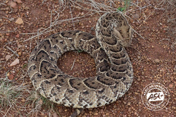
  <figcaption>Puff adder (<em>Bitis arietans</em>)</figcaption>

  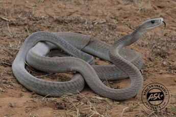
  <figcaption>Black mamba (<em>Dendroaspis polylepis</em>)</figcaption>

  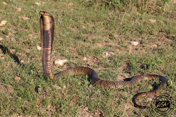
  <figcaption>Egyptian cobra (<em>Naja haje</em>)</figcaption>

  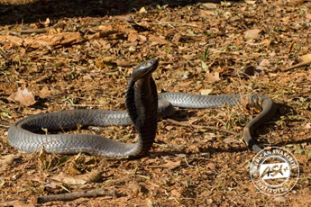
  <figcaption>Black-necked spitting cobra (<em>Naja nigricollis</em>)</figcaption>

  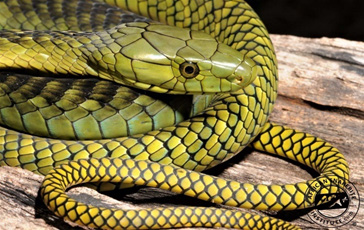
  <figcaption>Jameson’s mamba (<em>Dendroaspis jamesoni</em>)</figcaption>

  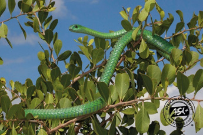
  <figcaption>Boomslang (<em>Dispholidus typus</em>)</figcaption>

  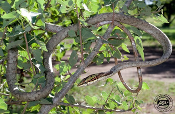
  <figcaption>Vine, bird, twig or tree snake (<em>Thelotornis spp.</em>)</figcaption>

  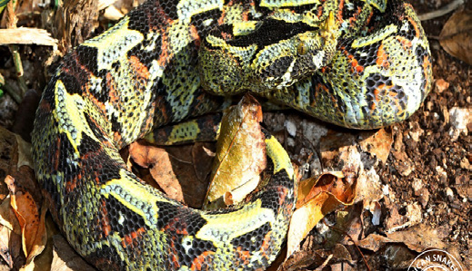
  <figcaption>Rhino-horned viper (<em>Bitis nasicornis</em>)</figcaption>

  
  <figcaption>Egyptian cobra (<em>Naja haje</em>)</figcaption>

  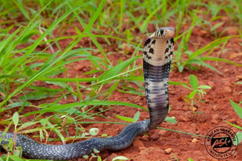
  <figcaption>Eastern forest cobra (<em>Naja subfulva</em>)</figcaption>

  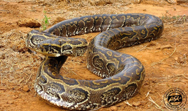
  <figcaption>Rock python (<em>Python sebae</em>)</figcaption>

  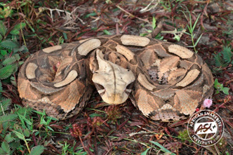
  <figcaption>Gaboon adder (<em>Bitis gabonica</em>)</figcaption>

  
  <figcaption>Battersby’s green snake (<em>Philothamnus battersbyi</em>)</figcaption>

  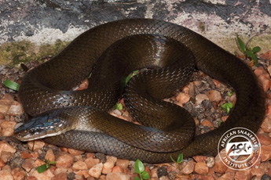
  <figcaption>Olive house snake (<em>Lycodonomorphis inornatus</em>)</figcaption>

#### 1.2.1.2 Insect Bites and Stings

**ICD-10 CODE:** T63.4

**Causes**

- Bees, wasps, hornets, and ants. The venom is usually mild and causes only local reaction, but may cause anaphylactic shock in previously sensitized persons.
- Spiders and scorpions. Most are non-venomous or only mildly venomous.
- Other stinging insects.

**Clinical features**

- Swelling, discolouration, burning sensation, and pain at the site of the sting.
- There may be signs of anaphylactic shock.

**Differential diagnosis**

- Allergic reaction

**Management**

| Management | LOC |
|---|---|
| If the sting remains implanted in the skin, carefully remove it with a needle or knife blade | HC2 |
| Apply cold water or ice | |
| If there is a severe local reaction, give chlorpheniramine 4 mg every 6 hours, maximum 24 mg daily, until swelling subsides | |
| Child 1–2 years: chlorpheniramine 1 mg every 12 hours | |
| Child 2–5 years: chlorpheniramine 1 mg every 6 hours, maximum 6 mg daily | |
| Child 6–12 years: chlorpheniramine 2 mg every 6 hours, maximum 12 mg daily | |
| Apply calamine lotion prn every 6 hours | |
| If scorpion sting is very painful, infiltrate 2 ml of lignocaine 2% around the area of the bite | |
| If there are signs of systemic envenomation, refer | |

**Prevention**

- Clear overgrown vegetation and bushes around the home.
- Prevent children from playing in the bush.
- Cover exposed skin while moving in the bush.
- Use pest control methods to clear insect colonies.

#### 1.2.1.3 Animal and Human Bites

**ICD-10 CODE:** W50.3, W54.0

**Clinical features**

- Teeth marks or scratches, lacerations
- Puncture wounds, especially from cats
- Complications may include bleeding, lesions of deep structures, wound infection by mixed flora or anaerobes, tissue necrosis, and transmission of diseases such as tetanus and rabies

**Management**

| Management | LOC |
|---|---|
| **First aid** | HC2 |
| Immediately clean the wound thoroughly with plenty of clean water and soap to remove any dirt or foreign bodies | |
| Stop excessive bleeding where necessary by applying pressure | |
| Rinse the wound and allow it to dry | |
| Apply an antiseptic: chlorhexidine solution 0.05% or povidone iodine solution 10% | |
| Soak puncture wounds in antiseptic for 15 minutes | |
| Thoroughly clean, explore, and debride the wound under local anaesthesia if possible | |
| As a general rule, do not suture bite wounds | |
| Refer wounds on hands and face, deep wounds, and wounds with tissue defects to hospital for surgical management | HC4 |
| **Tetanus prophylaxis** | |
| Give TT immunisation, tetanus toxoid 0.5 ml, if not previously immunised within the last 10 years | HC2 |

**Prophylactic antibiotics**

Prophylactic antibiotics are indicated in the following situations:

- Deep puncture wounds, especially from cats
- Human bites
- Severe deep or extensive wounds
- Wounds on the face, genitalia, or hands
- Wounds in immunocompromised hosts

| Treatment | LOC |
|---|---|
| Amoxicillin 500 mg every 8 hours for 5–7 days | HC2 |
| Child: amoxicillin 15 mg/kg per dose | |
| Plus metronidazole 400 mg every 12 hours | |
| Child: metronidazole 10–12.5 mg/kg per dose | |

> **Note**
> Do not use routine antibiotics for small uncomplicated dog bites or wounds.
>
#### 1.2.1.4 Rabies Post Exposure Prophylaxis

**ICD-10 CODE:** Z20.3, Z23

Post-exposure prophylaxis effectively prevents the development of rabies after contact with saliva of infected animals through bites, scratches, licks on broken skin, or mucous membranes.

For further details, refer to the Rabies Post-Exposure Treatment Guidelines, Veterinary Public Health Unit, Community Health Department, Ministry of Health, September 2001.

**General management**

**Dealing with the animal**

| Situation | Action | LOC |
|---|---|---|
| Animal can be identified and caught | If domestic, confirm rabies vaccination status | HC2 |
| No information on rabies vaccination, or wild animal | Quarantine for 10 days, only for dogs, cats, or endangered species; or kill humanely and send the head to the Veterinary Department for analysis | HC2 |
| No signs of rabies infection within 10 days | Release the animal and stop immunisation | HC2 |
| Animal shows signs of rabies infection | Kill the animal, remove the head, and send it to the Veterinary Department for verification of infection | HC2 |
| Animal cannot be identified | Presume the animal is infected and the patient is at risk | HC2 |

> **Notes**
> - Consumption of properly cooked rabid meat is not harmful.
> - Animals at risk include dogs, cats, bats, and other wild carnivores.
> - Non-mammals cannot harbour rabies.
>
**Dealing with the patient**

- The combination of local wound treatment plus passive immunisation with rabies immunoglobulin (RIG) plus vaccination with rabies vaccine (RV) is recommended for all suspected exposures to rabies.
- If RIG is not available, the patient should still be vaccinated with rabies vaccine alone.
- Since prolonged rabies incubation periods are possible, persons who present for evaluation and treatment even months after being bitten should be treated in the same way as if the contact occurred recently.
- Administration of rabies immunoglobulin and rabies vaccine depends on the type of exposure and the animal’s condition.

**Local wound treatment**

| Treatment | LOC |
|---|---|
| Prompt and thorough local wound treatment is an effective method to reduce risk of infection | HC2 |
| For mucous membrane contact, rinse thoroughly with water or normal saline | |
| If the wound is deep, give tetanus toxoid (TT) to prevent tetanus | |
| Local cleansing is indicated even if the patient presents late | |
| Do not suture the wound | |
| If the Veterinary Department confirms rabies infection, or if the animal cannot be identified or tested, give rabies vaccine with or without human rabies immunoglobulin as per the recommendations below | |

**Recommendations for rabies vaccination or serum**

| Nature of exposure | Condition of animal at time of exposure | Condition of animal 10 days later | Recommended action |
|---|---|---|---|
| Saliva in contact with skin but no skin lesion | Healthy | Healthy | Do not vaccinate |
| Saliva in contact with skin but no skin lesion | Healthy | Rabid | Vaccinate |
| Saliva in contact with skin but no skin lesion | Suspect/unknown | Healthy | Do not vaccinate |
| Saliva in contact with skin but no skin lesion | Suspect/unknown | Rabid | Vaccinate |
| Saliva in contact with skin but no skin lesion | Suspect/unknown | Unknown | Vaccinate |
| Saliva in contact with skin that has lesions, minor bites on trunk or proximal limbs | Healthy | Healthy | Do not vaccinate |
| Saliva in contact with skin that has lesions, minor bites on trunk or proximal limbs | Healthy | Rabid | Vaccinate |
| Saliva in contact with skin that has lesions, minor bites on trunk or proximal limbs | Suspect/unknown | Healthy | Vaccinate, but stop course if animal is healthy after 10 days |
| Saliva in contact with skin that has lesions, minor bites on trunk or proximal limbs | Suspect/unknown | Rabid | Vaccinate |
| Saliva in contact with skin that has lesions, minor bites on trunk or proximal limbs | Suspect/unknown | Unknown | Vaccinate |
| Saliva in contact with mucosae, serious bites to face, head, fingers, or multiple bites | Domestic or wild rabid animal or suspect | Suspect/unknown | Vaccinate and give antirabies immunoglobulin |
| Saliva in contact with mucosae, serious bites to face, head, fingers, or multiple bites | Domestic or wild rabid animal or suspect | Healthy after 10 days | Vaccinate, but stop course if animal is healthy after 10 days |

**Prevention**

- Vaccinate all domestic animals against rabies, e.g., dogs, cats, and others.

#### 1.2.1.5 Rabies Vaccine Schedules

**Administration of rabies vaccine (RV)**

The following schedules use purified Vero cell culture rabies vaccine (PVRV), which contains one intramuscular immunising dose, at least 2.5 IU, in 0.5 ml of reconstituted vaccine.

> **Important**
> Rabies vaccine and rabies immunoglobulin are both very expensive and should only be used when there is an absolute indication.
>
**Post-exposure vaccination in non-previously vaccinated patients**

Give rabies vaccine to all patients who are not vaccinated against rabies, together with local wound treatment. In severe cases, also give rabies immunoglobulin.

**2-1-1 intramuscular regimen**

This induces an early antibody response and may be particularly effective when post-exposure treatment does not include administration of rabies immunoglobulin.

| Day | Dose |
|---|---|
| Day 0 | One dose, 0.5 ml, in right arm plus one dose in left arm |
| Day 7 | One dose |
| Day 21 | One dose |

> **Notes on IM doses**
> - Doses are given into the deltoid muscle of the arm. In young children, the anterolateral thigh may also be used.
> - Never use the gluteal area, buttock, as fat deposits may interfere with vaccine uptake, making it less effective.
>
**Alternative 2-site intradermal (ID) regimen**

This uses PVRV intradermal doses of 0.1 ml, one fifth of the 0.5 ml IM dose of PVRV.

| Day | Dose |
|---|---|
| Day 0 | One dose of 0.1 ml in each arm, deltoid |
| Day 3 | One dose of 0.1 ml in each arm |
| Day 7 | One dose of 0.1 ml in each arm |
| Day 28 | One dose of 0.1 ml in each arm |

> **Notes on ID regimen**
> - Much cheaper as it requires less vaccine.
> - Requires special staff training in ID technique using 1 ml syringes and short needles.
> - Compliance with Day 28 is vital but may be difficult to achieve.
> - Patients must be followed up for at least 6–18 months to confirm the outcome of treatment.
> - If on malaria chemoprophylaxis, do not use.
>
**Post-exposure immunisation in previously vaccinated patients**

This applies to persons known to have previously received full pre-exposure or post-exposure rabies vaccination within the last 3 years.

| Regimen | Schedule |
|---|---|
| Intramuscular regimen | Day 0: one booster dose IM Day 3: one booster dose IM |
| Intradermal regimen | Day 0: one booster dose ID Day 3: one booster dose ID |

> **Note**
> If incompletely vaccinated or immunosuppressed, give the full post-exposure regimen.
>
**Passive immunisation with rabies immunoglobulin (RIG)**

Give RIG in all high-risk rabies cases irrespective of the time between exposure and start of treatment, but within 7 days of the first vaccine dose. Do not use RIG in a patient who was previously immunised.

**Human rabies immunoglobulin (HRIG)**

| Treatment | Details |
|---|---|
| HRIG dose | 20 IU/kg. Do not exceed this dose |
| Administration around wound | Infiltrate as much as possible of this dose around the wound or wounds. If there are multiple wounds and the quantity is insufficient, dilute 2 to 3 fold with normal saline |
| Remaining dose | Give the remainder IM into the gluteal muscle |
| Rabies vaccine | Follow this with a complete course of rabies vaccine |
| Timing | The first dose of vaccine should be given at the same time as the immunoglobulin, but at a site as far away as possible from the site where the immunoglobulin was injected |
| Bite at or near upper arm | If the bite is at or near the upper arm, do not infiltrate the wound with immunoglobulin unless the vaccine will not be injected in the deltoid muscle of that arm. If the wound near the deltoid is infiltrated with immunoglobulin, use the deltoid muscle of the opposite arm for the vaccine |

> **Note**
> If RIG is not available at the first visit, its administration can be delayed up to 7 days after the first dose of vaccine.
>
**Pre-exposure immunisation**

Offer rabies vaccine to persons at high risk of exposure, such as:

- Laboratory staff working with rabies virus
- Veterinarians
- Animal handlers
- Zoologists and wildlife officers
- Any other persons considered to be at high risk

| Day | Dose |
|---|---|
| Day 0 | One dose IM or ID |
| Day 7 | One dose IM or ID |
| Day 28 | One dose IM or ID |

### 1.2.2 Fractures

**ICD-10 CODE:** S00–T88

**Causes**

- Trauma, e.g., road traffic accident, assault, falls, sports injuries
- Bone weakening by disease, e.g., cancer, TB, osteomyelitis, osteoporosis

**Clinical features**

- Pain, tenderness, swelling, deformity
- Inability to use or move the affected part
- May be open, with a wound, or closed

**Differential diagnosis**

- Sprain or dislocation
- Infection of bone, joints, or muscles
- Bone cancer

**Investigations**

- X-ray: 2 views, AP and lateral, including the joints above and below the fracture

**Management**

Suspected fractures should be referred to HC4 or hospital after initial care.

| Treatment | LOC |
|---|---|
| If polytrauma, assess and manage airways | HC2 |
| Assess and treat shock. See section 1.1.2 | |
| For closed fractures, assess nerve and blood supply distal to the injury | |
| If there is no sensation or pulse, refer as an emergency | |
| Immobilise the affected part with a splint | |
| Apply ice or cold compresses | |
| Elevate any involved limb | |
| Give tetanus toxoid if not fully vaccinated | HC3 |
| Start antibiotic: amoxicillin 500 mg every 8 hours | |
| Child: amoxicillin 25 mg/kg every 8 hours or 40 mg/kg every 12 hours | |
| If there is severe soft tissue damage, add gentamicin 2.5 mg/kg every 8 hours | |
| Refer urgently to hospital for further management | HC4 |

> **Note**
> Treat sprains, strains, and dislocations as above.
>
> **Caution**
> Do not give pethidine or morphine for rib fractures and head injuries, as they may cause respiratory depression.
>
### 1.2.3 Burns

**ICD-10 CODE:** T20–T25

**Causes**

- Thermal, e.g., hot fluids, flame, steam, hot solids, sun
- Chemical, e.g., acids, alkalis, and other caustic chemicals
- Electrical, e.g., domestic low voltage, high voltage transmission lines
- Radiation, e.g., exposure to excess radiotherapy or radioactive materials

**Clinical features**

- Pain and swelling
- Skin changes, e.g., hyperaemia, blisters, singed hairs
- Skin loss, e.g., eschar formation, charring
- Reduced ability to use the affected part
- Systemic effects in severe or extensive burns, including shock, low urine output, generalised swelling, respiratory insufficiency, and deteriorated mental state
- Breathing difficulty, hoarse voice, and cough in smoke inhalation injury, which is a medical emergency

**Criteria for classification of the severity of burns**

The following criteria are used to classify burns:

| Criteria | Description |
|---|---|
| Depth of the burn | Depends on the temperature, agent, and duration of contact with the skin |
| Percentage of total body surface area (TBSA) | Small areas are estimated using the open palm of the patient to represent 1% TBSA. Large areas are estimated using the rule of nines or a Lund and Browder chart. Count all areas except those with erythema only |
| Body parts injured | Burns of the face, neck, hands, feet, perineum, and major joints are considered severe |
| Age and general condition | Children and elderly patients generally need more care. A person who is sick or debilitated at the time of the burn will be more affected than one who is healthy |

**Depth of burns**

| Burn depth | Description |
|---|---|
| 1st degree burns | Superficial epidermal injury with no blisters. Main signs are redness of the skin, tenderness, or hypersensitivity with intact two-point discrimination. Healing occurs in about 7 days |
| 2nd degree or partial thickness burns | Dermal injury subclassified as superficial or deep 2nd degree burns. In superficial 2nd degree burns, blisters occur, the wound is pink, moist, and painful. A thin eschar is formed. Healing occurs in 10–14 days. In deep 2nd degree burns, blisters are lacking, the wound is pale and moderately painful, and a thick eschar is formed. Healing takes more than 1 month and may require surgical debridement |
| 3rd degree burns | Full thickness skin destruction with leather-like rigid eschar. Painless on palpation or pinprick. Requires skin graft |
| 4th degree burns | Full thickness destruction of skin, fascia, muscles, or bone. The affected body part is lifeless |

**Categorisation of severity of burns**

Using the above criteria, a burn patient may be categorised as follows:

| Severity | Criteria |
|---|---|
| Minor or mild burn | Adult with <15% TBSA affected, or child/elderly patient with <10% TBSA affected, or full thickness burn with <2% TBSA affected and no serious threat to function |
| Moderate or intermediate burn | Adult with partial thickness burn affecting 15–25% TBSA, or child/elderly patient with partial thickness burn affecting 10–20% TBSA. These should have no serious threat to function and no cosmetic impairment of eyes, ears, hands, feet, or perineum |
| Major or severe burn | Adult with partial thickness burn affecting >25% TBSA or full thickness burn affecting >10% TBSA |
| Major or severe burn in child/elderly patient | Partial thickness burn affecting >20% TBSA or full thickness burn affecting >5% TBSA |
| Major or severe burn irrespective of age | Any burns of the face and eyes, neck, ears, hands, feet, perineum, and major joints with cosmetic or functional impairment risks; circumferential burns; chemical burns; high-voltage burns; inhalation burns; or any burn with associated major trauma |

**Chart for estimating percentage of total body surface area (TBSA) burnt**

Use Lund and Browder charts where available. Ignore simple erythema.

| Region | % |
|---|---|
| Head | |
| Neck | |
| Anterior trunk | |
| Posterior trunk | |
| Right arm | |
| Left arm | |
| Buttocks | |
| Genitalia | |
| Right leg | |
| Left leg | |
| Total burn | |

**Relative percentage of body surface area affected by growth**

| Area | Age 0 | 1 | 5 | 10 | 15 | Adult |
|---|---|---|---|---|---|---|
| A = ½ of head | 9½ | 8½ | 6½ | 5½ | 4½ | 3½ |
| B = ½ of one thigh | 2¾ | 3¼ | 4 | 4½ | 4½ | 4¾ |
| C = ½ of one lower leg | 2½ | 2½ | 2¾ | 3 | 3¼ | 3½ |

**Management**

**Mild or moderate burns: first aid**

| Treatment | LOC |
|---|---|
| Stop the burning process and move the patient to safety | HC1 |
| Roll on the ground if clothing is on fire | |
| Switch off electricity, if electrical injury is involved | |
| Cool the burn by pouring, showering, or soaking the affected area with cold water for 30 minutes, especially in the first hour after the burn | |
| Remove soaked clothes, wash off chemicals, and remove any constrictive clothing or rings | |
| Clean the wound with clean water | |
| Cover the wound with a clean dry cloth and keep the patient warm | |

**At health facility**

| Treatment | LOC |
|---|---|
| Give oral or IV analgesics as required | HC2 |
| If TBSA is <10% and the patient is able to drink, give oral fluids; otherwise consider IV fluids | |
| Give tetanus toxoid if not fully immunised | |
| Leave small blisters alone | |
| Drain large blisters and dress if closed dressing method is being used | |
| Monitor urine output. Normal urine output is 1–2 ml/kg/hour in children <30 kg and 0.5 ml/kg/hour, or 30–50 ml/hour, in adults | |
| Dress with silver sulphadiazine cream 1%, add saline-moistened gauze or paraffin gauze, and dry gauze on top to prevent seepage | HC3 |
| Small superficial 2nd degree burns can be dressed directly with paraffin gauze dressing | |
| Change dressing after 1–3 days, then as needed | |
| Patient may be exposed in a bed cradle if there are extensive burns | |
| Saline bath should be done before wound dressing | |
| If wound is infected, dress more frequently with silver sulphadiazine cream until infection is controlled | |

**Severe burns**

| Treatment | LOC |
|---|---|
| Provide first aid and wound management as above | HC3 |
| Give IV fluid replacement in a total volume per 24 hours according to the calculation below, using crystalloids such as Ringer’s lactate or normal saline | |
| If patient is in shock, run the IV fluids fast until BP improves. See section 1.1.2 | |
| Manage pain as necessary | |
| Refer for admission | |
| Monitor vital signs and urine output | |
| Use antibiotics if there are systemic signs of infection: benzylpenicillin 3 MU every 6 hours, with or without gentamicin 5–7 mg/kg IV or IM once a day | HC4 |
| Blood transfusion may be necessary | |
| If signs or symptoms of inhalation injury are present, give oxygen and refer for advanced life support at regional level | |

**Surgery**

| Treatment | LOC |
|---|---|
| Escharotomy and fasciotomy for circumferential finger, hand, limb, or torso burns | HC4 |
| Escharectomy to excise dead skin | |
| Skin grafting to cover clean deep burn wounds | |

**Eye injury**

| Treatment | LOC |
|---|---|
| Irrigate with abundant sterile saline | HC4 |
| Place eye pad over eye ointment and refer | |

**Additional care**

| Treatment | LOC |
|---|---|
| Nutritional support | |
| Physiotherapy of affected limb | |
| Counselling and psychosocial support | |
| Health education on prevention, e.g., epilepsy control | |

> **Caution**
> Silver sulphadiazine is contraindicated in pregnancy, breastfeeding, and premature babies.
>
**Fluid replacement in burns**

- The objective is to maintain normal physiology as shown by urine output, vital signs, and mental status.
- Fluid is lost from the circulation into the tissues surrounding the burns, and some is lost through the wounds, especially in the first 18–30 hours after the burns.
- Low intravascular volume results in tissue circulatory insufficiency, shock, and complications such as kidney failure and deepening of the burns.
- Fluid requirements are often very high and should be given as necessary to ensure adequate urine output.

| Treatment | LOC |
|---|---|
| Give oral fluids, ORS or others, and/or IV fluids such as normal saline or Ringer’s lactate, depending on the degree of loss of intravascular fluid | HC2/HC3 |
| The total volume of IV solution required in the first 24 hours after burns is: 4 ml × weight (kg) × % TBSA burned, plus the normal daily fluid requirement | |
| Give 50% of the fluid replacement in the first 8 hours and 50% in the next 16 hours | |
| Balance fluid input against clinical response, urine output, vital signs, and mental status | |

**Prevention**

- Promote public awareness of burn risks and first aid use of water in cooling burnt skin.
- Construct raised cooking fireplaces as a safety measure.
- Ensure safe handling of hot water and food, and keep them well out of reach of children.
- Take particular care of high-risk persons near fires, e.g., children, epileptic patients, and alcohol or drug users.
- Encourage people to use closed flames, e.g., hurricane lamps, and avoid candles.
- Beware of possible cases of child abuse.

### 1.2.4 Wounds

**ICD-10 CODE:** S00–T88

Any break in the continuity of the skin or mucosa, or disruption in the integrity of tissue due to injury.

**Causes**

- Sharp objects, e.g., knives, causing cuts or punctures
- Blunt objects causing bruises, abrasions, or lacerations
- Infections, e.g., abscess
- Bites, e.g., insect, animal, or human bites
- Missile and blast injury, e.g., gunshot wounds, mines, explosives, or landmines
- Crush injury, e.g., road traffic accident or building collapse

**Clinical features**

- Raw area of broken skin or mucous membrane
- Pain, swelling, bleeding, or discharge
- Reduced use of affected part
- Cuts: sharp edges
- Lacerations: irregular edges
- Abrasions: loss of surface skin
- Bruises: subcutaneous bleeding, e.g., black eye

**Management**

| Treatment | LOC |
|---|---|
| **Minor cuts and bruises** | HC2 |
| Provide first aid, tetanus prophylaxis, dressing, and pain management | |
| Antibiotics are not usually required | |
| If the wound is grossly contaminated, give cloxacillin or amoxicillin 500 mg every 6 hours as empiric treatment | |
| Child: cloxacillin or amoxicillin 125–250 mg every 6 hours | |
| **Deep and/or extensive wounds** | HC4 |
| Identify the cause of the wound or injury if possible | |
| Wash affected part and wound with plenty of water or saline solution | |
| If the wound is contaminated, clean with chlorhexidine 0.05% or hydrogen peroxide 6% diluted with an equal amount of saline to 3% | |
| Explore the wound under local anaesthesia to ascertain the extent of damage and remove foreign bodies | |
| Carry out surgical toilet and debridement to freshen the wound | |
| Provide tetanus prophylaxis, pain management, and immobilisation | |

**Wound closure**

| Situation | Management | LOC |
|---|---|---|
| Clean and fresh wound, <8 hours old | Carry out primary closure by suturing under local anaesthetic | HC3 |
| Local anaesthetic | Use lignocaine hydrochloride 2%. Dilute to 1% with equal volume of water for injection where needed | |
| Wound >8 hours old or dirty | Clean thoroughly and dress daily | |
| Wound review | Check the state of the wound for 2–3 days | |
| Delayed primary closure | Carry out delayed primary closure if clean. Use this for wounds up to 2–4 days old | |
| Wound >4 days old, deep puncture wound, contaminated wound, bite/gunshot wound, or abscess cavity | Let it heal by secondary closure through granulation tissue | |
| Dressing frequency | Dress daily if contaminated or dirty; dress every other day if clean | |
| Cavities, e.g., abscesses | Pack with saline-soaked gauze | |
| Extensive or deep wound | Consider closure with skin graft or flap | HC4 |

> **Note**
> - Use SOPs for collection of wound discharge or deep tissue and submit to the laboratory.
> - Start treatment and change treatment when results return.
> - If MDR, gram-negative infection, MRSA, or VRE is suspected or confirmed, implement the respective transmission-based precautions.
> - Where possible, use chlorine-releasing agents for environmental decontamination or alternate fumigation. Avoid formaldehyde.
>
>
### 1.2.5 Head Injuries

**ICD-10 CODE:** S00–S09

Head injuries may result from:

- Direct damage to the brain, including contusion, concussion, penetrating injury, or diffuse axonal damage
- Haemorrhage from rupture of blood vessels around and in the brain
- Severe swelling of the cerebral tissue, cerebral oedema

**Causes**

- Road traffic accident
- Assault, fall, or blow to the head

**Clinical features**

- May be closed, without a cut, or open, with a cut
- Swelling on the head, scalp haematoma
- Fracture of the skull, e.g., depressed area of the skull or open fracture where brain matter may be exposed
- Raccoon eyes, haematoma around the eyes, bleeding and/or leaking of CSF through nose or ears, which are signs of possible skull base fracture

**Severe head injury**

- Altered level of consciousness, agitation, or coma. See GCS below
- Seizures, focal neurological deficits, pupil abnormalities

**Minor head injury, concussion**

- Transient and short-lived loss of mental function, e.g., loss of consciousness <5 minutes, transient amnesia, headache, disorientation, dizziness, drowsiness, or vomiting
- Symptoms should improve by 4 hours after the trauma

**Severity classification of head injuries**

Head injuries are classified based on Glasgow Coma Scale (GCS) score as:

- Severe: GCS 3–8
- Moderate: GCS 9–13
- Mild: GCS >13

**Glasgow Coma Scale (GCS)**

| Score | Eye opening | Verbal response | Motor response |
|---|---|---|---|
| 1 | No response | No response | No response |
| 2 | Opens in response to pain | Incomprehensible sounds, grunting in children | Extension to painful stimuli, decerebrate |
| 3 | Opens in response to voice | Inappropriate words, cries or screams inappropriately in children | Abnormal flexion to painful stimuli, decorticate |
| 4 | Opens spontaneously | Disoriented but able to converse; uses words inappropriately or cries in children | Flexion/withdrawal from painful stimuli |
| 5 | N/A | Oriented and able to converse; uses words appropriately or cries appropriately in children | Localises pain |
| 6 | N/A | N/A | Obeys command, not applicable in children <1 year |

**AVPU scale for infants and children**

| AVPU | Response | Approximate GCS |
|---|---|---|
| A | Alert | GCS >13 |
| V | Responds to voice | GCS 13 |
| P | Responds to pain | GCS 8 |
| U | Unresponsive | GCS <8 |

> **Note**
> Mild injuries can still be associated with significant brain damage and can be divided into low and high risk according to the criteria below.
>
**Risk classification for mild head injury**

| Low risk mild head injury | High risk mild head injury |
|---|---|
| GCS 15 at 2 hours No focal neurological deficits No signs or symptoms of skull fracture No recurrent vomiting No risk factors such as age >65 years, bleeding disorders, or dangerous mechanism Brief loss of consciousness <5 minutes and post-traumatic amnesia <30 minutes | GCS <15 at 2 hours Deterioration of GCS Focal neurological deficits Clinical suspicion of skull fracture Recurrent vomiting Known bleeding disorder Age >65 years Post-traumatic seizure Loss of consciousness >5 minutes Persistent amnesia Persistent abnormal behaviour Persistent severe headache |

**Investigations**

- Skull X-ray is useful only to detect fracture
- CT scan is the gold standard for detection of head injury

**Differential diagnosis**

- Alcoholic coma, which may occur together with a head injury
- Hypoglycaemia
- Meningitis
- Poisoning
- Other causes of coma

**Management: general principles**

Management depends on:

- GCS and clinical features at first assessment
- Risk factors, including mechanism of trauma, age, and baseline conditions
- GCS and clinical features at follow-up

| Treatment | LOC |
|---|---|
| Assess mechanism of injury to assess risk of severe injury, which may not be apparent at the beginning | HC3 |
| Assess medical history to assess risk of complications, e.g., elderly patient or anticoagulant treatment | |
| Assess level of consciousness using GCS or AVPU | |
| Perform general examination, including ears, and neurological examination, including pupils, motor and sensory examination, and reflexes | |
| Assess other possible trauma, especially if road traffic accident, e.g., abdominal or chest trauma | |
| Do not sedate | |
| Do not give opioids | |
| Do not give NSAIDs because of risk of bleeding | |

**Low-risk and high-risk mild head injury**

| Low-risk mild head injury | High-risk mild head injury |
|---|---|
| No persistent headache No large haematoma or laceration Isolated head injury No risk of wrong information | Large scalp haematoma Polytrauma Dangerous mechanism, e.g., fall from height or car crash Unclear information |

**Management of moderate head injury**

| Treatment | LOC |
|---|---|
| Maintain systolic BP >90 mmHg | H |
| Monitor GCS, pupils, and neurological signs | |
| Do early CT if available; otherwise observe and refer immediately if not improving in the following hours | |

**Management of severe traumatic head injury**

| Treatment | LOC |
|---|---|
| Do early CT if available; otherwise observe and refer immediately if not improving in the following hours | NR |
| Refer immediately for specialist management | |
| Provide supportive care as per moderate head injury | |
| If open head injury, give first dose of antibiotic before referral: ceftriaxone 2 g IV | |
| Child: ceftriaxone 100 mg/kg | |

**Prevention**

- Careful defensive driving to avoid accidents
- Use of safety belts by motorists
- Wearing helmets by cyclists, motorcyclists, and people working in hazardous environments
- Avoid dangerous activities, e.g., climbing trees

#### 1.2.5.1 Traumatic Spinal Injury

Early recognition of spinal injury is important.

Immobilisation with a rigid cervical collar or thoracolumbar corset helps prevent further nerve damage.

**Decompression**

- Non-operative: skull traction, skin traction of lower limbs
- Operative: e.g., discectomy, anterior or posterior spinal decompression surgery

### 1.2.6 Sexual Assault/Rape

**ICD-10 CODE:** Z04.4

Rape is typically defined as oral, anal, or vaginal penetration that involves threats or force against an unwilling person.

Such penetration, whether wanted or not, is considered statutory rape if the victim is younger than the age of consent, 18 years.

Sexual assault or any other sexual contact that results from coercion is rape. This includes seduction of a child through offers of affection or bribes. It also includes being touched, grabbed, kissed, or shown genitals.

**Clinical features**

Rape may result in the following:

- Extragenital injury
- Genital injury, usually minor, although some vaginal lacerations can be severe
- Psychological symptoms, often the most prominent
- Short-term symptoms such as fear, nightmares, sleep problems, anger, and embarrassment
- Long-term symptoms such as post-traumatic stress disorder, an anxiety disorder
- Shame, guilt, or a combination of both
- Sexually transmitted infections, e.g., hepatitis, syphilis, gonorrhoea, chlamydial infection, trichomoniasis, and HIV infection
- Pregnancy

Symptoms of post-traumatic stress disorder may include:

- Re-experiencing, e.g., flashbacks, intrusive upsetting thoughts, or images
- Avoidance, e.g., avoidance of trauma-related situations, thoughts, and feelings
- Hyperarousal, e.g., sleep difficulties, irritability, and concentration problems

Symptoms may last for more than 1 month and significantly impair social and occupational functioning.

**Investigations**

- Pregnancy test
- HIV test
- Hepatitis B test
- RPR test

**Management**

Whenever possible, assessment of a rape case should be done by a specially trained provider. Victims are traumatised and should be approached with empathy and respect. Explain each step and ask for consent before undertaking it.

The goals are:

- Medical assessment and treatment of injuries
- Assessment, treatment, and prevention of pregnancy and STIs
- Collection of forensic evidence
- Psychological evaluation and support

| Treatment | LOC |
|---|---|
| Advise the patient not to throw away or change clothing, wash, shower, douche, brush teeth, or use mouthwash, as doing so may destroy evidence | HC2 |
| Conduct initial assessment, history, and examination using standard forms if available | HC4 |
| Document the type of injuries sustained, particularly injuries to the mouth, breasts, vagina, and rectum | |
| Document any bleeding or abrasions on the patient or assailant to help assess the risk of transmission of HIV and hepatitis | |
| Document the description of the attack, including orifices penetrated, whether ejaculation occurred, and whether a condom was used | |
| Document assailant’s use of aggression, threats, weapons, and violent behaviour | |
| Document description of the assailant | |
| Document use of contraceptives to assess risk of pregnancy and previous coitus to assess validity of sperm testing | |
| Clearly describe the size, extent, and nature of any injury | |
| If possible, take photos of the lesions with the patient’s consent | |
| Test for HIV, RPR, hepatitis B, and pregnancy to assess baseline status of the patient | |
| If possible, test for flunitrazepam and gamma hydroxybutyrate, also called “rape drugs” | |

**Forensic evidence collection**

Collect forensic evidence using standard kits if available. Evidence may include:

- Condition of clothing, e.g., damaged, stained, or with adhering foreign material
- Small samples of clothing, including an unstained sample, given to the police or laboratory
- Hair samples, including loose hairs adhering to the patient or clothing, semen-encrusted pubic hair, and clipped scalp and pubic hairs of the patient, at least 10 of each for comparison
- Semen samples from the cervix, vagina, rectum, mouth, and thighs
- Blood sample from the patient
- Dried samples of the assailant’s blood from the patient’s body and clothing
- Urine and saliva
- Smears of buccal mucosa
- Fingernail clippings and scrapings
- Other specimens as indicated by the history or physical examination

**Medical prophylaxis and treatment**

| Treatment | LOC |
|---|---|
| Provide prophylaxis for STIs | HC4 |
| Ceftriaxone 1 g IM or cefixime 400 mg orally stat | |
| Azithromycin 1 g stat or doxycycline 100 mg twice a day for 1 week | |
| Metronidazole 2 g stat | |
| Provide HIV post-exposure prophylaxis if within 72 hours | |
| Adults: TDF + 3TC + ATV/r for 28 days | |
| Children: ABC + 3TC + LPV/r | |
| Give hepatitis B vaccine if not already immunised | |
| Give emergency contraception if within 72 hours. It may still be useful up to 5 days after exposure | |
| Levonorgestrel 1.5 mg. Double the dose if the patient is HIV positive and on ARVs | |

**Counselling and referral**

| Service | Details |
|---|---|
| Counselling | Use common sense measures such as reassurance, general support, and a non-judgmental attitude to relieve strong emotions of guilt or anxiety |
| Long-term psychosocial support | Provide referral or linkage |
| Legal counselling | Provide referral or linkage |
| Police investigations and restraining orders | Provide referral or linkage where appropriate |
| Child protection services | Provide referral or linkage where appropriate |
| Economic empowerment and emergency shelters | Provide referral or linkage where available |
| Long-term case management | Provide referral or linkage |

> **Notes**
> - Because the full psychological effects cannot always be ascertained at the first examination, follow-up visits should be scheduled at 2-week intervals.
> - Health facilities should use HMIS 105 to report Gender-Based Violence (GBV).
>
**Harm classification for police reporting**

| Classification | Description |
|---|---|
| Harm | Any bodily hurt, disease, or disorder, whether permanent or temporary |
| Grievous harm | Harm which amounts to maim or dangerous harm, seriously or permanently injures health, causes permanent disfigurement, or causes permanent injury to any internal or external organ, membrane, or sense |
| Dangerous harm | Harm endangering life |
| Maim | Destruction or permanent disabling of any external organ, membrane, or sense |

## 1.3 Poisoning

### 1.3.1 General Management of Poisoning

**ICD-10 CODE:** T36–T50

Bodily entry of toxic substances in amounts that cause dysfunction of body systems.

**Causes**

- Microorganisms, e.g., food poisoning
- Fluids and gases, e.g., agricultural chemicals, petrol, paraffin, carbon monoxide
- Metal poisoning, e.g., lead, mercury, copper
- Alcohol, drugs of abuse, and medicines taken in excessive amounts

Acute poisoning can occur by ingestion, inhalation, injection, or cutaneous/mucosal absorption.

Exposure can be intentional, unintentional, e.g., medication error, or environmental/occupational.

**Principles of general management**

- If possible, refer patients showing signs of poisoning to hospital for admission. Send a note of what is known about the poison and what treatment has been given.
- Also refer or admit patients who have taken slow-acting poisons even if they appear well. These include acetylsalicylic acid, iron, paracetamol, tricyclic antidepressants, paraquat, and modified-release products.
- Optimal management of the poisoned patient depends on the specific poison involved, the presenting and predicted severity of illness, and the time elapsed between exposure and presentation.
- Treatment includes supportive care, decontamination, antidotal therapy, and enhanced elimination techniques.
- It may not always be possible to identify the poison and the amount taken.
- Only a few poisons have specific antidotes.
- Few patients need active removal of the poison.
- Most patients must be treated symptomatically.

Knowledge of the poison helps to anticipate the likely effects on the patient.

**Supportive treatment in poisoning**

| Treatment | LOC |
|---|---|
| Ensure safety of the patient and minimise or stop exposure, e.g., wash or clean skin with water and soap | HC2 |
| Monitor and stabilise all vital signs: blood pressure, heart rate, respiratory rate, oxygen saturation, and temperature | |

| Treatment | LOC |
|---|---|
| **Airway and breathing** | HC2/HC4 |
| Ensure the airway is cleared and maintained | |
| Insert an airway cannula if necessary | |
| Position patient semi-prone to minimise risk of inhalation of vomit | |
| Assist ventilation if necessary | |
| Administer oxygen if necessary | |
| **Blood pressure** | HC2 |
| Hypotension is common in severe poisoning with CNS depressants. A systolic BP <70 mmHg may cause irreversible brain or renal damage | |
| Carry the patient head-down on the stretcher and nurse in this position in the ambulance | |
| **Fluid management** | HC3 |
| Set up an IV normal saline line | |
| Fluid depletion without hypotension is common after prolonged coma and after aspirin poisoning due to vomiting, sweating, and hyperpnoea | |
| Hypertension is less common but may be associated with sympathomimetic poisoning, e.g., amphetamines, cocaine, pseudoephedrine | |
| **Heart** | HC4 |
| Cardiac conduction defects and arrhythmias may occur in acute poisoning, especially with tricyclic antidepressants, but usually respond to correction of hypoxia or acidosis | |

| Treatment | LOC |
|---|---|
| **Body temperature** | HC2 |
| Hypothermia may develop in patients with prolonged unconsciousness, especially after overdose of barbiturates or phenothiazines, e.g., chlorpromazine, trifluoperazine | |
| Hypothermia may be missed unless temperature is monitored | |
| Treat hypothermia by covering the patient with a blanket | |
| Hyperthermia may occur with anticholinergics and sympathomimetics | |
| Treat hyperthermia by tepid sponging and antipyretics if appropriate | |
| **Convulsions** | HC2/HC3 |
| Diazepam 10 mg rectally, repeated if necessary | |
| Child: diazepam 0.5 mg/kg per dose; 1.5–2.5 mg if <1 month, 5 mg if 1 month–2 years, 5–10 mg if 2–12 years | |
| Or diazepam 5–10 mg slow IV repeated if necessary, maximum 30 mg | |
| Child: 200 micrograms/kg, 0.2 mg/kg, maximum 10 mg | |
| **Other considerations** | HC4 |
| Counsel patient and family concerning poisoning | |
| A mental health evaluation is necessary if poisoning was intentional | |
| If exposure was environmental or occupational, follow up to assess if other people have been affected and take appropriate measures | |

#### 1.3.1.2 Removal and Elimination of Ingested Poison

Removal and elimination of poison, decontamination, should be implemented after stabilisation of vital signs.

**Removal from the stomach**

- Balance the dangers of attempting to empty the stomach against the likely toxicity of the swallowed poison, the amount swallowed, and the risk of inhalation.
- Do not induce vomiting.
- Gastric lavage is only useful if done within 2 hours of poisoning, except with salicylates or anticholinergics where it may be useful within 4–6 hours.
- Gastric lavage is seldom practicable or necessary before the patient reaches hospital.

**Contraindications to gastric lavage**

- Drowsy or comatose patient
- Poisoning with corrosive or petroleum products

**Prevention of absorption and active elimination**

Oral activated charcoal can bind many poisons in the stomach and reduce their absorption.

- It is more effective the sooner it is given, but may still work up to 2 hours after poisoning.
- It may work for longer with modified-release products and anticholinergics.

**Contraindications to activated charcoal**

- Depressed mental status
- Late presentation
- Ingestion of corrosives and petroleum products
- Toxins poorly absorbed by charcoal, e.g., metals such as iron, lithium, and alcohol
- Intestinal obstruction

Activated charcoal is generally safe and is especially useful for poisons toxic in small amounts, e.g., antidepressants.

| Treatment | LOC |
|---|---|
| **Prevention of absorption** | HC2 |
| Activated charcoal powder 50 g | |
| Child: 0.5–1 g/kg | |
| Grind tablets into fine powder before mixing with 100–200 ml of water, 50 g = 200 tablets of 250 mg | |
| If patient is unable to swallow the charcoal/water slurry, give by gastric lavage tube | |
| **Active elimination** | |
| Repeated doses of activated charcoal may be beneficial in some cases, e.g., acetylsalicylic acid, carbamazepine, phenobarbital, phenytoin, quinine, theophylline | |
| Give activated charcoal 50 g repeated every 4 hours | |
| Treat vomiting, as this may reduce the effectiveness of charcoal | |
| In case of intolerance, reduce dose and increase frequency, e.g., 25 g every 2 hours, or 12.5 g every hour | |

### 1.3.2 Acute Organophosphate Poisoning

**ICD-10 CODE:** T60.0

**Causes**

- Accidental exposure, e.g., contamination of food
- Intentional poisoning
- Occupational hazard, e.g., agricultural workers

**Clinical features**

- Patient may smell of the chemicals
- Constricted pupils
- Cold sweat, anxiety, restlessness
- Abdominal pain, diarrhoea and vomiting
- Twitching, convulsions
- Bradycardia
- Excessive salivation, difficulty in breathing, abundant respiratory secretions
- Headache, hypotension, urinary incontinence
- Coma

**Differential diagnosis**

- Other causes of poisoning
- Other causes of convulsions

**Management**

| Treatment | LOC |
|---|---|
| Remove contaminated clothing using gloves | HC4 |
| Wash contaminated skin with plenty of water | |
| Establish and maintain the airway | |
| Assisted respiration with air or oxygen may be required during the first 24 hours after poisoning | |
| Give IV fluids, e.g., normal saline prn for dehydration, hypovolaemia, and shock | |
| Prevent and treat convulsions with diazepam 10 mg IV | |
| Child: diazepam 0.2 mg/kg IV or 0.5 mg/kg rectal | |
| Give salbutamol 5 mg nebulisation if bronchospasm is present | |
| Child <5 years: salbutamol 2.5 mg nebulisation | |

| Treatment | LOC |
|---|---|
| Give atropine 2–4 mg IM or IV according to severity of poisoning | HC4 |
| Child: atropine 0.05 mg/kg per dose | |
| Double the atropine dose every 3–5 minutes until signs of atropinisation occur, such as stopping of bronchial secretions and bronchoconstriction | |
| Continuous infusion of atropine 0.05 mg/kg/hour may be necessary | |
| Reduce dose of atropine slowly over 24 hours while monitoring the patient’s status | |

| Treatment | LOC |
|---|---|
| Perform gastric lavage if the poison was ingested, up to 6 hours after ingestion, but consider risk of aspiration | HC4 |
| Give standard dose of activated charcoal if patient presents within 2 hours, up to 4 hours in selected cases | |
| Monitor patient for a few days because worsening can occur a few days after ingestion | |
| In moderate to severe poisoning, only if not responding to adequate doses of atropine, add pralidoxime mesylate 30 mg/kg IV over 30 minutes | |
| Child: pralidoxime mesylate 25–50 mg/kg IV | |
| Continue with infusion 8 mg/kg/hour | |
| Child: 10–20 mg/kg/hour | |

> **Note**
> Pralidoxime is only effective if given within 24 hours of poisoning.
>
**Prevention**

- Label agricultural and domestic pesticides properly. Do not use unlabelled bottles for pesticides.
- Store such products away from children.
- Wear protective clothing when using the products.

### 1.3.3 Paraffin and Other Petroleum Products Poisoning

**ICD-10 CODE:** T53.7

Includes paraffin, petrol, paint thinners, organic solvents, and turpentine.

**Clinical features**

- Patient may smell of paraffin or other petroleum product
- Burning sensation in mouth and throat
- Patient looks pale, transient cyanosis
- Vomiting, diarrhoea, bloody stools
- Cough, dyspnoea, wheezing, tachypnoea, nasal flaring due to chemical pneumonitis
- Lethargy, convulsions, difficulty in breathing

> **Important**
> The main risk is damage to lung tissue due to aspiration. Avoid gastric lavage or use of emetics as this may lead to inhalation of gastric contents and pneumonitis.
>
**Differential diagnosis**

- Other causes of poisoning
- Acute infections

**Management**

| Treatment | LOC |
|---|---|
| Treatment is supportive and symptomatic | HC4 |
| Remove clothes and wash skin if contaminated | |
| Avoid gastric lavage or use of an emetic | |
| Activated charcoal is not useful | |
| Give oxygen if patient has hypoxia | |

**Prevention**

- Store paraffin and other petroleum products safely, e.g., in a locked cupboard, out of reach of children.
- Do not store paraffin and other petroleum products in common beverage bottles.

### 1.3.4 Acetylsalicylic Acid (Aspirin) Poisoning

**ICD-10 CODE:** T39.0

Overdose of acetylsalicylic acid (ASA), due to consumption of >10 g of ASA in adults and 3 g in children.

**Clinical features**

- Mild to moderate toxicity after 1–2 hours: hyperventilation, tinnitus, deafness, nausea, vomiting, dizziness, vasodilation
- Severe toxicity: hyperpyrexia, convulsions, altered mental status, non-cardiac pulmonary oedema, coma
- Complex acid-base disturbances, including acidosis

**Management**

| Treatment | LOC |
|---|---|
| Stabilise vital signs | H |
| Give oxygen and IV fluids as necessary | |
| Gastric lavage may be worthwhile up to 4 hours after poisoning because stomach emptying is delayed | |
| Give activated charcoal 50 g repeated as needed every 4 hours, or 25 g repeated prn every 2 hours | |
| Activated charcoal delays absorption of any remaining salicylate | |
| Treat or prevent hypoglycaemia with dextrose 50% 50–100 ml | |
| Child: dextrose 10% 2–5 ml/kg | |

| Treatment | LOC |
|---|---|
| Tepid sponging for hyperpyrexia | RR |
| Treat convulsions with IV diazepam 10 mg prn | |
| Refer to higher level of care if coma, pulmonary oedema, renal insufficiency, or clinical deterioration occurs despite the above measures | |
| Treat acidosis and enhance renal excretion in symptomatic patients with sodium bicarbonate | |
| Bolus sodium bicarbonate 1–2 mEq/kg, maximum 100 mEq, over 3–5 minutes | |
| Follow with infusion of 50–75 mEq in 500 ml of dextrose 5%; run at 250 ml/hour in adults, or 1.5–2 times maintenance in children | |
| Maintain urine pH 7.5–8 | |

### 1.3.5 Paracetamol Poisoning

**ICD-10 CODE:** T39.1

Accidental or intentional intake of excessive amount of paracetamol. Toxic dose: >150 mg/kg or >7.5 g, and 200 mg/kg for children <6 years.

**Clinical features**

- First 24 hours: asymptomatic or non-specific symptoms such as nausea and vomiting, malaise, anorexia, and abdominal pain
- In mild poisoning, symptoms resolve and the patient recovers
- In severe poisoning, symptoms progress to the next phase
- In 24–72 hours: progressive signs of hepatic toxicity, e.g., right upper quadrant abdominal pain, enlarged tender liver, increased transaminases
- After 72 hours: signs and symptoms peak at 72–96 hours and may be followed by full recovery in 5–7 days or progression into irreversible hepatic failure, less frequently renal failure, and death

**Investigations**

- Monitor liver function
- Monitor renal function
- Monitor INR
- Rule out pregnancy because paracetamol crosses the placental barrier

**Management**

| Treatment | LOC |
|---|---|
| Give repeated doses of activated charcoal, 25–50 g every 4 hours | HC2/H |
| If ingestion was <2 hours, empty the stomach to remove any remaining medicine using gastric lavage | |
| Give acetylcysteine IV, preferably within 8 hours from ingestion; if patient presents later, give it anyway | |
| Acetylcysteine 150 mg/kg, maximum 15 g, in 200 ml dextrose 5% over 60 minutes | |
| Then acetylcysteine 50 mg/kg, maximum 5 g, in dextrose 5% 500 ml over 4 hours | |
| Then acetylcysteine 100 mg/kg, maximum 10 g, in dextrose 5% 1000 ml over 16 hours | |
| Provide supportive treatment | |

> **Note**
> Acetylcysteine may cause histamine release, mimicking an allergic reaction. If the patient is stable, slow the infusion. If bronchospasm occurs, stop the infusion.
>
### 1.3.6 Iron Poisoning

**ICD-10 CODE:** T45.4

Common in children due to the candy-like appearance of iron tablets. Ingestion of a quantity <40 mg/kg of elemental iron is unlikely to cause problems. Doses >60 mg/kg can cause serious toxicity.

> **Note**
> The common tablet of 200 mg of an iron salt contains 60–65 mg of elemental iron.
>
**Clinical features**

Clinical symptoms vary according to the time from ingestion.

| Time | Symptoms |
|---|---|
| Phase 1, 30 minutes to 6 hours | Initial symptoms due to corrosive action of iron in the gastrointestinal tract: nausea, vomiting which may be blood stained, abdominal pain, shock, metabolic acidosis |
| Phase 2, 6–12 hours | Symptoms improve or disappear |
| Phase 3, 12–48 hours | Severe shock, vascular collapse, metabolic acidosis, hypoglycaemia, convulsions, coma |
| Phase 4, 2–4 days | Liver and renal failure, pulmonary oedema |
| Phase 5, >4 days | Gastrointestinal scarring and obstruction in survivors |

**Management**

| Treatment | LOC |
|---|---|
| Give IV fluids to manage shock and hypovolaemia | NR |
| Use antidote if there are severe symptoms or metabolic acidosis | |
| Give desferrioxamine continuous infusion 15 mg/kg/hour in normal saline or glucose 5% | |
| Do not use desferrioxamine for more than 24 hours | |
| Increase IV fluids if BP drops | |
| Continue until metabolic acidosis clears or clinical condition improves | |
| Contraindication: renal failure/anuria | |

### 1.3.7 Carbon Monoxide Poisoning

Usually due to inhalation in confined spaces of smoke, car exhaust, or fumes caused by incomplete combustion of fuel gases, e.g., use of charcoal stoves in unventilated rooms.

**Cause**

- Carbon monoxide, a colourless and odourless non-irritating gas

**Clinical features**

Clinical features are due to hypoxia and may include:

- Headache, nausea, vomiting, dizziness, confusion, and weakness
- Collapse, seizures, coma, and death

**Management**

| Treatment | LOC |
|---|---|
| Move person to fresh air | HC4 |
| Clear the airway | |
| Give 100% oxygen using a non-rebreather mask as soon as possible | |
| Give IV fluids for hypotension | |
| Give diazepam for seizures | |

### 1.3.8 Barbiturate Poisoning

**ICD-10 CODE:** T42.3

Barbiturates are used in the treatment of epilepsy and convulsions, e.g., phenobarbital.

**Clinical features**

- Confusion, irritability, combativeness
- Drowsiness, lethargy
- Hypotension, bradycardia or tachycardia, progressing to shock
- Respiratory depression, progressing to coma

**Management**

| Treatment | LOC |
|---|---|
| Provide supportive care | H/RR |
| Give oxygen therapy | |
| Give IV fluids for hypotension | |
| Activated charcoal may be useful, but only if given within 1 hour from ingestion and if the patient is not drowsy because of risk of inhalation | |
| Refer for ventilatory support if necessary | |
| Alkalinisation may be used to increase renal excretion | |
| Sodium bicarbonate 1 mEq/kg bolus followed by infusion, specialist only | |

### 1.3.9 Opioid Poisoning

**ICD-10 CODE:** T40

**Clinical features**

- Respiratory depression
- Hypotension, hypothermia
- Pinpoint pupils
- Decreased mental status progressing to coma

**Management**

| Treatment | LOC |
|---|---|
| Gastric lavage if ingestion was within 1 hour from arrival or pills are visible in the stomach on X-ray | H |
| Activated charcoal is not effective | |
| Patients who are asymptomatic after 6 hours from ingestion most likely do not need specific treatment, but should be monitored for at least 12 hours | |
| Give IV fluids to manage shock and hypovolaemia | |

**Antidote**

| Treatment | LOC |
|---|---|
| Give naloxone 0.4–2 mg IV or IM | H |
| Repeat every 2–3 minutes if not improving, up to maximum 10 mg | |
| Child: naloxone 0.01 mg/kg, increase to 0.1 mg/kg if necessary | |
| Aim at restoring ventilation, not consciousness | |
| Repeated doses or infusion may be necessary | |
| Manage complications accordingly | |

> **Note**
> Naloxone doses used in acute poisoning may not be suitable for treating opioid-induced respiratory depression and sedation in palliative care and in chronic opioid use.
>
### 1.3.10 Warfarin Poisoning

**ICD-10 CODE:** T45.5

**Clinical features**

- Bleeding, which may be life threatening, either internal or from mucosae
- Usually evident 24 hours after ingestion

**Management**

| Treatment | LOC |
|---|---|
| Empty the stomach | HC2 |
| Give activated charcoal 50 g if presenting early | |
| Child: activated charcoal 25 g, or 50 g if severe | |
| Give phytomenadione, vitamin K1, 5 mg IV slowly | HC4/RR |
| Provide supportive treatment, including IV fluids, blood transfusion, and fresh frozen plasma if active bleeding is present | HC2 |

> **Note**
> Intoxication with rat poison may require prolonged treatment with vitamin K.
>
### 1.3.11 Methyl Alcohol (Methanol) Poisoning

**ICD-10 CODE:** T51.1

Methanol is used as an industrial solvent and is an ingredient of methylated spirits. It is often ingested for self-harm or as a substitute for alcohol. It can form in home-distilled crude alcohol due to incomplete conversion to ethanol. A dose >1 g/kg is potentially lethal because methanol is transformed into toxic metabolites and causes profound acidosis.

**Clinical features**

- Initial inebriation, similar to alcohol intoxication
- Latent asymptomatic period of 12–24 hours
- Headache, dizziness, nausea, vomiting, visual disturbances, CNS depression, and respiratory failure
- Toxic metabolites may cause severe acidosis and retinal or optic nerve damage

**Management**

| Treatment | LOC |
|---|---|
| Gastric aspiration and lavage may be used only if done within 2 hours of ingestion because methanol has very rapid absorption | H |
| Activated charcoal is not useful | |
| Give 1.5–2 ml/kg of oral alcohol 40%, e.g., waragi, whisky, or brandy, in 180 ml of water as a loading dose, orally or via NGT | |
| Maintenance dose: 0.3 ml/kg/hour | |
| Give sodium bicarbonate 50–100 ml IV over 30–45 minutes | |
| Check for and correct hypoglycaemia | |

### 1.3.12 Alcohol (Ethanol) Poisoning

**ICD-10 CODE:** T51

Alcohol poisoning may be acute or chronic.

#### 1.3.12.1 Acute Alcohol Poisoning

Symptoms of alcoholic poisoning following ingestion of a large amount of alcohol over a short period.

**Causes**

- Deliberate consumption of excessive alcohol in a short period of time
- Accidental ingestion, which may occur in children

**Clinical features**

- Smell of alcohol in the breath
- Slurred speech, uninhibited behaviour
- Altered cognition and perception
- Nausea and vomiting
- Excessive sweating, dilated pupils
- Hypoglycaemia and hypothermia
- In later stages, stupor and coma develop

As coma deepens, the following may appear:

- Thready pulse and falling BP
- Fall in body temperature
- Noisy breathing

**Differential diagnosis**

Other causes of coma include:

- Malaria and other intracranial infections
- Diabetes mellitus
- Head injury
- Stroke, cerebrovascular accident
- Low blood sugar, hypoglycaemia, due to other causes
- Poisoning by other medicines, e.g., narcotics
- Mental illness

**Investigations**

- Blood: alcohol content, glucose level
- Urine: glucose and protein
- Lumbar puncture

**Management**

| Treatment | LOC |
|---|---|
| Manage airway. Ventilation may be needed | H |
| Correct hypothermia and hypovolaemia if present | |
| Check and correct hypoglycaemia with dextrose 50%, 20–50 ml IV | |
| Give dextrose via NGT or rectal route if IV access is not available | |
| Maintain infusion of dextrose 5–10% until patient wakes up and can eat | |
| Give thiamine IV 100 mg in 1 L of dextrose 5% | |

#### 1.3.12.2 Chronic Alcohol Poisoning

Chronic alcohol poisoning may present with withdrawal syndrome and Wernicke encephalopathy.

**Withdrawal syndrome**

Symptoms may include:

- Mild symptoms such as anxiety, agitation, insomnia, tremors, palpitations, and sweating. If not progressing, these may resolve over 24–48 hours.
- Severe symptoms such as seizures and hallucinations, from 12 to 48 hours after the last drink.
- Very severe symptoms such as delirium tremens, characterised by hallucinations, disorientation, tachycardia, hypertension, hyperthermia, agitation, and diaphoresis.

In the absence of complications, symptoms of delirium tremens typically persist for up to seven days.

**Wernicke encephalopathy**

- Due to thiamine deficiency and common in chronic alcohol abuse
- Characterised by acute mental confusion, ataxia, unstable gait, and nystagmus/ophthalmoplegia, abnormal eye movements

**Management**

| Treatment | LOC |
|---|---|
| **Withdrawal syndrome** | HC3 |
| Provide supportive care, including IV fluids and nutrition | |
| Check and correct hypoglycaemia with dextrose 50%, 20–50 ml IV | |
| Give dextrose via NGT or rectal route if IV access is not available | |
| Maintain infusion of dextrose until patient wakes up and can eat | |
| Give diazepam 5–10 mg every 10 minutes until appropriate sedation is achieved | |
| Very high doses may be required | |
| Monitor respiration | |
| If not responding, consider phenobarbital 100–200 mg slow IV, but note the risk of respiratory depression and hypotension | HC4 |
| Give thiamine IV 100 mg in 1 L of dextrose 5% | |
| If delirium or hallucinations persist despite treatment, consider haloperidol 2.5–5 mg up to 3 times a day | |
| **Wernicke encephalopathy** | |
| Give thiamine 100 mg IV or IM every 8 hours for 3–5 days | |

> **Note**
> See section 9.1.1 for general management of alcohol use disorders.
>
### 1.3.13 Food Poisoning

**ICD-10 CODE:** A05

Illness caused by consumption of food or water contaminated by certain pathogenic microorganisms. It usually affects large numbers of people after ingestion of communal food in homes, hospitals, hotels, and parties.

**Causes**

- Can be infective or toxic
- Infective: by bacteria, e.g., *Salmonella typhimurium*, *Campylobacter jejuni*, *Bacillus cereus*
- Toxic: by toxins from *Staphylococcus aureus* and *Clostridium botulinum*

**Clinical features**

- Nausea, vomiting
- Intermittent abdominal pain, colic, with associated diarrhoea
- Fever, especially if poisoning is the infective type
- Often self-limiting

**Botulism**

- Paralysis of skeletal, ocular, pharyngeal, and respiratory muscles

**Differential diagnosis**

- Cholera, dysentery
- Other causes of stomach and intestinal infections

**Investigations**

- Good history and examination are important for diagnosis
- Stool microscopy, culture and sensitivity

**Management**

| Treatment | LOC |
|---|---|
| Establish the cause and treat accordingly | HC2 |
| Give oral fluids, ORS, or IV fluids, normal saline, for rehydration as required | |
| For pain, give paracetamol 1 g every 4–6 hours | |
| Child: paracetamol 10 mg/kg per dose | |
| If diarrhoea is severe and persistent or bloody, or if there is high fever, give an antibiotic for 3–7 days depending on response | |
| Ciprofloxacin 500 mg every 12 hours | |
| Child: ciprofloxacin 10 mg/kg per dose | |
| Or erythromycin 500 mg every 6 hours | |
| Child: erythromycin 10 mg/kg per dose | |

**Prevention**

- Heat cooked foods thoroughly before eating and avoid eating cold leftover cooked foods.
- Ensure adequate personal and domestic hygiene.

## 1.4 Hypoxaemia Management and Oxygen Therapy Guidelines

Hypoxaemia is a low concentration of oxygen in blood, or oxygen saturation (SpO₂) less than 90% in peripheral arterial blood, detected by pulse oximeter reading. Hypoxaemia is a life-threatening condition correlated with disease severity and is an emergency state. If left untreated for prolonged periods, it results in low tissue oxygen concentration, hypoxia, which can lead to death.

**Causes**

- Surgical causes: head injury and chest trauma
- Medical causes: severe asthma, pneumonia, sepsis, shock, malaria, COVID-19, heart failure, cardiac arrest, upper airway obstruction, severe anaemia, pertussis, and carbon monoxide poisoning
- Obstetric, gynaecological, and perioperative causes: obstructed labour, ruptured uterus, pre-eclampsia and eclampsia, and post-caesarean section complications
- Neonatal causes: transient tachypnoea of the newborn, hypoxic ischaemic encephalopathy, birth asphyxia, respiratory distress syndrome, and neonatal septicaemia

**Diagnosis**

Do a clinical assessment, including history taking for symptoms and physical examination for signs.

Pulse oximetry and blood gas analysis may be used. Clinical assessment alone is non-invasive but is associated with missed opportunities for diagnosis.

**Symptoms**

- Fast or very slow breathing
- Difficulty in breathing
- Inability to talk in complete sentences
- Extreme weakness
- Inability to feed
- Confusion, sleepiness, or agitation
- Convulsions

**Clinical features**

**Fast breathing rate for age, tachypnoea**

| Rate | Age | Implication |
|---|---|---|
| >60 breaths per minute | 0–2 months | Tachypnoea |
| >50 breaths per minute | 2–12 months | Tachypnoea |
| >40 breaths per minute | 12–59 months | Tachypnoea |
| >40 breaths per minute | 5–12 years | Tachypnoea |
| >20 breaths per minute | Adults | Tachypnoea |

> **Note**
> bpm means breaths per minute.
>
Other clinical features may include:

- Nasal flaring
- Head nodding
- Chest indrawing, including intercostal or subcostal recession
- Cyanosis, peripheral or central
- Prostration
- Glasgow Coma Scale <10/15
- Use of accessory muscles of respiration

**Management**

**Pulse oximetry use**

Always refer to the manufacturer’s insert or the steps outlined below for guidance on how to use the pulse oximeter.

Steps in conducting pulse oximetry:

- Turn on the pulse oximeter.
- Attach the oximeter probe to the finger or toe.
- Wait until there is a consistent pulse-wave signal before taking the reading. This may take 20–30 seconds.
- Record the reading and act accordingly.

**Interpreting pulse oximetry results**

| Reading | Interpretation |
|---|---|
| SpO₂ >90% without danger signs | Normal |
| SpO₂ <90% | Low oxygen concentration in blood, hypoxaemia |
| SpO₂ <92–95% in pregnancy | Low oxygen concentration in blood, hypoxaemia |
| SpO₂ <94% with danger signs | Low oxygen concentration in blood, hypoxaemia |

**Blood gas analysis**

Blood gas analysis directly measures the partial pressure of oxygen (PaO₂), carbon dioxide (PaCO₂), pH, and electrolyte concentration in blood. It is the most accurate method, but it is highly skill-dependent, expensive, and invasive.

**Treatment: oxygen therapy**

The treatment of hypoxaemia includes the use of medical oxygen, oxygen therapy, and specific treatment of the underlying cause.

**Indications**

Oxygen therapy is indicated for:

- All patients with documented hypoxaemia: arterial carbon dioxide tension (PaCO₂) <60 mmHg or peripheral arterial oxygen saturation (SpO₂) <90%
- Patients with danger or emergency signs irrespective of documented SpO₂ or PaCO₂
- Absent or obstructed breathing
- Features of severe respiratory distress
- Central cyanosis
- Convulsions
- Signs of shock
- Coma
- Acute conditions in which coma is suspected, such as acute asthma, severe trauma, acute myocardial infarction, and carbon monoxide poisoning
- Post-anaesthesia recovery
- Increased metabolic demand, such as severe burns, poisoning, multiple injuries, and severe infections

**Medical oxygen dosing and appropriate use of delivery device**

The dosing of oxygen depends on the age of the patient and severity of disease. The choice of appropriate delivery device depends on the amount or dose of oxygen to be delivered to the patient.

Titrate oxygen based on oxygen saturation and delivery device.

| Delivery device | Neonates | Infants, 1 month–1 year | Preschool age, 1–3 years | School age, ≥4 years | Adults | Comments |
|---|---|---|---|---|---|---|
| Nasal cannulae | 0.5–1.0 L/min | 1–2 L/min | 1–4 L/min | 1–6 L/min | | |
| Face mask | NA | NA | | 6–10 L/min | 6–10 L/min | Use at 5–7 L/min to avoid CO₂ rebreathing |
| Face mask with reservoir | NA | NA | NA | NA | 10–15 L/min | Reservoir must be filled correctly before administration |
| CPAP | Use when nasal cannulae fail to raise SpO₂ above 90% | Use when nasal cannulae fail to raise SpO₂ above 90% | Use when nasal cannulae fail to raise SpO₂ above 90% | Use when nasal cannulae fail to raise SpO₂ above 90% | NA | Bubble CPAP with modified nasal prongs can be run with an oxygen concentrator or cylinder. CPAP decreases atelectasis and respiratory fatigue and improves oxygenation |
| High-flow nasal cannula | NA | NA | NA | NA | | |

**Oxygen flow rate by illness severity**

| Category | Illness severity | FiO₂ | O₂ flow rate range | Average O₂ flow rate | Delivery device |
|---|---|---|---|---|---|
| 1 | Mild | 25–40% | 1–5 L/min | 3 L/min | Nasal cannula |
| 2 | Moderate | 40–60% | 6–10 L/min | 8 L/min | Face mask |
| 3 | Severe | 60–90% | 10–15 L/min | 13 L/min | Face mask with reservoir bag |
| 4 | Critical | 100% | 20–60 L/min | 40 L/min | High-flow nasal cannula |
| 5 | Mechanical ventilation | | 16–20 L/min | 18 L/min | Mechanical ventilation |

> **Notes**
> - For mild to moderate illness, start with 5 L/min by nasal cannula.
> - For older children and adults with severe disease, give 10–15 L/min via face mask with reservoir bag.
> - For older children and adults with mild to moderate disease, give 6–10 L/min via a simple face mask.
> - For children below 5 years of age who require >5 L/min of oxygen, the preferred delivery device is CPAP.
>
**Titration and weaning patients off oxygen**

**How to escalate or increase oxygen in non-responsive adult patients with consistent SpO₂ below 90%**

| Step | Action |
|---|---|
| 1 | Start oxygen therapy at 1–5 L/min using nasal prongs. Assess response |
| 2 | If there is worsening respiratory distress with SpO₂ <90%, use a simple face mask and give 5–10 L/min. Assess response |
| 3 | If there is worsening respiratory distress with SpO₂ <90%, use a mask with reservoir bag, ensure the bag is well inflated, and give 10–15 L/min. Assess response |
| 4 | If there is worsening respiratory distress with SpO₂ <90%, continue to seek a higher level of care and consider HFNO, CPAP, or BiPAP if available and oxygen supply is adequate |

**Advanced oxygen support options**

| Option | Suggested setting |
|---|---|
| HFNO | 30–60 L/min, may also adjust FiO₂ |
| CPAP | 10–15 cmH₂O |
| BiPAP | PS, ΔP 5–15; PEEP/EPAP 5–15 |

**Weaning patient off oxygen**

- Decrease the oxygen flow rate or dose if the patient stabilises or improves with SpO₂ above 90%.
- Decrease oxygen flow by 1–2 L/min once the patient is stable with oxygen saturation above 92%.
- Observe the patient for 2–3 minutes.
- Reassess after 15 minutes to ensure SpO₂ is still above 90%, by recording clinical examination and SpO₂.
- If the patient does not tolerate less oxygen, maintain the previous oxygen flow rate until the patient is stable, SpO₂ >92%.
- If the patient develops increased respiratory distress or SpO₂ falls below 90%, increase the oxygen flow rate to the previous rate until the patient is stable.
- If the patient remains stable after 15 minutes of reassessment and SpO₂ is >92%, continue to titrate oxygen down as tolerated.
- Recheck clinical status and SpO₂ after 1 hour for delayed hypoxaemia or respiratory distress.

**Basic use and maintenance of oxygen sources**

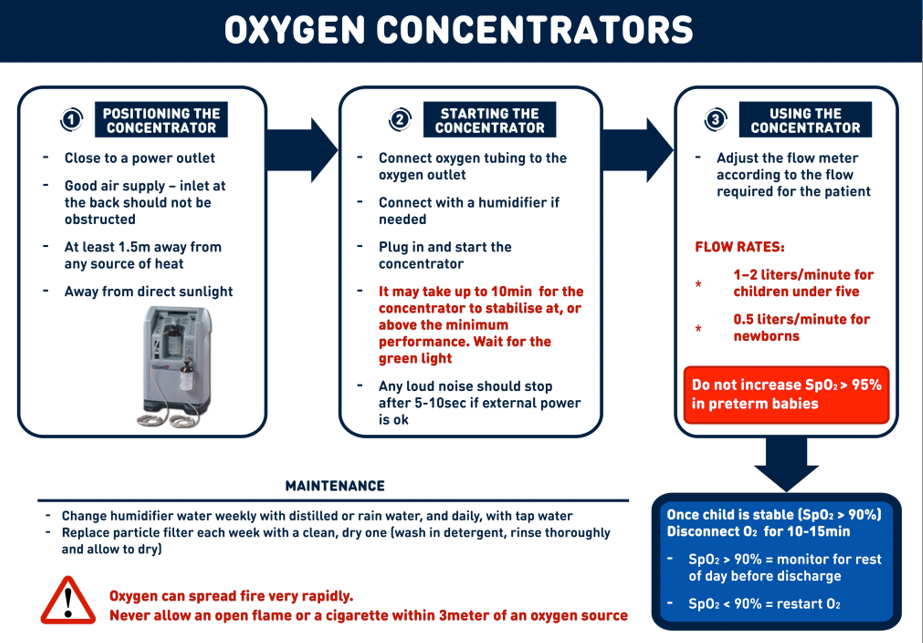

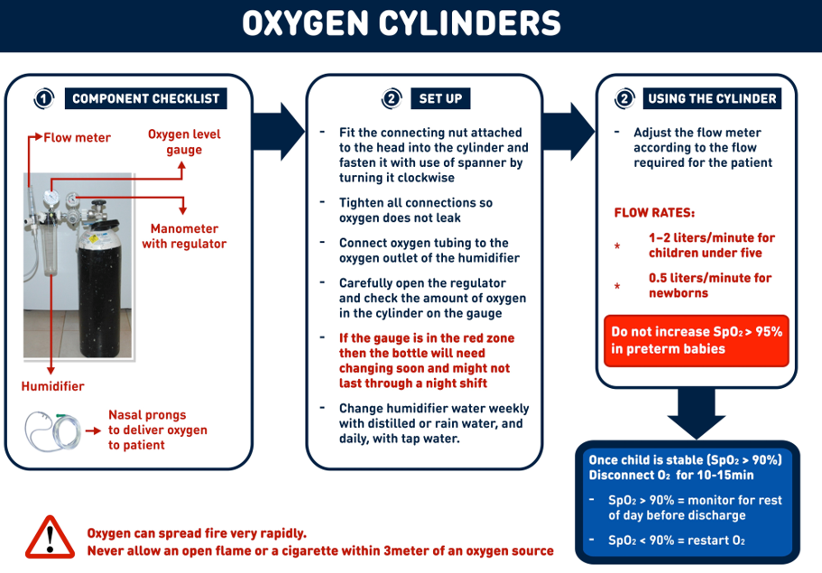
