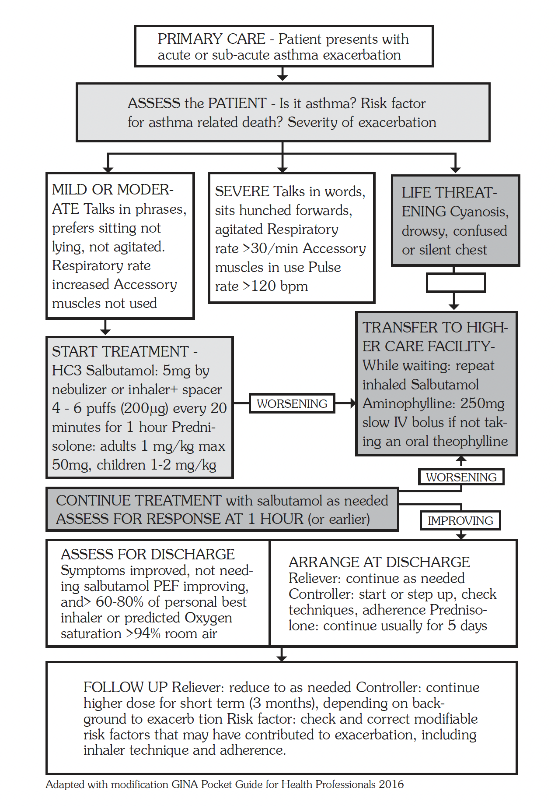
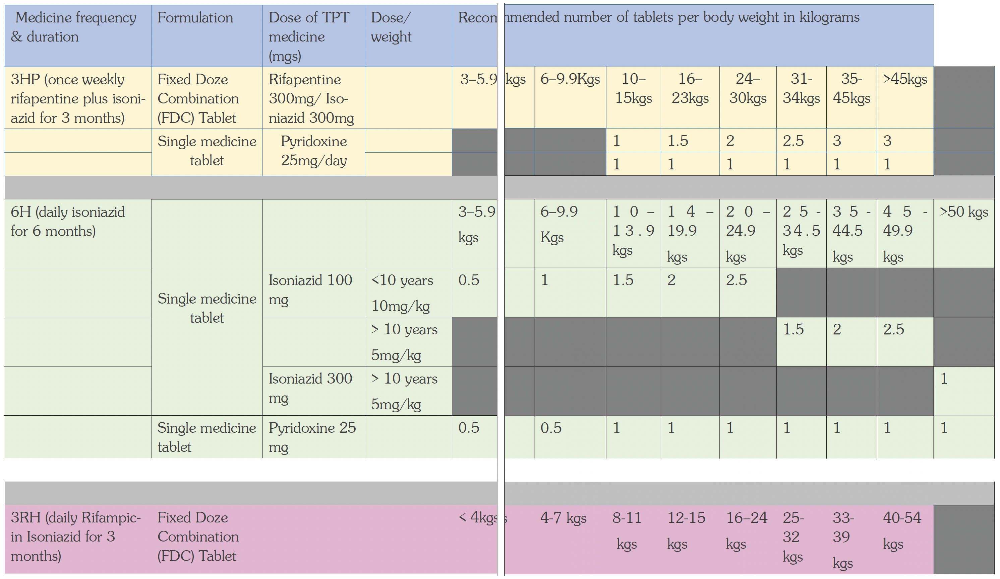
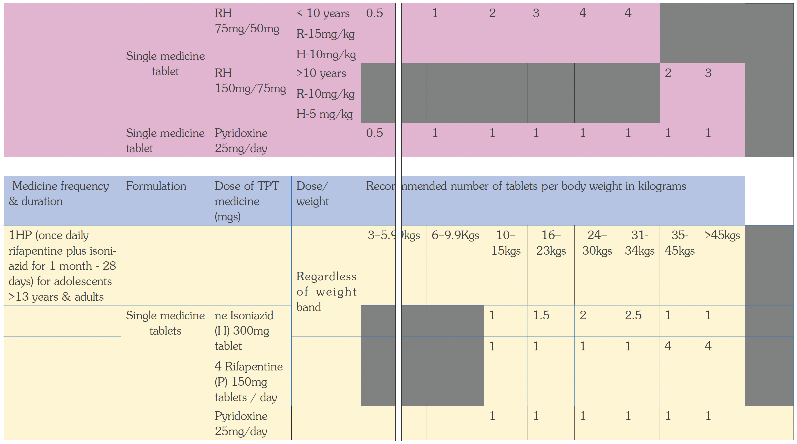
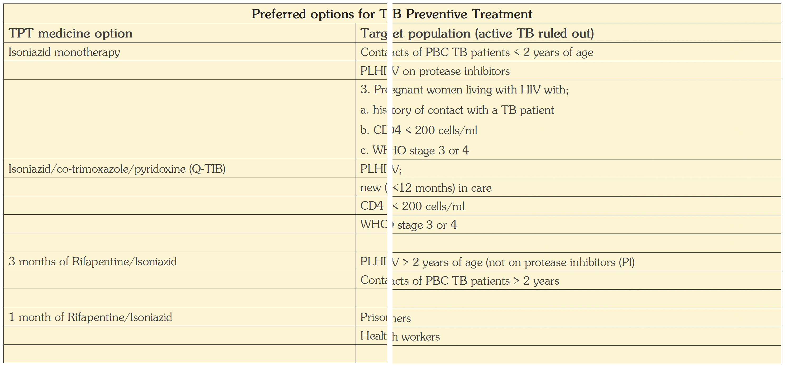

# Chapter 5: Respiratory Diseases

<!-- Source: 05-00-overview.md -->

## 5.1 Non-Infectious Respiratory Diseases

### 5.1.1 Asthma

Asthma is a chronic inflammatory disease of the airways which leads to muscle spasm, mucus plugging, and oedema. It results in recurrent wheezing, cough, breathlessness, and chest tightness.

Severe forms may present with failure to complete sentences and darkening of the lips, oral mucosa, or extremities due to cyanosis.

**Differential diagnosis**

- Heart failure
- Other causes of chronic cough
- Bronchiolitis
- Bronchiectasis

**Investigations**

Diagnosis is mainly based on clinical features.

Specialised investigations may include:

- Peak flow rate, where the peak flow rate increases after administration of a bronchodilator
- Spirometry, showing an increase in forced expiratory volume (FEV) of more than 12% after bronchodilation
- Sputum examination for eosinophilia
- Chest X-ray, if there is evidence of bacterial infection
- Complete blood count, if there is evidence of bacterial infection

**General principles of asthma management**

The four essential components of asthma management are:

- Patient education
- Control of asthma triggers
- Monitoring for changes in symptoms or lung function
- Pharmacologic therapy

The inhalation route is preferred because it delivers medicines directly to the airways, requires smaller doses, and reduces systemic side effects.

Examples include nebuliser solutions for acute severe asthma, usually given over 5 to 10 minutes and driven by oxygen in hospital.

In children with acute asthma attacks, use spacers to administer inhaler puffs.

The oral route may be used if inhalation is not possible, but systemic side effects occur more frequently, onset of action is slower, and higher doses are required.

The parenteral route should be used only in very severe cases when nebulisation is not adequate.

#### 5.1.1.1 Acute Asthma

An asthma attack is a substantial worsening of asthma symptoms. The severity and duration of attacks are variable and unpredictable. Most attacks are triggered by viral infections.

Assess severity using the table below.

**Assessment of severity**

| Severity | Children below 12 years | Adults and children >12 years |
|---|---|---|
| Mild to moderate | Able to talk in sentences.  Peak flow is >50% of predicted or personal best.  Pulse: - Child >5 years: <125 beats/minute - Child <5 years: <140 beats/minute  Respiratory rate: - Child >5 years: <30 breaths/minute - Child <5 years: <40 breaths/minute  SpO₂ ≥92%. | Able to talk.  Pulse <110 beats/minute.  Respiratory rate <25 breaths/minute.  Peak flow >50% of predicted or personal best.  SpO₂ ≥92%. |
| Severe | Cannot complete sentences in one breath, or too breathless to talk or feed.  Peak flow <50% of predicted or personal best.  Pulse: - Child >5 years: >125 beats/minute - Child <5 years: >140 beats/minute  Respiratory rate: - Child >5 years: >30 breaths/minute - Child <5 years: >40 breaths/minute  Use of accessory muscles for breathing in young children.  SpO₂ <92%. | Cannot complete sentences in one breath.  Pulse >110 beats/minute.  Respiratory rate >25 breaths/minute.  Peak flow <50% of predicted or personal best.  SpO₂ <92%. |
| Life-threatening | Silent chest, feeble respiratory effort, cyanosis, hypotension, bradycardia or exhaustion, agitation, reduced level of consciousness, peak flow <33% of predicted or personal best, or arterial oxygen saturation <92%. | Silent chest, feeble respiratory effort, cyanosis, hypotension, bradycardia or exhaustion, agitation, reduced level of consciousness, peak flow <33% of predicted or personal best, or arterial oxygen saturation <92%. |

> **Note**
> Not all features may be present. If the patient says they feel very unwell, listen to them.
>
**Management of asthma attacks**

| Severity / situation | Treatment | LOC |
|---|---|---|
| Mild to moderate asthma attack | Treat as an outpatient. | HC3 |
| Mild to moderate asthma attack | Reassure the patient and place the patient in a half-sitting position. | HC3 |
| Mild to moderate asthma attack | Give salbutamol inhaler 2 to 10 puffs via a large-volume spacer. | HC3 |
| Mild to moderate asthma attack | Alternatively, give salbutamol nebulisation 5 mg, or 2.5 mg in children. | HC3 |
| Mild to moderate asthma attack | Repeat salbutamol every 20 to 30 minutes if necessary. | HC3 |
| Mild to moderate asthma attack | Give prednisolone 50 mg, or 1 mg/kg in children. | HC3 |
| If not improving after 30 to 60 minutes, or if relapse occurs within 3 to 4 hours | Refer to a higher level of care. | HC3 |
| If improving | Send home with prednisolone 50 mg once daily for 5 days, or 1 mg/kg once daily in children for 3 days. | HC3 |
| If improving | Institute or step up chronic asthma treatment. See section 5.1.1.2. | HC3 |
| If improving | Follow up after 1 to 2 weeks. | HC3 |
| If improving | Instruct the patient on self-treatment and when to return. | HC3 |
| If improving | Review in 48 hours. | HC3 |
| Mild to moderate asthma attack | Do not give routine antibiotics unless there are clear signs of bacterial infection. | HC3 |

**Severe asthma attack**

Patients with severe asthma need to be referred to HC4 or hospital after initial treatment.

| Treatment | LOC |
|---|---|
| Admit the patient and place the patient in a half-sitting position. | HC4 |
| Give high-flow oxygen continuously, at least 5 L/minute, to maintain SpO₂ ≥94% if available. | HC4 |
| Give salbutamol inhaler 2 to 10 puffs via a large-volume spacer. | HC4 |
| Alternatively, give salbutamol nebulisation 5 mg, or 2.5 mg in children. | HC4 |
| Repeat salbutamol every 20 to 30 minutes if necessary during the first hour. | HC4 |
| Give prednisolone 50 mg, or 1 mg/kg in children. | HC4 |
| Alternatively, give hydrocortisone 100 mg IV every 6 hours, or 4 mg/kg IV every 6 hours in children, maximum 100 mg, until the patient can take oral prednisolone. | HC4 |
| Monitor response after nebulisation. | HC4 |
| If response is poor, give ipratropium bromide nebuliser 500 micrograms, or 250 micrograms in children below 12 years, every 20 to 30 minutes for the first 2 hours, then every 4 to 6 hours. | HC4 |
| Alternatively, give aminophylline 250 mg slow IV bolus, or 5 mg/kg in children, if the patient is not taking oral theophylline. | HC4 |

If symptoms have improved, respiration and pulse are settling, and peak flow is above 50%:

| Treatment | LOC |
|---|---|
| Step up the usual treatment. | HC4 |
| Continue prednisolone to complete 5 days of treatment. | HC4 |
| Review within 24 hours. | HC4 |
| Monitor symptoms and peak flow. | HC4 |
| Arrange a self-management plan. | HC4 |

**Life-threatening asthma attack**

Arrange immediate hospital referral and admission.

First aid:

| Treatment | LOC |
|---|---|
| Admit the patient and place the patient in a half-sitting position. | HC4 |
| Give high-flow oxygen continuously, at least 5 L/minute, to maintain SpO₂ ≥94% if available. | HC4 |
| Give salbutamol inhaler 2 to 10 puffs via a large-volume spacer. | HC4 |
| Alternatively, give salbutamol nebulisation 5 mg, or 2.5 mg in children. | HC4 |
| Repeat salbutamol every 20 minutes for 1 hour. | HC4 |
| Give hydrocortisone 100 mg IV stat, or 4 mg/kg IV in children, maximum 100 mg. | HC4 |
| Alternatively, give prednisolone 50 mg, or 1 mg/kg in children. | HC4 |
| Give ipratropium bromide nebuliser 500 micrograms, or 250 micrograms in children below 12 years, every 20 to 30 minutes for the first 2 hours, then every 4 to 6 hours. | HC4 |
| Monitor response for 15 to 30 minutes. | HC4 |
| If response is poor, give aminophylline 250 mg slow IV bolus, or 5 mg/kg in children, if the patient is not taking oral theophylline. | HC4 |

> **Note**
> The use of aminophylline and theophylline in the management of asthma exacerbations is discouraged because of poor efficacy and poor safety profile.
>

#### 5.1.1.2 Chronic Asthma

Chronic asthma management follows a stepped approach. Treatment should be reviewed regularly, and medicines should be stepped up or stepped down depending on asthma control.

**General principles of long-term asthma management**

Follow a stepped approach.

Before initiating a new medicine, check that:

- The diagnosis is correct.
- Adherence is adequate.
- Inhaler technique is correct.
- Trigger factors for acute exacerbations have been identified and addressed.

Start treatment at the step most appropriate to the initial severity.

**Rescue course**

A 3 to 5 day rescue course of prednisolone may be given at any step and at any time when required to control acute exacerbations of asthma.

Recommended doses:

- Child <1 year: prednisolone 1 to 2 mg/kg daily
- Child 1 to 5 years: prednisolone up to 20 mg daily
- Child 5 to 15 years: prednisolone up to 40 mg daily
- Adult: prednisolone 40 to 60 mg daily for up to 3 to 5 days

**Stepping down**

- Review treatment every 3 to 6 months.
- If control is achieved, stepwise reduction may be possible.
- If treatment was started recently at Step 4, or included corticosteroid tablets, reduction may take place after a short interval.
- In other patients, 1 to 3 months or longer of stability may be needed before stepwise reduction can be done.

**Stepwise management of chronic asthma**

| Step | Clinical pattern | Treatment | LOC |
|---|---|---|---|
| **Step 1: Intermittent asthma** | Intermittent symptoms occurring less than once per week.  Night-time symptoms less than twice per month.  Normal physical activity. | Occasional relief bronchodilator.  Give inhaled short-acting beta-2 agonist, such as salbutamol inhaler 1 to 2 puffs, equivalent to 100 to 200 micrograms.  Use with a spacer in children.  Move to Step 2 if salbutamol is needed more than twice per week or if night-time symptoms occur at least once per week. | HC3 |
| **Step 2: Mild persistent asthma** | Symptoms more than once per week but less than once per day.  Night-time symptoms more than twice per month.  Symptoms may affect activity. | Regular inhaled preventer therapy.  Give salbutamol inhaler 1 to 2 puffs as needed.  Plus regular standard-dose inhaled corticosteroid, such as beclomethasone 100 to 400 micrograms every 12 hours.  Children: beclomethasone 100 to 200 micrograms every 12 hours.  Assess after 1 month and adjust the dose as needed.  A higher dose may be needed initially to gain control.  Doubling of the regular dose may be useful to cover exacerbations. | HC3 / HC4 |
| **Step 3: Moderate persistent asthma** | Daily symptoms.  Symptoms affect activity.  Night-time symptoms more than once per week.  Daily use of salbutamol.  Children below 5 years should be referred to a specialist. | Regular high-dose inhaled corticosteroid therapy.  Give salbutamol inhaler 1 to 2 puffs as needed, up to every 2 to 3 hours. Usual use is every 4 to 12 hours.  Plus beclomethasone inhaler 400 to 1000 micrograms every 12 hours.  Children 5 to 12 years: beclomethasone 100 to 400 micrograms every 12 hours.  In adults, also consider a 6-week trial of aminophylline 200 mg every 12 hours. | HC4 |
| **Step 4: Severe persistent asthma** | Daily symptoms.  Frequent night-time symptoms.  Daily use of salbutamol.  Refer to a specialist clinic, especially children below 12 years. | Regular corticosteroid tablets plus regular high-dose inhaled corticosteroid therapy.  Give regular high-dose beclomethasone as in Step 3.  Plus regular prednisolone 10 to 20 mg daily after breakfast. | RR |

> **Note**
> If an inhaler is not available, consider salbutamol tablets.
>
> Adult dose: salbutamol 4 mg every 8 hours.
>
> Child <2 years: salbutamol 100 micrograms/kg per dose.
>
> Child 2 to 5 years: salbutamol 1 to 2 mg per dose.
>
> **Caution**
> Do not give medicines such as morphine, propranolol, or other beta-blockers to patients with asthma because they worsen respiratory problems.
>
> Do not give sedatives to children with asthma, even if they are restless.
>
**Prevention**

Avoid precipitating factors, including:

- Cigarette smoking
- Acetylsalicylic acid
- Known allergens such as dust, pollens, and animal skins
- Exposure to cold air

Exercise can precipitate asthma in children. Advise children to keep an inhaler available during sports and play.

Effectively treat respiratory infections.

## 5.2 Infectious Respiratory Diseases

### 5.2.1 Bronchiolitis

**ICD-10 CODE:** J21

Bronchiolitis is an acute inflammatory obstructive disease of the small airways, or bronchioles. It is common in children below 2 years of age.

**Causes**

- Mainly viral, often respiratory syncytial virus (RSV)
- Mycoplasma

**Clinical features**

- First 24 to 72 hours: rhinopharyngitis with dry cough
- Later tachypnoea, difficulty in breathing, and wheezing that is poorly responsive to bronchodilators
- Cough with profuse, frothy, obstructive secretions
- Mucoid nasal discharge
- Moderate fever or no fever

**Criteria for severe bronchiolitis**

- Age below 3 months
- Worsening general condition
- Pallor
- Cyanosis
- Respiratory distress
- Anxiety
- Respiratory rate above 60 breaths per minute
- Difficulty feeding
- SpO₂ below 92%

**Differential diagnosis**

- Asthma
- Pneumonia
- Whooping cough
- Foreign body inhalation
- Heart failure

**Investigations**

- Clinical diagnosis
- Chest X-ray to exclude pneumonia
- Blood haemogram

**Management**

| Treatment | LOC |
|---|---|
| **Mild to moderate bronchiolitis**  Features include wheezing, respiratory rate of 50 to 60 breaths per minute, no cyanosis, and ability to drink or feed.  Treat symptoms, possibly as an outpatient:  - Nasal irrigation with normal saline - Small, frequent feeds - Increased fluids and nutrition - Treat fever with paracetamol | HC2 |
| **Severe bronchiolitis**  Features include wheezing, fast breathing above 60 breaths per minute, and cyanosis.  Admit and give supportive treatment as above.  Give humidified nasal oxygen at 1 to 2 litres per minute.  Give salbutamol inhaler 100 micrograms per puff: 2 puffs with spacer every 30 minutes, or nebulised salbutamol 2.5 mg in 4 mL normal saline.  If symptoms improve, continue salbutamol every 6 hours.  If symptoms are non-responsive, stop salbutamol.  Nebulise adrenaline 1:1000, 1 mL diluted in 2 to 4 mL normal saline every 2 to 4 hours.  Give as much oral fluid as the child can take, such as ORS. Use an NGT or IV line if the child cannot take orally.  Give basic total fluid requirement of 150 mL/kg over 24 hours, plus extra to cover increased losses due to illness. | HC4 |

> **Note**
> Antibiotics are usually not needed for bronchiolitis because it is commonly viral.
>
> Steroids are not recommended.
>
**Prevention**

- Avoid exposure to cold and viral infections.
- Promote proper handwashing after contact with patients.

### 5.2.2 Acute Bronchitis

**ICD-10 CODE:** J20

Acute bronchitis is acute inflammation of the bronchi. It is commonly viral, but may be complicated by secondary bacterial infection.

**Causes**

- Viruses
- Mycoplasma pneumoniae
- Secondary bacterial infection, commonly:
    - Streptococcus pneumoniae
    - Haemophilus influenzae

**Predisposing factors**

- Exposure to cold
- Exposure to dust
- Exposure to smoke
- Cigarette smoking

**Clinical features**

- Often starts with rhinopharyngitis and descends progressively to the larynx, pharynx, and trachea
- Irritating productive cough, sometimes with scanty mucoid or blood-streaked sputum
- Chest tightness, sometimes with wheezing
- Fever may be present
- No tachypnoea or dyspnoea

Features suggesting secondary bacterial infection include:

- Fever above 38.5°C
- Dyspnoea
- Purulent expectoration

**Differential diagnosis**

- Bronchial asthma
- Emphysema
- Pneumonia
- Tuberculosis

**Investigations**

- Diagnosis is based mainly on clinical features
- Chest X-ray, where indicated

**Management**

| Treatment | LOC |
|---|---|
| Most cases are viral and mild. | HC2 |
| Give paracetamol 1 g every 4 to 6 hours. Maximum dose: 4 g daily. | HC2 |
| Children: give paracetamol 10 mg/kg per dose. Maximum dose: 500 mg per dose. | HC2 |
| Encourage plenty of oral fluids. | HC2 |
| In children, use nasal irrigation with normal saline to clear the airway. | HC2 |
| Use local remedies for cough, such as honey, ginger, and lemon. | HC2 |
| If bacterial infection is suspected, especially if the patient is in poor general condition, give amoxicillin 500 mg every 8 hours. | HC2 |
| Children: give amoxicillin dispersible tablets 40 mg/kg every 12 hours. | HC2 |
| Alternatively, give doxycycline 100 mg every 12 hours. | HC2 |
| Children above 8 years: give doxycycline 2 mg/kg per dose. | HC2 |

**Prevention**

- Avoid predisposing factors such as cold, dust, smoke, and cigarette smoking.

### 5.2.3 Coryza (Common Cold)

**ICD-10 CODE:** J00

Coryza, or the common cold, is acute inflammation of the upper respiratory tract. It commonly involves rhinitis, which affects the nasal mucosa, and rhinopharyngitis, which affects the nose and pharynx.

**Cause**

- Viruses, especially rhinoviruses

**Clinical features**

- Sudden onset
- Tickling sensation in the nose
- Sneezing
- Dry and sore throat
- Profuse watery or purulent nasal discharge
- Tearing

**Complications**

- Sinusitis
- Lower respiratory tract infection, including pneumonia
- Earache
- Deafness
- Otitis media
- Headache

**Differential diagnosis**

- Nasal allergy

> **Note**
> The common cold is a viral disease and does not require antibiotics.
>
> Antibiotics do not promote recovery, do not prevent complications, and may cause unnecessary side effects.
>
**Management**

| Treatment | LOC |
|---|---|
| Do not give antibiotics. Provide symptomatic treatment only. | HC2 |
| Increase fluid intake, preferably warm drinks. | HC2 |
| Give paracetamol for 2 to 3 days. | HC2 |
| Use home remedies such as steam and honey. | HC2 |
| Give xylometazoline 0.05% to 0.1% nasal drops, 2 to 3 drops into each nostril 3 times daily, for a maximum of 5 days. | HC2 |
| For breastfeeding children, continue breastfeeding. | HC2 |
| Clear the nose with normal saline to ease breathing or feeding. | HC2 |
| Keep the child warm. | HC2 |

> **Note**
> Avoid cough syrups in children below 6 years.
>
**Prevention**

- Avoid contact with infected persons.
- Include adequate fresh fruits and vegetables in the diet.
<!-- Source: 5-02-04-acute-epiglottitis-icd10-code-j05-1.md -->

### 5.2.4 Acute Epiglottitis

**ICD-10 CODE:** J05.1

Acute epiglottitis is acute inflammation of the epiglottis. It is a rare but serious disease of young children. Airway obstruction is usually severe, and intubation or tracheostomy may be needed.

It has become rare since routine childhood immunisation with Hib vaccine was introduced.

**Cause**

- Bacterial infection, commonly *Haemophilus influenzae*

**Clinical features**

- Rapid onset of high fever
- Typical tripod or sniffing position, where the child prefers to sit, leans forward with an open mouth, and appears anxious
- Sore throat
- Difficulty swallowing
- Drooling
- Respiratory distress
- Stridor, sometimes with cough
- Critically ill appearance, including weakness, grunting, crying, drowsiness, failure to smile, anxious gaze, pallor, or cyanosis
- Asphyxia, which may lead to rapid death

**Differential diagnosis**

- Laryngeal causes of stridor, such as laryngotracheobronchitis

> **Caution**
> Avoid tongue depression examination because it may cause complete airway blockage and sudden death.
>
> Do not force the child to lie down because this may precipitate airway obstruction.
>
**Management**

| Treatment | LOC |
|---|---|
| Admit and treat as an emergency. Intubation or tracheostomy may often be needed. | H |
| Avoid examination or procedures that agitate the child, as this may worsen symptoms. | H |
| Avoid intramuscular medication. | H |
| Insert an IV line and provide IV hydration. | H |
| Give ceftriaxone 50 mg/kg once daily for 7 to 10 days. | H |

**Prevention**

- Hib vaccine is part of the pentavalent DPT/HepB/Hib vaccine used in routine immunisation of children.

### 5.2.5 Influenza (“Flu”)

**ICD-10 CODE:** J09–J11

Influenza is a specific acute respiratory tract illness occurring in epidemics and occasionally pandemics. Influenza virus strains can be transmitted to humans from animals, such as pigs and birds, and can occasionally mutate and spread from person to person, for example swine flu or H1N1.

**Cause**

- Influenza viruses of several types and strains
- Spread by droplet inhalation

**Clinical features**

- Sudden onset
- Headache
- Pain in the back and limbs
- Anorexia, sometimes with nausea and vomiting
- Fever for 2 to 3 days with shivering
- Inflamed throat
- Harsh unproductive cough

**Complications**

- Secondary bacterial infection, including bronchopneumonia
- Toxic cardiomyopathy and sudden death

**Differential diagnosis**

- Other respiratory viral infections

**Investigations**

- Isolation of virus
- Viral serology to identify virus

**Management**

| Treatment | LOC |
|---|---|
| If there are no complications, treat symptoms. | HC2 |
| Give paracetamol 1 g every 4 to 6 hours. Maximum dose: 4 g/day. | HC2 |
| Children: paracetamol 10 mg/kg per dose. | HC2 |
| For nasal congestion, use steam inhalation as needed. | HC2 |
| Alternatively, use xylometazoline nose drops 0.05% to 0.1%, 2 to 3 drops into each nostril 3 times daily. Maximum duration: 5 days. | HC4 |
| In a breastfeeding child, if nasal blockage interferes with breastfeeding, clean or clear the nose with normal saline. | HC2 |
| Keep the child warm. | HC2 |
| Breastfeed more frequently. | HC2 |
| For troublesome cough, give frequent warm drinks and home remedies such as honey and ginger. | HC2 |

**Prevention**

- Avoid contact with infected persons.
- Give inactivated influenza vaccine yearly for vulnerable populations.

### 5.2.6 Laryngitis

**ICD-10 CODE:** J04

Laryngitis is inflammation of the larynx which may involve surrounding structures, such as the pharynx and trachea.

**Causes**

- Viruses, especially para-influenza group and influenza viruses. These are the most common causes and are usually acute, lasting up to 3 weeks.
- Excessive use of the voice
- Allergic reactions
- Inhalation of irritating substances, such as cigarette smoke
- Gastro-oesophageal reflux, often associated with chronic symptoms lasting more than 3 weeks

**Clinical features**

- Onset similar to any upper respiratory tract infection
- Mild fever
- Hoarseness

**Differential diagnosis**

- Diphtheria
- Whooping cough
- Laryngotracheobronchitis
- Epiglottitis
- Bacterial tracheitis
- Foreign body aspiration
- Asthma
- Airway compression by an extrinsic mass, such as tumours, haemangioma, or cysts

**Investigations**

- Complete blood count
- Chest X-ray
- Laryngeal swab for culture and sensitivity

**Management**

| Treatment | LOC |
|---|---|
| The cause is usually viral, therefore there is no specific treatment and no need for antibiotics. | HC2 |
| Give analgesics. | HC2 |
| Use steam inhalation 2 to 3 times daily. | HC2 |
| Rest the voice. | HC2 |
| For chronic laryngitis, identify and treat the cause. | HC2 |

### 5.2.7 Acute Laryngotracheobronchitis (Croup)

**ICD-10 CODE:** J05.0

Acute laryngotracheobronchitis, also known as croup, is an acute inflammation of the larynx, trachea, and bronchi. It occurs primarily in children below 3 years and is usually viral.

**Causes**

- Measles virus
- Influenza virus
- Parainfluenza type 1 virus
- Rarely, bacterial superinfection, such as *Haemophilus influenzae*

> **Note**
> Secondary bacterial infection is rare, therefore antibiotics are rarely needed.
>
**Clinical features**

Early phase, or mild croup:

- Barking cough
- Hoarse voice or cry
- Inspiratory stridor, meaning abnormal high-pitched breathing sound
- Common cold symptoms

Late phase, or severe croup:

- Severe dyspnoea and stridor at rest
- Cyanosis, especially blue colour of the extremities and mouth
- Asphyxia

> **Caution**
> Avoid throat examination. Gagging can cause acute airway obstruction.
>
**Management**

| Treatment | LOC |
|---|---|
| **Mild croup** |  |
| Isolate the patient and ensure plenty of rest. | HC2 |
| Keep well hydrated with oral fluids. | HC2 |
| Use oral rehydration solution where needed. | HC2 |
| Give analgesics. | HC2 |
| Give a single dose steroid: prednisolone 1 to 2 mg/kg as a single dose. | HC3 / HC4 |
| Alternatively, give dexamethasone 0.15 mg/kg as a single dose. | HC3 / HC4 |
| **If the condition is severe** |  |
| Admit the patient and ensure close supervision. | H |
| Give humidified oxygen 30% to 40%. | H |
| Keep well hydrated with IV fluids. | H |
| Use Darrow’s solution half-strength in glucose 2.5%. | H |
| Give steroids: hydrocortisone slow IV or IM. | H |
| Child <1 year: hydrocortisone 25 mg. | H |
| Child 1 to 5 years: hydrocortisone 50 mg. | H |
| Child 6 to 12 years: hydrocortisone 100 mg. | H |
| Alternatively, give dexamethasone 300 micrograms/kg IM. | H |
| Repeat the steroid dose after 6 hours if necessary. | H |
| If not controlled, nebulise adrenaline 0.4 mg/kg, maximum 5 mg, diluted with normal saline. Repeat after 30 minutes if necessary. | H |
| **If severe respiratory distress develops** |  |
| Carry out nasotracheal intubation or tracheostomy if necessary. | RR |
| Admit to ICU or HDU. | RR |
| If bacterial infection is suspected because the child does not improve or appears critically ill, treat as epiglottitis. See section 5.2.4. | RR |

> **Note**
> Avoid cough mixtures in children below 6 years.
>
**Prevention**

- Avoid contact with infected persons.
- Isolate infected persons.

### 5.2.8 Pertussis (Whooping Cough)

**ICD-10 CODE:** A37

Pertussis is an acute bacterial respiratory infection characterised by an inspiratory whoop following paroxysmal cough. It is highly contagious, has an incubation period of 7 to 10 days, and is a notifiable disease.

**Cause**

- *Bordetella pertussis*, spread by droplet infection

**Clinical features**

**Stage 1: Coryzal stage, usually 1 to 2 weeks**

- Most infectious stage
- Running nose, mild cough, and slight fever

**Stage 2: Paroxysmal stage, usually 1 to 6 weeks**

- More severe and frequent repetitive cough ending in a whoop, vomiting, or conjunctival haemorrhage
- Fever may be present
- Patient becomes increasingly tired
- In infants below 6 months, paroxysms may lead to apnoea and cyanosis. Coughing bouts and whoops may be absent.

**Stage 3: Convalescent stage**

- Paroxysmal symptoms reduce over weeks or months
- Cough may persist

**Complications**

Respiratory complications may include:

- Pneumonia
- Atelectasis
- Emphysema
- Bronchiectasis
- Otitis media

Nervous system complications may include:

- Convulsions
- Coma
- Intracranial haemorrhage

Other complications may include:

- Malnutrition
- Dehydration
- Inguinal hernia
- Rectal prolapse

**Differential diagnosis**

- Chlamydial respiratory tract infection
- Bacterial respiratory tract infection
- Foreign body in the trachea

**Investigations**

- Clinical diagnosis
- Complete blood count
- Chest X-ray

**Management**

| Treatment | LOC |
|---|---|
| Maintain nutrition and fluids. | HC4 |
| Give oxygen and perform suction if the child is cyanotic. | HC4 |
| For unimmunised or partly immunised children, give DPT, 3 doses, as per the routine immunisation schedule. | HC4 |
| Isolate the patient and avoid contact with other infants until after 5 days of antibiotic treatment. | HC4 |
| Treatment should be initiated within 3 weeks from onset of cough. | HC4 |
| Give erythromycin 500 mg every 6 hours for 7 days. | HC4 |
| Children: erythromycin 10 to 15 mg/kg every 6 hours for 7 days. | HC4 |

> **Note**
> Cough mixtures, sedatives, mucolytics, and antihistamines are useless in pertussis and should not be given.
>
**Prevention**

- Educate parents on the importance of following the routine childhood immunisation schedule.
- Ensure good nutrition.
- Avoid overcrowding.
- Give booster doses of vaccine to exposed infants.

### 5.2.9 Pneumonia

**ICD-10 CODE:** J13–J18

Pneumonia is an acute infection and inflammation of the lung alveoli. There are two major types:

- **Bronchopneumonia:** involves both the lung parenchyma and the bronchi. It is common in children and the elderly.
- **Lobar pneumonia:** involves one or more lobes of the lung. It is common in young people.

**Causes**

Causative agents may be viral, bacterial, or parasitic. Pathogens vary according to age, patient condition, and whether the infection was acquired in the community or in hospital. Gram-negative organisms are more common in hospital-acquired pneumonia.

Common causes include:

- **Neonates:** group B streptococcus, *Klebsiella*, *E. coli*, *Chlamydia*, and *Staphylococcus aureus*
- **Children below 5 years:** pneumococcus, *Haemophilus influenzae*, and less frequently *Staphylococcus aureus*, *Moraxella catarrhalis*, *Mycoplasma pneumoniae*, respiratory syncytial virus (RSV), influenza, and measles
- **Adults and children above 5 years:** most commonly *Streptococcus pneumoniae*, followed by atypical bacteria such as *Mycoplasma pneumoniae* and viruses
- **Immunosuppressed patients:** *Pneumocystis jirovecii*, especially in people living with HIV

**Predisposing factors**

- Malnutrition
- Old age
- Immunosuppression, including HIV, cancer, and alcohol dependence
- Measles
- Pertussis
- Pre-existing lung or heart disease
- Diabetes

**Investigations**

If facilities are available:

- Chest X-ray to assess for complications such as:
    - Pneumothorax
    - Pyothorax
    - Pneumonitis suggestive of *Pneumocystis jirovecii* pneumonia
    - Pneumatocoeles, which may suggest staphylococcal pneumonia
- Sputum for Gram stain, Ziehl-Neelsen stain, culture, and AFB testing
- Complete blood count

#### 5.2.9.1 Pneumonia in an Infant (up to 2 months)

In infants, not all respiratory distress is due to infection. However, pneumonia may be rapidly fatal in this age group. Suspected cases should be treated promptly and referred for parenteral antimicrobial treatment.

Consider all children below 2 months with pneumonia as having **severe disease**.

**Clinical features**

- Rapid breathing, defined as 60 breaths per minute or more
- Severe chest indrawing
- Grunting respiration
- Inability to breastfeed
- Convulsions
- Drowsiness
- Stridor in a calm child
- Wheezing
- Fever may or may not be present
- Cyanosis
- Apnoeic attacks
- SpO₂ less than 90%

**Management**

Infants with suspected pneumonia should be referred to hospital after a pre-referral dose of antibiotics.

| Treatment | LOC |
|---|---|
| Admit. | H |
| Keep the baby warm. | H |
| Prevent hypoglycaemia by breastfeeding, giving expressed breast milk, or using NGT feeding where appropriate. | H |
| If the child is lethargic, do not give oral feeds. Use IV fluids with care. See section 1.1.4. | H |
| Give oxygen to keep SpO₂ above 94%. | H |
| Give ampicillin 50 mg/kg IV every 6 hours. | H |
| Plus gentamicin 7.5 mg/kg IV once daily. | H |
| For neonates below 7 days old, give gentamicin 5 mg/kg IV once daily. | H |
| In premature babies, doses may need to be reduced. This should be done by a specialist. | H |
| In severely ill infants, give ceftriaxone 100 mg/kg IV once daily. | H |
| Alternative, only if the above medicines are not available: give chloramphenicol 25 mg/kg IV every 6 hours. | H |

> **Caution**
> Chloramphenicol is contraindicated in premature babies and neonates below 7 days old.
>
| Treatment duration | LOC |
|---|---|
| Continue treatment for at least 5 days, and for 3 days after the child is well. | H |
| If meningitis is suspected, continue treatment for 21 days. | H |
| If septicaemia is suspected, continue treatment for 10 days. | H |

#### 5.2.9.2 Pneumonia in a Child of 2 months to 5 years

**Clinical features**

Non-severe pneumonia may present with:

- Cough or difficulty breathing
- Fast breathing
- Mild chest wall indrawing

**Severe pneumonia**

Severe pneumonia includes the above features plus at least one of the following:

- Central cyanosis, including blue lips, oral mucosa, or fingernails
- Oxygen saturation below 90% by pulse oximeter
- Inability to feed
- Vomiting everything
- Convulsions
- Lethargy
- Decreased level of consciousness
- Severe respiratory distress, including severe chest indrawing, grunting, or nasal flaring

Extrapulmonary features, such as confusion or disorientation, may predominate and may be the only signs of pneumonia in malnourished or immunosuppressed children.

**Management of pneumonia**

| Classification | Treatment | LOC |
|---|---|---|
| Non-severe pneumonia | Give oral amoxicillin dispersible tablets 40 mg/kg every 12 hours for 5 days. | HC2 / HC3 |
| Non-severe pneumonia | Age 2 to 12 months: give 250 mg, equivalent to 1 tablet, every 12 hours for 5 days. | HC2 / HC3 |
| Non-severe pneumonia | Age 1 to 3 years: give 500 mg, equivalent to 2 tablets, every 12 hours for 5 days. | HC2 / HC3 |
| Non-severe pneumonia | Age 3 to 5 years: give 750 mg, equivalent to 3 tablets, every 12 hours for 5 days. | HC2 / HC3 |
| If wheezing is present | Give salbutamol inhaler 1 to 2 puffs every 4 to 6 hours until wheezing stops. | HC2 / HC3 |
| Follow-up | Reassess the child for progress after 3 days. | HC2 / HC3 |
| Severe pneumonia | Refer to hospital after the first dose of antibiotic. | HC4 |
| Severe pneumonia | Admit. | HC4 |
| Severe pneumonia | Give oxygen if SpO₂ is below 90% using nasal prongs, and monitor using pulse oximetry. | HC4 |
| Severe pneumonia | Give ampicillin 50 mg/kg IV every 6 hours. | HC4 |
| Severe pneumonia | Alternatively, give benzylpenicillin 50,000 IU/kg IM or IV. | HC4 |
| Severe pneumonia | Plus gentamicin 7.5 mg/kg IM or IV once daily. | HC4 |
| Severe pneumonia | Continue treatment for at least 5 days and up to 10 days. | HC4 |
| If not better after 48 hours | Use second-line treatment with ceftriaxone 80 mg/kg IM or IV once daily. | HC4 |
| If staphylococcal pneumonia is suspected, such as with empyema or pneumatocele on X-ray | Give gentamicin 7.5 mg/kg once daily plus cloxacillin 50 mg/kg IM or IV every 6 hours. | HC4 |
| Once the patient improves | Switch to oral amoxicillin 40 mg/kg every 12 hours for 5 days to complete a total of at least 5 days of antibiotics. | HC4 |
| Alternative, if above is not available or not working | Give chloramphenicol 25 mg/kg IV every 6 hours. | HC4 |

**Other treatments**

- Give paracetamol 10 mg/kg every 4 to 6 hours for fever.
- If wheezing is present, give salbutamol 1 to 2 puffs every 4 to 6 hours.
- Gently suction thick secretions from the upper airway.
- Give daily maintenance fluids, with care to avoid overload, especially in small and malnourished children. See section 1.1.4.
- If convulsions occur, give diazepam 0.5 mg/kg rectally or 0.2 mg/kg IV.

If convulsions are continuous:

- Give a long-acting anticonvulsant, such as phenobarbital 10 to 15 mg/kg IM as a loading dose.
- Depending on response, repeat the dose after 12 hours or switch to oral maintenance dose of 3 to 5 mg/kg every 8 to 12 hours.

**Monitoring**

Monitor and record:

- Respiratory rate every 2 hours
- Body temperature every 6 hours
- Oxygen saturation every 12 hours
- Improvement in appetite and playing
- Use of accessory muscles of respiration
- Ability to breastfeed, drink, and eat

#### 5.2.9.3 Pneumonia in Children above 5 years and Adults

**Clinical features**

**Moderate pneumonia**

- Fever
- Chest pain
- Cough, with or without sputum
- Rapid breathing above 30 breaths per minute
- No chest indrawing

**Severe pneumonia**

Severe pneumonia includes the above features plus:

- Chest indrawing
- Pulse above 120 beats per minute
- Temperature above 39.5°C
- Low blood pressure below 90/60 mmHg
- Oxygen saturation below 90%

> **Note**
> Extrapulmonary features, such as confusion or disorientation, may predominate and may be the only signs of pneumonia in elderly or immunosuppressed patients.
>
**Management of pneumonia**

| Classification | Treatment | LOC |
|---|---|---|
| Moderate pneumonia in ambulatory patients | Give amoxicillin 500 mg to 1 g every 8 hours for 5 days. | HC3 |
| Moderate pneumonia in children | Give amoxicillin 40 mg/kg every 12 hours for 5 days. Preferably use dispersible tablets in younger children. | HC3 |
| Penicillin allergy or poor response after 48 hours, possible atypical pneumonia | Give doxycycline 100 mg every 12 hours for 7 to 10 days. | HC3 |
| Children above 8 years only | Give doxycycline 2 mg/kg per dose. | HC3 |
| Alternative | Give erythromycin 500 mg every 6 hours for 5 days. Extend to 14 days in cases of atypical pneumonia. | HC3 |
| Children receiving erythromycin | Give erythromycin 10 to 15 mg/kg per dose. | HC3 |
| Severe pneumonia in hospitalised patients | Give oxygen and monitor SpO₂ using a pulse oximeter. | H |
| Severe pneumonia | Give benzylpenicillin 2 MU IV or IM every 4 to 6 hours. | H |
| Severe pneumonia in children | Give benzylpenicillin 50,000 to 100,000 IU/kg per dose. | H |
| If not better in 48 hours | Give ceftriaxone 1 g IV or IM every 24 hours. | H |
| Children receiving ceftriaxone | Give ceftriaxone 50 mg/kg per dose, maximum 1 g. | H |
| If *Staphylococcus aureus* is suspected | Give cloxacillin 500 mg IV every 6 hours. | H |
| If other options are not available | Give chloramphenicol 1 g IV every 6 hours for 7 days. | H |
| Children receiving chloramphenicol | Give chloramphenicol 25 mg/kg per dose, maximum 750 mg. | H |

#### 5.2.9.4 Pneumonia by Specific Organisms

**Management of pneumonia by specific organisms**

| Organism / condition | Treatment | LOC |
|---|---|---|
| Staphylococcal pneumonia | This form is especially common after recent influenza infection. It can cause empyema and pneumatocele. | H |
| Staphylococcal pneumonia in adults and children above 5 years | Give cloxacillin 1 to 2 g IV or IM every 6 hours for 10 to 14 days. | H |
| Staphylococcal pneumonia in children above 5 years | Give cloxacillin 50 mg/kg per dose, maximum 2 g. | H |
| Staphylococcal pneumonia in children aged 2 months to 5 years | Give cloxacillin 25 to 50 mg/kg IV or IM every 6 hours. | H |
| Staphylococcal pneumonia in children aged 2 months to 5 years | Plus gentamicin 7.5 mg/kg IV daily in 1 to 3 divided doses. | H |
| Staphylococcal pneumonia | Continue both medicines for at least 21 days. | H |
| *Mycoplasma pneumoniae* | Give doxycycline 100 mg every 12 hours for 7 to 10 days. | H |
| *Mycoplasma pneumoniae* in children above 8 years only | Give doxycycline 2 mg/kg per dose. | H |
| Pregnancy | Doxycycline is contraindicated in pregnancy. | H |
| Alternative for *Mycoplasma pneumoniae* | Give erythromycin 500 mg every 6 hours for 5 days. | H |
| Children receiving erythromycin | Give erythromycin 10 to 15 mg/kg per dose. | H |
| *Klebsiella* pneumonia | Give gentamicin 5 to 7 mg/kg IV daily in divided doses. | H |
| Alternative for *Klebsiella* pneumonia | Give ciprofloxacin 500 mg every 12 hours. | H |
| Children with *Klebsiella* pneumonia | Give chloramphenicol 25 mg/kg every 6 hours. | H |
| *Klebsiella* pneumonia | Give a 5-day course and amend therapy according to culture and sensitivity results. | H |
| Pneumococcal pneumonia | Give benzylpenicillin 50,000 IU/kg IV or IM every 6 hours for 2 to 3 days, then switch to oral amoxicillin 500 mg to 1 g every 8 hours for 5 days. | H |
| Pneumococcal pneumonia in children | Give amoxicillin 40 mg/kg every 12 hours for 5 days. Preferably use dispersible tablets in younger children. | H |

#### 5.2.9.5 Pneumocystis jirovecii Pneumonia

Refer to section 3.1.10.2.

#### 5.2.9.6 Lung Abscess

**ICD-10 CODE:** J85.0–J85.1

Lung abscess is localised inflammation and necrosis, or destruction, of lung tissue leading to pus formation. It is most commonly caused by aspiration of oral secretions by patients with impaired consciousness.

**Causes**

- Infection of the lungs with pus-forming organisms, such as:
    - *Klebsiella pneumoniae*
    - *Staphylococcus aureus*

**Clinical features**

- Acute or gradual onset
- Malaise
- Loss of appetite
- Sweating with chills and fever
- Cough with purulent sputum
- Foul-smelling breath, or halitosis
- Chest pain, suggesting pleurisy
- Finger clubbing

**Complications**

- Pus in the pleural cavity, or empyema
- Haemoptysis
- Septic emboli to various parts of the body, including the brain, causing brain abscess
- Bronchiectasis

**Differential diagnosis**

- Bronchogenic carcinoma
- Bronchiectasis
- Primary empyema communicating with a bronchus
- Pulmonary tuberculosis
- Liver abscess communicating into the lung

**Investigations**

- Chest X-ray
    - Early stages may show signs of consolidation.
    - Later stages may show a cavity with a fluid level.
- Sputum for microscopy, culture, and sensitivity

**Management**

| Treatment | LOC |
|---|---|
| Give benzylpenicillin 1 to 2 MU IV or IM every 4 to 6 hours. | HC4 |
| Children: give benzylpenicillin 50,000 to 100,000 IU/kg per dose, maximum 2 MU. | HC4 |
| Plus metronidazole 500 mg IV every 8 to 12 hours. | HC4 |
| Children: give metronidazole 12.5 mg/kg per dose. | HC4 |
| Once improvement occurs, change to oral medication and continue for 4 to 8 weeks. | HC4 |
| Give metronidazole 400 mg every 12 hours. | HC4 |
| Children: give metronidazole 10 mg/kg per dose. | HC4 |
| Plus amoxicillin 500 mg to 1 g every 8 hours. | HC4 |
| Children: give amoxicillin 25 to 50 mg/kg per dose for 4 to 6 weeks. | HC4 |
| Provide postural drainage and physiotherapy. | HC4 |
| Surgical drainage may be necessary. | HC4 |

**Prevention**

- Early detection and treatment of pneumonia.

## 5.3 Tuberculosis (TB)

**ICD-10 CODE:** A15–A19

### 5.3.1 Definition, Clinical Features and Diagnosis of TB

Tuberculosis is a chronic infection caused by the *Mycobacterium tuberculosis* complex. It commonly affects the lungs, but it can affect any organ, including lymph nodes, bones, meninges, abdomen, and kidneys.

> **Note**
> For more information on TB management, refer to:
>
> - Manual of the National TB/Leprosy Programme (NTLP), Uganda, 4th Edition, 2022
> - NTLP desk guide
> - Latent TB guidelines
> - National drug-resistant TB guidelines
>
**Causes**

- *Mycobacterium tuberculosis* complex, including:
    - *M. tuberculosis*
    - *M. bovis*
    - *M. avium*
    - *M. africanum*
    - *M. microti*
- *M. tuberculosis* is the commonest cause of tuberculosis.
- Transmission is mainly by droplet inhalation from a patient with open pulmonary TB.
- Transmission can also occur through drinking unpasteurised milk, especially with *M. bovis*.

**Clinical features**

General symptoms include:

- Fever, especially in the evening
- Excessive night sweats
- Weight loss
- Loss of appetite

Pulmonary TB may present with:

- Chronic cough for more than 2 weeks
- In HIV settings, cough of any duration should raise suspicion
- Chest pain
- Purulent sputum, sometimes blood-stained
- Shortness of breath

Extrapulmonary TB may present as:

- Lymph node TB, with localised enlargement of lymph nodes, commonly in the neck
- Pleural or pericardial effusion
- Abdominal TB, with ascites and abdominal pain
- TB meningitis, presenting as subacute meningitis with headache and altered consciousness
- Bone or joint TB, with swelling and deformity

**Complications**

- Massive haemoptysis, defined as coughing up more than 250 mL of blood per episode
- Spontaneous pneumothorax
- Pleural effusion
- TB pericarditis
- TB meningitis
- TB peritonitis
- Bone TB, including TB spine with gibbus and TB joints with deformity
- Respiratory failure

**TB case definitions**

| Case definition | Description |
|---|---|
| Presumptive TB patient | Any patient who presents with symptoms and signs suggestive of TB, or who has a chest X-ray suggestive of active TB disease. |
| Bacteriologically confirmed TB patient | A patient in whom a biological specimen is positive by smear microscopy, culture, or molecular WHO-recommended diagnostic test, such as GeneXpert, Truenat, or TB LAMP. All such cases should be notified and registered in the unit TB register. |
| Clinically diagnosed TB patient | A patient who does not meet the criteria for bacteriological confirmation but has been diagnosed with active TB by a clinician on the basis of clinical signs and symptoms supported by relevant investigations. |

**Classification of TB disease**

| Classification area | Category | Description |
|---|---|---|
| Site of disease | Pulmonary TB | A bacteriologically confirmed or clinically diagnosed case affecting the lung parenchyma or tracheobronchial tree. |
| Site of disease | Extrapulmonary TB | Any other case of TB. Isolated TB pleural effusion and mediastinal lymphadenopathy without lung tissue involvement are considered extrapulmonary TB. If the patient has both pulmonary and extrapulmonary involvement, classify as pulmonary TB. |
| History of treatment | New | No previous TB treatment, or treatment for less than 1 month. |
| History of treatment | Relapse | A patient who completed a previous course of treatment, was declared cured or treatment completed, and is now diagnosed with a recurrent episode of TB. |
| History of treatment | Treatment after failure | A patient who was previously treated for TB and whose treatment failed at the end of the most recent course of treatment. |
| History of treatment | Treatment after loss to follow-up | A patient who was previously treated for TB and was declared lost to follow-up at the end of the most recent course of treatment. |
| History of treatment | Treatment history unknown | A patient previously treated for TB, but whose outcome after the most recent course of treatment is unknown or undocumented. |
| Drug susceptibility status | Drug-sensitive TB (DS-TB) | TB sensitive to first-line anti-TB medicines. |
| Drug susceptibility status | Drug-resistant TB (DR-TB) | TB resistant to any anti-TB medicine. |
| Drug susceptibility status | Rifampicin-resistant TB (RR-TB) | Any case of rifampicin resistance, isolated or in combination with other resistance. |
| Drug susceptibility status | Monoresistant TB | TB resistant to only one first-line anti-TB medicine. |
| Drug susceptibility status | Poly-drug-resistant TB | TB resistant to more than one first-line anti-TB medicine, other than both rifampicin and isoniazid together. |
| Drug susceptibility status | Multidrug-resistant TB (MDR-TB) | TB resistant to rifampicin and isoniazid. |
| Drug susceptibility status | Extensively drug-resistant TB (XDR-TB) | MDR-TB with resistance to any fluoroquinolone and at least one of either bedaquiline or linezolid. |
| HIV status | Positive | Patient tested HIV-positive at diagnosis or was already enrolled in HIV care. |
| HIV status | Negative | Patient tested HIV-negative at diagnosis. |
| HIV status | Unknown | HIV status is unknown. If testing is later performed during treatment, the patient should be reclassified. |

**Differential diagnosis**

- Histoplasma pneumonia
- Trypanosomiasis
- Brucellosis
- Pneumonia
- COVID-19
- HIV/AIDS
- Malignancy
- COPD
- Asthma
- Bronchiectasis
- Emphysema
- Post-TB lung disease
- Fungal infection of the lungs, such as aspergillosis

**Screening and diagnosis of TB disease**

TB screening is the systematic identification of people at risk for TB disease in a predetermined target group using tests, examinations, or other procedures that can be applied rapidly.

TB screening approaches include:

- Symptom screening
- Chest X-ray
- Screening all individuals seeking health care at each visit

**Investigations for TB**

Obtain sputum or other relevant samples from presumptive TB patients for diagnosis.

- Xpert MTB/RIF is the recommended diagnostic test for TB diagnosis.
- Where Xpert MTB/RIF is not available, do sputum smear microscopy for AAFBs using Ziehl-Neelsen stain, but send the sample for Xpert MTB/RIF testing.
- GeneXpert MTB/RIF is an automated DNA test performed on body samples such as sputum, lymph node tissue, pleural fluid, and CSF. It can diagnose pulmonary TB and determine rifampicin susceptibility. It is superior to microscopy.

Other investigations may include:

- Chest X-ray
- Abdominal ultrasound
- Biopsy, especially in sputum-negative, GeneXpert-negative, or extrapulmonary TB cases, according to clinical judgement
- Tuberculin skin test as a supportive test to guide TB treatment decisions in children
- Sputum culture and drug susceptibility testing

Sputum culture and drug susceptibility testing should be done for:

- Patients with rifampicin resistance reported on GeneXpert
- Patients on first-line treatment who remain positive at 2 months and are reported rifampicin-sensitive on GeneXpert
- Patients suspected to be failing on first-line treatment

> **Note**
> All presumed and diagnosed TB patients should be offered an HIV test.
>
#### 5.3.1.1 Tuberculosis in Children and Adolescents

TB may present at any age in children, although the risk is highest below 2 years of age. Compared with adults, children are more prone to TB infection, TB disease, and severe forms of TB disease.

**Risk factors**

- Contact with an infectious pulmonary TB case
- Age below 5 years
- Immunosuppression, including HIV, malnutrition, and diabetes
- Age below 1 year
- Lack of BCG vaccination, which increases risk of severe disease

**Clinical features**

Suspect TB in children with:

- Fever for more than 2 weeks
- Cough for more than 2 weeks
- Poor weight gain for 1 month
- Close household contact with a pulmonary TB case
- Reduced playfulness in young children
- Poor feeding
- Decreased activity
- Swollen lymph nodes, including in the neck or groin region

**Investigations**

Bacteriological confirmation of TB is more difficult in children. Diagnosis depends on detailed clinical assessment combined with available tests.

Whenever possible, GeneXpert should be performed.

**Management**

The principles and objectives of TB treatment in children are similar to those in adults. Effective TB treatment in children also promotes growth and development.

#### 5.3.1.2 Drug-Resistant TB

Drug resistance occurs when TB organisms continue to grow in the presence of one or more anti-TB medicines.

Although several factors can contribute to the development of drug-resistant TB, inadequate anti-TB treatment is probably the most important. Inadequate treatment can lead to mutation in drug-susceptible bacilli, making them drug-resistant.

**Patients at risk for drug-resistant TB**

- Contacts of known drug-resistant TB patients
- Retreatment cases, including relapse, treatment after failure, and return after loss to follow-up
- Patients with a history of frequent interruption of TB treatment
- Patients who remain sputum smear-positive at month 2 or 3 of first-line anti-TB treatment

Patients presumed to have drug-resistant TB should be screened using rapid drug susceptibility testing for rifampicin, such as Xpert MTB/RIF or Truenat.

All suspected drug-resistant TB patients should have sputum or other specimens taken for culture and drug susceptibility testing.

Patients with drug-resistant TB should be linked to designated MDR-TB treatment initiation centres in their respective regions.

> **danger**
> Drug-resistant TB is a major public health problem. Inadequate TB treatment is the major contributing factor.
>
#### 5.3.1.3 Post-TB Patient Management

A post-TB patient is one who was successfully treated for TB but presents with respiratory symptoms such as chest pain, shortness of breath, or cough.

**Management approach**

- Repeat standard TB diagnostic evaluation, including sputum GeneXpert and chest X-ray.
- If results are negative, evaluate for post-TB lung disease, such as:
    - Bronchiectasis
    - COPD
    - Pulmonary hypertension
- In most cases, these patients have residual lung damage on chest X-ray from previous TB.
- Do not retreat if bacteriological tests are negative.
- Counsel the patient and provide supportive treatment, including pulmonary rehabilitation where appropriate.

### 5.3.2 Management of TB

**General principles**

Uganda has adopted patient-centred TB care. It is recommended that all TB medicines are taken under direct observation by a treatment supporter using directly observed treatment (DOT). Digital adherence technologies have also been introduced to support treatment adherence.

Anti-TB drugs are given in fixed-dose combination regimens according to the patient’s TB classification.

TB treatment is divided into:

- Initial intensive phase, usually 2 months
- Continuation phase, usually 4 months
- Longer duration for severe forms, especially TB meningitis and osteoarticular TB

TB treatment regimens are expressed in a standard format, for example, **2RHZE/4RH**, where:

- Letters represent abbreviated medicine names
- Numbers show duration in months
- The slash separates treatment phases

Shorter treatment regimens recently adopted include:

- 2HRE(Z)/2RH for children aged 2 months to 16 years
- 2HPMZ/2HPM for adults

Anti-TB drugs have side effects and these should be managed appropriately. See section 5.3.2.1.

TB treatment monitoring should be done clinically, by sputum testing, and radiologically where possible.

A treatment outcome status should be assigned for every patient treated for TB.

**First-line anti-TB medicines**

| Medicine | Adult dose | Child dose | Contraindications / interactions |
|---|---|---|---|
| Isoniazid (H), oral | 5 mg/kg, maximum 300 mg | 10 mg/kg, range 7 to 15 mg/kg | Contraindications: liver disease, known hypersensitivity. Interactions: carbamazepine, phenytoin. |
| Rifampicin (R), oral | 10 mg/kg, maximum 600 mg | 15 mg/kg, range 10 to 20 mg/kg | Contraindications: liver disease, known hypersensitivity. Interactions: oral contraceptives, nevirapine, warfarin, phenytoin, glibenclamide. |
| Pyrazinamide (Z), oral | 30 to 40 mg/kg, maximum 2500 mg | 35 mg/kg, range 30 to 40 mg/kg | Contraindications: liver disease, known hypersensitivity. |
| Ethambutol (E), oral | 15 mg/kg | 20 mg/kg, range 15 to 25 mg/kg | Contraindications: pre-existing optic neuritis, established kidney failure. |
| Moxifloxacin (M), oral | 10 to 15 mg/kg | Not specified | Avoid where there is resistance to a fluoroquinolone. |

> **Note**
> Rifampicin interacts with oestrogen-containing contraceptives and reduces contraceptive efficacy. Use a high-dose contraceptive or an additional barrier method.
>
> **important**
> The choice of TB regimen now depends on rifampicin sensitivity and not on previous treatment history.
>
> - All patients without rifampicin resistance, whether new or retreatment cases, are treated with a first-line regimen.
> - Patients with rifampicin resistance, whether new or retreatment cases, are treated with second-line medicines in a designated MDR-TB treatment facility.
>
**Susceptible TB: first-line treatment regimens**

For patients without rifampicin resistance on GeneXpert MTB/RIF, including both new and retreatment cases.

New cases not belonging to priority risk groups, and in whom diagnosis was made by sputum examination, are also treated with this regimen.

| Type of TB disease | Intensive phase | Continuation phase | LOC |
|---|---|---|---|
| All forms of TB in adults and children of all ages, excluding TB meningitis and bone TB | 2RHZE | 4RH | HC3 |
| TB meningitis and bone or osteoarticular TB | 2RHZE | 10RH | HC4 and above |
| Alternative first-line regimen for all forms of TB in children aged 2 months to 16 years with non-severe disease | 2HRE(Z) | 2RH | General hospital and above |
| Alternative first-line regimen for adults above 12 years, weight above 40 kg, HIV-positive with CD4 above 100 cells/µL | 2HPMZ | 2HPM | Not specified |

**Drug-resistant TB**

Patients with drug-resistant TB should undergo culture and drug susceptibility testing and be treated with second-line regimens according to national guidelines.

Notify the relevant TB focal persons and organise referral to an MDR-TB treatment initiation centre for appropriate management.

| Type of TB disease | Regimen for drug-resistant TB | LOC |
|---|---|---|
| INH mono-resistance | 6(H)REZ plus levofloxacin | DTUs |
| RR/MDR-TB | Treatment at designated MDR-TB treatment initiation centres according to national guidelines | Hospital and above |
| Pre-XDR or XDR-TB | Treatment at designated MDR-TB treatment initiation centres according to national guidelines, in consultation with the national panel | Hospital and above |

**Adjunctive treatment**

| Treatment | LOC |
|---|---|
| Give vitamin B6, pyridoxine 25 mg daily, together with isoniazid for the duration of therapy to prevent peripheral neuropathy. | HC3 |
| Give prednisolone in TB patients where complications of fibrosis are anticipated because of severe inflammation, such as TB meningitis. | H |
| Prednisolone dose: 1 to 2 mg/kg body weight, maximum 60 mg/day, as a single dose for 4 weeks, then taper over 2 weeks. | H |

**Laboratory monitoring for pulmonary TB**

| Time point | Monitoring action |
|---|---|
| End of the initial 2 months | If sputum smear-negative, start continuation phase. |
| End of the initial 2 months | If sputum smear-positive, do GeneXpert to rule out rifampicin resistance. Start continuation phase and, where accessible, do Xpert MTB/XDR to rule out resistance to other medicines. |
| End of the initial 2 months | If rifampicin-resistant, refer for MDR-TB treatment. |
| End of the initial 2 months | If rifampicin-sensitive, continue first-line treatment, explore adherence issues, and repeat smear as recommended. |
| Beginning of 5 months | If sputum smear-negative, continue continuation treatment. |
| Beginning of 5 months | If sputum smear-positive, diagnose treatment failure. |
| Beginning of 5 months | Take sputum for GeneXpert to rule out rifampicin resistance and Xpert MTB/XDR where accessible, to rule out resistance to other medicines. |
| Beginning of 5 months | If rifampicin-resistant, refer for drug-resistant TB treatment. |
| Beginning of 5 months | If INH-resistant, manage as INH mono-resistant TB. |
| Beginning of 5 months | If TB is detected but rifampicin resistance is not detected, restart first-line regimen and explore adherence issues. |
| During the 6th month | If sputum smear-negative, complete treatment and declare cured or treatment completed. |
| During the 6th month | If sputum smear-positive, diagnose treatment failure. |
| During the 6th month | Take sputum for GeneXpert and Xpert MTB/XDR where accessible. |
| During the 6th month | If rifampicin-resistant, refer for MDR-TB treatment. |
| During the 6th month | If rifampicin-sensitive, restart first-line treatment and explore adherence issues. |

**Clinical monitoring for all TB cases**

- Monitor wellbeing and weight gain.
- Assess and reinforce treatment adherence.
- Assess and manage side effects.

> **Note**
> Radiological monitoring should not be used as the sole monitoring method.
>
**Management of treatment interruptions**

Refer to the NTLP manual.

**Treatment outcomes**

A treatment outcome should be assigned for every TB patient started on anti-TB treatment.

| Outcome | Description |
|---|---|
| Cure | A pulmonary TB patient with bacteriologically confirmed TB at the beginning of treatment who was smear- or culture-negative in the last month of treatment and on at least one previous occasion. |
| Treatment completed | A TB patient who completed treatment without evidence of failure, but with no record showing that sputum smear or culture results in the last month of treatment and on at least one previous occasion were negative, either because tests were not done or results are unavailable. |
| Lost to follow-up | A TB patient who did not start treatment, or who completed more than 1 month of treatment and whose treatment was interrupted for 2 or more consecutive months. |
| Died | A TB patient who dies for any reason before starting or during treatment. |
| Treatment failure | A TB patient whose sputum smear or culture is positive at month 5 or later during treatment. |
| Not evaluated | A patient for whom no treatment outcome is assigned. This includes patients transferred out to another treatment unit and patients whose treatment outcome is unknown to the reporting unit. |
| Treatment success | The sum of cured and treatment completed. |

#### 5.3.2.1 Anti-TB Drug Side Effects

**Common side effects**

| Medicine | Common side effects |
|---|---|
| Isoniazid | Hepatitis, peripheral neuropathy |
| Rifampicin | Flu-like syndrome, dermatitis, hepatitis, reddish-brown urine discolouration |
| Pyrazinamide | Joint pains, hepatitis |
| Ethambutol | Impaired visual acuity and colour vision |
| Moxifloxacin | Tendonitis, arthralgia, gastrointestinal disturbance, haematuria |

**Management of side effects**

| Side effect | Medicine likely to cause it | Management |
|---|---|---|
| Low appetite, nausea, abdominal pain | Pyrazinamide, rifampicin | Give medicines with a small meal or just before going to bed. |
| Joint pains | Pyrazinamide | Give an analgesic, such as ibuprofen or paracetamol. |
| Burning sensation in the feet | Isoniazid | Give pyridoxine 25 to 100 mg daily. |
| Orange or red urine | Rifampicin | Reassure the patient that it is not harmful. |
| Skin rash or hypersensitivity reaction | Any anti-TB medicine | Manage according to severity. See hypersensitivity section below. |
| Deafness, dizziness, vertigo, or nystagmus without wax on auroscopy | Streptomycin | Stop streptomycin and use ethambutol. |
| Jaundice after excluding other causes | Pyrazinamide, rifampicin, isoniazid | Stop anti-TB medicines and manage as drug-induced hepatitis. |
| Mental confusion | Isoniazid, rifampicin, pyrazinamide | If jaundiced, suspect liver failure and stop medicines. If no jaundice, suspect isoniazid and increase pyridoxine dose. |
| Visual impairment after excluding other causes | Ethambutol | Stop ethambutol. Use streptomycin. |

**Hypersensitivity reaction**

Most anti-TB medicines can cause hypersensitivity between week 3 and week 8 of treatment. In order of frequency, the commonly implicated medicines are:

- Ethambutol
- Pyrazinamide
- Rifampicin
- Isoniazid

If the reaction is mild, such as a simple itchy rash:

- Give an antihistamine, such as chlorpheniramine.
- Give a moisturiser.
- Continue TB treatment.

Severe reactions may present with:

- Fever
- Headache
- Vomiting
- Macular dark erythematous rash
- Progression to Stevens-Johnson syndrome or toxic epidermal necrolysis

**Adjunctive treatment for severe hypersensitivity**

| Treatment | LOC |
|---|---|
| Stop all medicines immediately. | H / RR |
| Manage supportively. | H / RR |
| Refer for specialised management. | H / RR |

**Drug-induced hepatitis**

Drug-induced hepatitis presents with severe hepatic damage, including jaundice, vomiting, and severe malaise. In order of frequency, the implicated medicines are:

- Isoniazid
- Pyrazinamide
- Rifampicin
- Ethambutol

**Adjunctive treatment for drug-induced hepatitis**

| Treatment | LOC |
|---|---|
| Stop all medicines immediately. | H / RR |
| Manage supportively. | H / RR |
| When jaundice has resolved, reintroduce single medicines at 3 to 7 day intervals, starting with the medicine least likely to be involved. | H / RR |
| If the reaction was very severe, do not restart pyrazinamide. If rifampicin and isoniazid are tolerated, do not try pyrazinamide. | H / RR |
| Use an alternative regimen avoiding the causative medicine. | H / RR |

#### 5.3.2.2 Prevention and Infection Control of TB

**Prevention and infection control measures**

- Early detection of cases and initiation of appropriate TB treatment
- Treatment under directly observed treatment (DOT)
- Follow-up to ensure adherence and cure

**Contact tracing**

- Trace contacts of TB patients.
- Routinely screen health workers for latent and active TB.

**High-priority patients for contact tracing**

- Bacteriologically confirmed pulmonary TB patients, including smear-positive, Xpert-positive, or culture-positive cases
- Patients with cavitation on chest X-ray
- Children below 5 years
- MDR-TB patients
- People living with HIV

**Other preventive measures**

- BCG vaccination at birth to prevent severe forms of TB
- TB preventive treatment for eligible risk categories
- Avoid overcrowding
- Avoid drinking unboiled milk
- Promote cough hygiene, including covering coughs with cloth, washing hands with soap, and proper disposal of sputum
- Promote good nutrition
- Promote good ventilation in houses and transport
- Open ventilators, windows, and doors to allow air exchange

#### 5.3.2.3 Tuberculosis Preventive Treatment

Tuberculosis preventive treatment is recommended to prevent development of active TB disease in individuals with latent TB infection.

Uganda guidelines for programmatic management of latent TB infection recommend TB preventive treatment for the following categories:

- Persons living with HIV
- Child and adult contacts of pulmonary TB patients

> **Caution**
> Do not use TB preventive treatment in active TB disease.
>
> Do not use TB preventive treatment in contacts of MDR-TB patients.
>
**Management before starting TPT**

| Treatment | LOC |
|---|---|
| Exclude active TB. | HC3 |
| Assess for cough, fever, weight loss, and night sweats. In children, assess for cough, fever, and poor weight gain. | HC3 |
| If any TB symptoms are present, perform clinical evaluation for TB. | HC3 |
| If no TB symptoms are present, TB is unlikely. Rule out contraindications for TPT medicines. | HC3 |
| If there are no contraindications, give TPT according to the dosing chart. | HC3 |

> **Note**
> HIV-positive children below 1 year should receive TPT only if they have a history of contact with a TB case and active TB has been excluded.
>
#### 5.3.2.5 TB Preventive Treatment Dosing Chart

