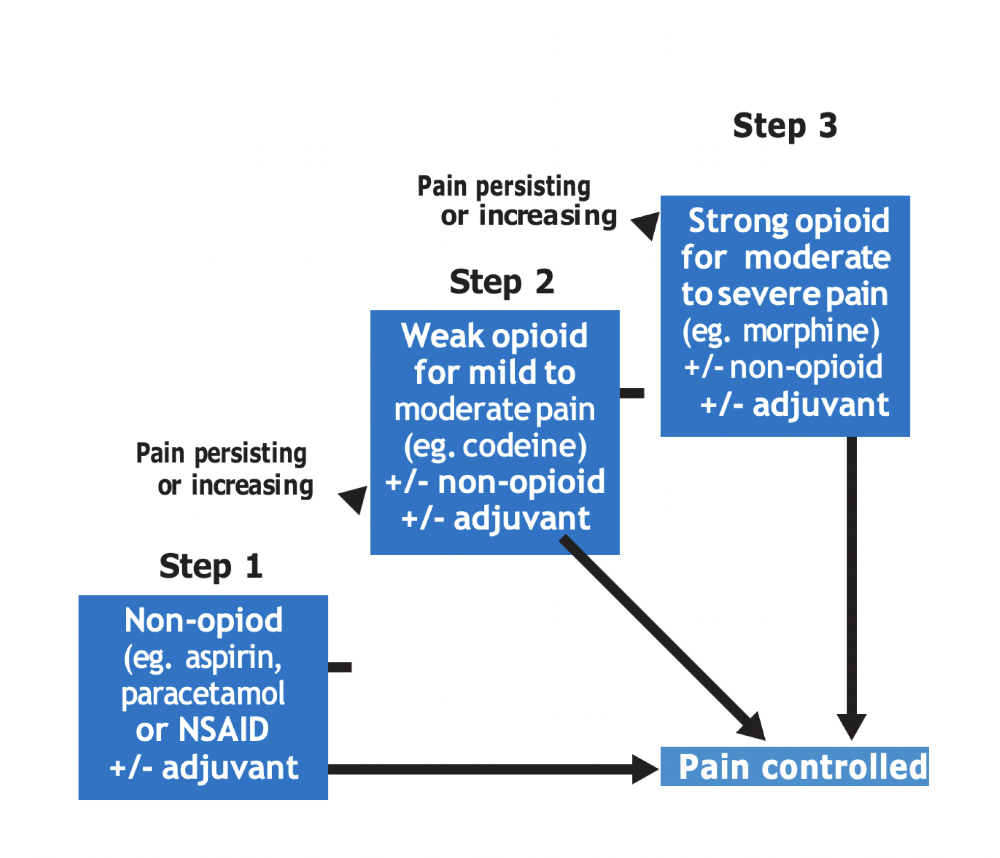

# Chapter 13: Palliative Care

ICD-10 CODE: Z51.5

Palliative care aims to improve the quality of life of patients and their families who are faced with life-threatening illness through the prevention and relief of suffering. This is achieved through early identification, ongoing assessment, treatment of pain, and treatment of other physical, psychosocial, and spiritual problems.

## 13.1 Pain

> **Key point**
> Pain is what the patient says hurts.
>
Pain is an unpleasant sensory and emotional experience associated with actual or potential tissue damage, or described in terms of such damage. Pain is the most common symptom of disease.

The nature, location, and cause of pain will differ in each case. Pain requires a holistic approach because it can be affected by spiritual, psychological, social, and cultural factors, which may need to be addressed after physical pain is controlled.

**Causes of pain**

Pain can be divided into two causative categories:

- Acute pain: caused by a specific action with a definite time period, such as postoperative pain, acute infection, or trauma.
- Chronic pain: ongoing pain with an indefinite time period.

Examples of chronic pain include:

- Constant and usually increasing pain, such as cancer pain
- Recurrent pain, such as sickle-cell crisis, arthritis, or HIV/AIDS-related pain
- Drug side effect or toxicity, such as peripheral neuropathy due to isoniazid or chemotherapy

**Risk factors and mitigators**

Factors that increase pain perception include:

- Anxiety and depression
- Social abandonment
- Insomnia
- Lack of understanding of the problem

Factors that decrease pain perception include:

- Relaxation and sleep
- Relief of other symptoms
- Explanation and understanding
- Venting feelings

### 13.1.1 Clinical Features and Investigations

**Types of pain**

| Type of pain | Features |
|---|---|
| Nociceptive pain | Pain pathways are intact. This kind of pain responds to the analgesic ladder.  Somatic pain, from bones and muscles, is described as aching or throbbing.  Visceral pain is described as colicky pain for hollow viscera, or pressure, cramping, and ache for solid viscera. |
| Neuropathic pain | There is damage to nerves or nerve pathways. The pain responds only partially to the analgesic ladder and needs adjuvants such as amitriptyline or phenytoin.  It may be described as burning, prickling, stinging, pins and needles, insects crawling under the skin, numbness, hypersensitivity, shooting pain, or electric shock. |

**Clinical investigation**

It is important for health workers to conduct a thorough investigation of a patient who indicates that they are in pain. The following points can be used to guide the investigation:

- Duration of pain
- Severity, assessed using the numerical rating scale where the patient grades pain from 0, meaning no pain, to 5, meaning worst pain ever experienced
- Site and radiation
- Nature, such as stabbing, throbbing, crushing, or cramp-like pain
- Periodicity, whether constant or intermittent
- Relieving or aggravating factors
- Accompanying symptoms
- Detailed history for each pain experienced, because there may be more than one type of pain and more than one area experiencing pain
- Targeted physical examination

### 13.1.2 Nociceptive Pain Management

There are two goals of pain management:

- Diagnose and treat the disease causing the pain.
- Achieve total pain relief with minimal side effects and enable the patient to live as normal a life as possible.

Pain can be treated through use of medicines and/or non-drug treatment.

**Non-pharmacological treatment of pain**

| Treatment | LOC |
|---|---|
| Lifestyle adjustment  Patient counselling  Massage with aromatherapy oils, which may be useful for neuropathic pain and muscular pain  Reflexology | HC2 |
| Application of heat or cold packs  Relaxation  Distraction, such as listening to radio or taking part in a non-invasive hobby  Non-pharmacological treatment of the underlying cause, such as surgery or radiotherapy for cancer  Social and spiritual support | HC2 |

**Medicines-based treatment**

The WHO analgesic ladder and the following tables describe the use of medicines to relieve pain based on the type and degree of pain.

#### 13.1.2.1 Pain Management in Adults

| Analgesics | Comments |
|---|---|
| **Step 1: Mild pain — non-opioid ± adjuvants**  Paracetamol 1 g every 6 hours, or 500 mg in elderly patients  And/or  Ibuprofen 400 mg every 6 to 8 hours, maximum 2,400 mg daily  Or  Diclofenac 50 mg every 8 hours | Continue with step 1 analgesics when moving to step 2 and step 3.  Prolonged use of high doses of paracetamol may cause liver toxicity.  Do not use NSAIDs in renal impairment.  Use caution when using NSAIDs for more than 10 days. |
| **Step 2: Moderate pain — weak opioid ± non-opioid ± adjuvant**  Morphine 2.5 to 5 mg every 4 hours during the day, with double dose at night  Or  Codeine 30 to 60 mg every 6 hours, maximum 240 mg daily  Or  Tramadol 50 to 100 mg every 6 hours, maximum 400 mg daily | Low-dose morphine is considered a step 2 analgesic and is recommended first line if available.  Discontinue step 2 analgesics when starting step 3.  Give bisacodyl 10 to 15 mg nocte to prevent constipation, except if diarrhoea is present.  Add liquid paraffin 10 mL once daily if bisacodyl is not enough. |
| **Step 3: Severe pain — strong opioid ± non-opioid ± adjuvant**  Morphine 7.5 to 10 mg every 4 hours during the day, with double dose at night  If there is breakthrough pain, give an equivalent additional dose.  Increase dose by 30% to 50% as required to control pain.  Give an additional dose 30 minutes before an activity that causes pain, such as wound dressing. | Elderly patients and patients with renal impairment may require dose adjustment.  Give bisacodyl 10 to 15 mg nocte to prevent constipation, except if diarrhoea is present.  Add liquid paraffin 10 mL once daily if bisacodyl is not enough.  If modified-release tablets are available, use the same 24-hour dose but give it in 1 or 2 doses daily. |
| **Adjuvants**  Amitriptyline 12.5 to 25 mg nocte for neuropathic pain, maximum 50 to 75 mg if tolerated  Clonazepam 0.5 to 1 mg nocte for neuropathic pain as second line  Dexamethasone 4 to 8 mg once daily for swelling or oedema  Hyoscine 20 mg every 6 hours for smooth muscle spasm  Diazepam 5 to 20 mg nocte for painful skeletal muscle spasms | Avoid amitriptyline in heart disease.  For side effects of opioids, see section 13.1.2.3. |
| **Caution**  Do not use pethidine for chronic pain. It accumulates and may cause severe gut-related side effects. Use only as a one-off dose for acute severe pain if morphine is not available.  Side effects of NSAIDs include gastritis, renal toxicity, bleeding, and bronchospasm. |  |

#### 13.1.2.3 Pain Management in Children

| Analgesics | Comments |
|---|---|
| **Step 1: Mild pain — non-opioid ± adjuvants**  Paracetamol 10 to 15 mg/kg every 6 hours  And/or  Ibuprofen 5 to 10 mg/kg every 6 to 8 hours, used only in children above 3 months | Continue with step 1 analgesics when moving to step 2.  Prolonged use of high doses of paracetamol may cause liver toxicity. |
| **Step 2: Moderate and severe pain — opioid ± non-opioid ± adjuvant**  Morphine every 4 hours:  1 to 6 months: 0.01 mg/kg  6 to 12 months: 0.2 mg/kg  1 to 2 years: 0.2 to 0.4 mg/kg  2 to 12 years: 0.2 to 0.5 mg/kg, maximum 10 mg  Increase the dose slowly until pain is controlled.  Increase dose by a maximum of 50% every 24 hours. | Codeine and tramadol are not used in children.  Give bisacodyl suppository only, 5 mg nocte, to prevent constipation, except if diarrhoea is present. |
| **Adjuvants**  Amitriptyline nocte for neuropathic pain:  Child 2 to 12 years: 0.2 to 0.5 mg/kg, maximum 1 mg/kg or 25 mg  Or carbamazepine 5 to 20 mg/kg in 2 to 3 divided doses, increased gradually to avoid side effects, as second line  Prednisolone 1 to 2 mg/kg per day  Hyoscine:  1 month to 2 years: 0.5 mg/kg every 8 hours  2 to 5 years: 5 mg every 8 hours  6 to 12 years: 10 mg every 8 hours  Diazepam for associated anxiety:  Child 1 to 6 years: 1 mg/day in 2 to 3 divided doses  Child 6 to 14 years: 2 to 10 mg/day in 2 to 3 divided doses |  |

**General principles in use of opioids**

Health professionals specially trained in palliative care should supervise management of chronic pain in advanced or incurable conditions such as cancer or AIDS.

Morphine is usually the drug of choice for severe pain. Liquid morphine is available, easy to dose, and well absorbed from the oral mucosa. It can be dripped into the mouth of adults and children.

In continuous pain, analgesics should be given:

- By the clock, according to a regular dose schedule
- By the patient, meaning self-administered where appropriate
- By the mouth, as oral dosage forms

Pain is better controlled using regular oral doses. If pain is not controlled, increase the 24-hour dose by 30% to 50%.

Repeated injections are not indicated.

Consider extra doses when a painful procedure is planned and for breakthrough pain. If breakthrough doses are used regularly, increase the regular dose.

Side effects are minor and manageable if careful dosing and titration are done.

**Cautions on use of opioids**

Opioids need to be effectively managed and administered, taking into account the cautions and side effects below.

Do not use opioids in:

- Severe respiratory depression
- Head injury

Use opioids with care in:

- Advanced liver disease, although they can be used in hepatocellular carcinoma when titrated as above
- Acute asthma
- Acute abdominal pain, where they can be used while awaiting diagnostic tests; never leave the patient in pain
- Hypothyroidism
- Renal failure, where starting dose and/or dose frequency should be reduced
- Elderly or severely wasted patients, where starting dose and/or dose frequency should be reduced

Use opioids with extreme care, starting with small doses and using small incremental increases, in patients with recurrent or concurrent intake of alcohol or other central nervous system depressants.

**Management of side effects of opioids**

| Side effect | Manage as follows |
|---|---|
| Respiratory depression | Rarely occurs if small oral doses are used and gradually titrated to response.  Can occur when morphine is used parenterally.  Reverse respiratory depression using naloxone 0.4 to 2 mg slow IV every 2 to 3 minutes according to response.  Child: naloxone 0.01 mg/kg slow IV; repeat 0.1 mg/kg if no response. |
| Constipation | Give bisacodyl 10 to 15 mg nocte to prevent constipation, except if diarrhoea is present.  Child: 5 mg rectally.  Add liquid paraffin 10 mL once daily if bisacodyl is not enough. |
| Nausea or vomiting | Usually occurs in the first 5 days and is self-limiting.  Vomiting later may be due to another cause.  Give an anti-emetic, such as metoclopramide 10 mg every 8 hours for 3 to 5 days.  Child 9 to 18 years: 5 mg 8 hourly.  Child 5 to 9 years: 2.5 mg 8 hourly.  Child 3 to 9 years: 2 to 2.5 mg 8 hourly.  Child 1 to 3 years: 1 mg 8 hourly.  Child below 1 year: 100 micrograms/kg every 12 hours. |
| Confusion or drowsiness | If excessive continuous drowsiness occurs, titrate the opioid dose down slowly. |

**Referral criteria**

- Refer to a palliative care specialist if pain does not respond to the above measures.
- Refer for radiotherapy at national referral hospital for severe bone pain not responding to the above medications.
- Refer for surgery if the cause of pain is amenable to surgery.

### 13.1.3 Neuropathic Pain

Neuropathic pain occurs due to damage to nerves or nerve pathways.

Examples include:

- Stabbing pain, such as trigeminal neuralgia, which may respond to phenytoin.
- Paraesthesia, dysaesthesia, or burning-type pain, such as post-herpetic neuralgia, which may respond to small doses of amitriptyline.

**Management**

| Treatment | LOC |
|---|---|
| **Trigeminal neuralgia or stabbing-type pain**  Acute phase:  - Carbamazepine initially 100 mg every 12 hours. - Increase gradually by 200 mg every 2 to 3 days according to response. - Maximum dose: 1,200 mg. - Carbamazepine may cause white cell depression. | HC3 |
| **Burning-type pain**  Examples include post-herpetic neuralgia and diabetic neuropathy.  - Amitriptyline 12.5 to 25 mg at night or every 12 hours depending on response. - Maximum dose: 50 to 75 mg. | HC3 |

### 13.1.4 Back or Bone Pain

Back or bone pain includes pain in the lumbar region of the spine or bone pain anywhere in the body.

**Causes**

Potential causes of back or bone pain include:

- Disc degeneration, often with a neuropathic element due to pressure on the sciatic or other nerve
- Osteoporosis, especially if there is collapse of vertebrae or fracture
- Infection, such as TB, brucellosis, pelvic inflammatory disease, or retroperitoneal infection
- Metastatic cancers
- Renal disease
- Strain
- Congenital abnormalities
- Spondylolisthesis

**Clinical features**

Clinical features differ depending on the cause of pain.

- If infection is present, pain may be throbbing and constant.
- If sciatica is present, sciatic nerve roots will be involved.

**Investigations**

- Try to establish the cause and type of pain.
- X-ray of the spine and pelvis.

**Management of back or bone pain**

| Treatment | LOC |
|---|---|
| **Analgesics**  Use analgesics as described in section 13.1.2.  - Give a step 1 drug for 7 days or as long as required according to the patient. - NSAIDs are the step 1 drug of choice in bone pain. - A step 2 or step 3 drug may need to be added, especially in metastatic disease. | HC4 |
| **Acute back pain**  - Rest the back on a firm but not hard surface.  **Neuropathic element**  - Manage as for neuropathic pain above. | HC4 |

## 13.2 Other Conditions in Palliative Care

In palliative care, other conditions that are commonly encountered are summarised below.

### 13.2.1 Breathlessness

ICD-10 CODE: R06

| Treatment | LOC |
|---|---|
| **Non-drug treatment**  - Reassure the patient. - Explore the patient’s fears and anxieties, because anxiety worsens breathlessness. - Teach breathing exercises and relaxation techniques. - Teach the patient how to slow down breathing by pursing the lips and breathing with the diaphragm rather than the chest. - Provide pulmonary rehabilitation where available. - Position the patient in the most comfortable position in bed. - Ensure good ventilation, for example by opening windows, using fans, and loosening tight clothing. - Conserve energy. - Refer if symptoms persist, if there is airway obstruction, or if pleurodesis is needed. | HC2 |
| **Medicines**  - Oral morphine 2.5 to 5 mg every 4 hours. - Give oxygen if the patient is hypoxic. - Give diazepam if the patient is anxious. - Diazepam 2.5 to 5 mg orally once daily may be used if breathlessness is associated with panic attacks. | HC4 |

### 13.2.2 Nausea and Vomiting

ICD-10 CODE: R11

| Treatment | LOC |
|---|---|
| Treat the underlying cause.  Vomiting typically relieves nausea. | HC4 |
| **If due to gastric stasis or delayed bowel transit time**  - Give metoclopramide 10 to 20 mg every 8 hours, 30 minutes before meals. - The same dose may be given subcutaneously or intravenously. | HC4 |
| **If due to metabolic disturbance**  Examples include liver failure, renal failure, or medicines such as chemotherapy.  - Give haloperidol 1.25 to 2.5 mg nocte orally or subcutaneously. | HC3 |
| **If due to raised intracranial pressure**  - Give dexamethasone 8 to 16 mg once daily. | HC4 |
| **If due to visceral stretch or compression**  - Give promethazine 25 mg every 8 hours.  Or  - Give hyoscine butylbromide 20 to 40 mg 8 hourly. | HC4 |

### 13.2.3 Pressure Ulcer / Decubitus Ulcers

ICD-10 CODE: L89

Pressure ulcers are ulcers of the skin and/or subcutaneous tissue caused by ischaemia secondary to extrinsic pressure or shear.

**Management**

| Treatment | LOC |
|---|---|
| **Non-drug treatment**  - Debride necrotic tissue. - Clean with normal saline. - If the patient is able, encourage them to raise themselves off the seat and shift their weight every 15 to 20 minutes, or to take short walks. - Reposition patients who cannot move themselves frequently, according to need and skin status. - Inspect the skin every time the patient’s position is changed. - Maintain optimal hydration and skin hygiene. - Avoid trauma by not dragging the patient. - Provide good nutrition for patients with good prognosis to maintain normal serum albumin. - Educate patient caretakers on risk factors for pressure ulcers, how to inspect and care for skin, and when to inform a health care professional. - Refer to hospital if skin grafting or flaps may be needed. | HC3 |
| **Medicines**  - Give antibiotics if there is evidence of surrounding cellulitis. See section 22.1.3. - Control pain. - Control odour with topical metronidazole powder or gel until there is no foul smell. - If the patient has sepsis, give parenteral antibiotics. See section 2.1.7 for treatment of sepsis. | HC3 |

### 13.2.4 Fungating Wounds

**Management**

| Treatment | LOC |
|---|---|
| - Treat the underlying cause. - Clean the wound regularly every day with 0.9% saline, or dissolve 1 teaspoon of salt in 1 pint of cooled boiled water. - Apply clean dressings daily. - Protect the normal skin around the wound with barrier creams such as petroleum jelly. - Give analgesia for pain. | HC2 |
| - If there is malodour or exudate, apply metronidazole powder directly to the wound daily when changing the dressing. - If there is cellulitis, give an appropriate antibiotic. | HC2 |

### 13.2.5 Anorexia and Cachexia

ICD-10 CODE: R63.0 AND R64

**Causes**

Causes include:

- Nausea and vomiting
- Constipation
- Gastrointestinal obstruction
- Sore mouth
- Mouth tumours
- Malodour
- Hypercalcaemia
- Hyponatraemia
- Uraemia
- Liver failure
- Medications
- Depression

**Management**

| Treatment | LOC |
|---|---|
| Treat underlying causes if possible.  In cancer patients, give corticosteroids for 1 week only under specialist supervision:  - Prednisolone 15 to 40 mg once daily for 7 days.  Or  - Dexamethasone 2 to 6 mg in the morning for 7 days.  **Non-medicine treatment**  - Give small amounts of food frequently. - Give energy-dense food and limit fat intake. - Avoid extremes in taste and smell. - Provide a pleasant environment and nice presentation of food. | HC4 |
| - Eating is a social habit and people eat better with others. - Provide nutritional counselling. - If prognosis is less than 2 months, counsel the patient and family to understand and adjust to reduced appetite as a normal disease process. | HC4 |
| **Caution**  In established cancer and cachexia, aggressive parenteral and enteral nutritional supplementation is of minimal value. | HC4 |

### 13.2.6 Hiccup

Hiccups are repeated involuntary spasmodic diaphragmatic and inspiratory intercostal muscle contractions.

Hiccups lasting up to 48 hours are acute. Hiccups lasting more than 48 hours are persistent. Hiccups lasting more than 2 months are intractable.

**Causes**

Causes include:

- Gastric distension
- Gastro-oesophageal reflux disease
- Gastritis
- Diaphragmatic irritation by supraphrenic metastasis
- Phrenic nerve irritation
- Metabolic causes such as uraemia, hypokalaemia, hypocalcaemia, hyperglycaemia, or hypocapnia
- Infection, such as oesophageal candidiasis
- Brain tumour
- Stroke
- Stress

**Management**

| Treatment | LOC |
|---|---|
| Most hiccups are short-lived and self-limiting.  Treat the underlying cause. | HC2 |
| **Non-medicine treatment**  - Directly stimulate the pharynx by swallowing dry bread or other dry food. - Stimulate the vagus nerve by ingesting crushed ice or performing the Valsalva manoeuvre. - Rapidly ingest 2 heaped teaspoons of sugar. - Indirectly stimulate the pharynx by C3 to C5 dermatome stimulation through tapping or rubbing the back of the neck. | HC2 |
| Refer if hiccups persist or are intractable. | HC4 |
| **Medicines for persistent or intractable hiccups**  - Metoclopramide 10 mg 8 hourly if the cause is gastric distension.  Or  - Haloperidol 2 to 5 mg once daily.  Or  - Chlorpromazine 25 mg 6 hourly. | HC3 |

### 13.2.7 Dry or Painful Mouth

ICD-10 CODE: R68.2

Dry mouth, painful mouth, and mouth ulcers are caused by infections, drugs, chemotherapy, trauma, dryness, radiotherapy, HIV, and opportunistic infections.

| Treatment | LOC |
|---|---|
| **Non-medicine treatment**  - Use salted water mouth wash hourly. - Sip frequently to keep the mouth moist. - Brush teeth and tongue at least 3 times daily. - Suck fresh cold pineapple cubes once or twice daily. - Avoid sugary foods and drinks. - Eat soft food. - Apply Vaseline to cracked lips. - Review medications because dry mouth can be a side effect, for example of amitriptyline. | HC2 |
| **Treat appropriate infection**  - Treat candidiasis with fluconazole 200 mg once daily for 7 days. - Treat herpes simplex with oral acyclovir 200 mg 5 times daily for 5 to 10 days depending on severity. | HC3 |
| **Anaerobic gingivitis, halitosis**  - Use metronidazole mouthwash made by mixing 50 mL of IV metronidazole with 450 mL of water plus 50 mL of juice. | HC3 |
| **Severe mucositis or aphthous ulcers**  - Consider dexamethasone 8 mg once daily for 5 days. - Apply analgesic gel such as Bonjela or Oracure on ulcers. | HC4 |
| **Painful mouth**  - Use oral liquid morphine as above. - Before swallowing, hold liquid morphine in the mouth for at least 30 seconds. | HC3 |

### 13.2.8 Other Symptoms

| Treatment | LOC |
|---|---|
| **Anxiety and muscle spasm**  Diazepam 5 to 10 mg once daily, titrated to 3 times daily. | HC2 |
| **Excessive bronchial secretions**  Hyoscine 20 mg once daily, titrated to 3 times daily according to response. | HC4 |
| **Intractable cough**  Morphine as above. See section 13.1.2. | HC3 |

### 13.2.9 End of Life Care

End-of-life care refers to care provided in the last days of life.

**Clinical features**

Clinical signs at the end of life should be considered in patients with terminal conditions who have been gradually deteriorating.

Signs include:

- The patient becomes bed-bound and increasingly drowsy or semi-conscious.
- Minimal oral intake; the patient is not managing oral medication and is only able to take sips of fluid.
- The patient’s condition is deteriorating rapidly, for example day by day or hour by hour.
- Breathing becomes irregular, with or without noisy breathing.
- Skin colour and/or temperature changes.
- Limited attention span.

**Investigations**

- Exclude reversible problems such as drug toxicity, infections, dehydration, and biochemical abnormalities.
- Before ordering a test, always ask: will this test change my management plan or the outcome for the patient?
- Weigh the benefit versus the burden when assessing an intervention and/or management plan based on the clinical features exhibited by the patient.

**Management**

| Treatment | LOC |
|---|---|
| **General principles of medicine treatment**  - Focus on giving medication that will improve the patient’s quality of life. - Treat symptoms of discomfort as described in the sections above. - If the patient is unable to swallow, choose an appropriate route for necessary medications, such as NG tube, parenteral, or rectal route. - Subcutaneous route is recommended when the enteral route is not possible. It is preferred over IV and IM access due to reduced trauma and better pharmacokinetics. - If repeated injections are anticipated or experienced, a butterfly needle can be inserted and used for regular subcutaneous injections. - Consider prescribing medications pre-emptively or anticipatorily to combat developing symptoms. - Morphine concentrations can vary depending on the preparation used. Remember that subcutaneous morphine has twice the potency of oral morphine. | HC2 |
| **Hydration and nutrition**  - Patients should eat and drink as they wish and take sips of water as long as they are able. - Families should be educated that it is normal for patients to lose appetite, have a sense of thirst, and stop feeding towards the end of life. - Patients should not be fed if they are no longer able to swallow, as this may cause choking and distress. - IV fluids at this stage will not prolong life or prevent thirst. - Over-hydration is discouraged because it may contribute to distressing respiratory secretions or generalised oedema. - Good regular mouth care is the best way to keep the patient comfortable. - IV dextrose for calorie supplementation is unlikely to be of benefit. - If there is reduced level of consciousness, patients should not be fed because of aspiration risk. - Artificial nutrition is generally discouraged at the end of life. | HC2 |
| **Supportive care**  - Keep the patient clean and dry. - Regularly clean the mouth with a moist cloth wrapped around a spoon. - Prevent and manage pressure sores appropriately. - Manage any associated pain. | HC2 |
| **Family, emotional, and spiritual support**  - The end of life is an emotional time for all involved. Health care professionals should be considerate and compassionate. - Take time to listen to the concerns of the patient and family. - Break bad news sensitively. - Encourage the family to be present, hold the patient’s hand, or talk to the patient even if there is no visible response. The patient may be able to hear even if they cannot respond. - Consider spiritual support. - Consider the best place of death for the patient and family, including whether discharge home would be best. | HC2 |
