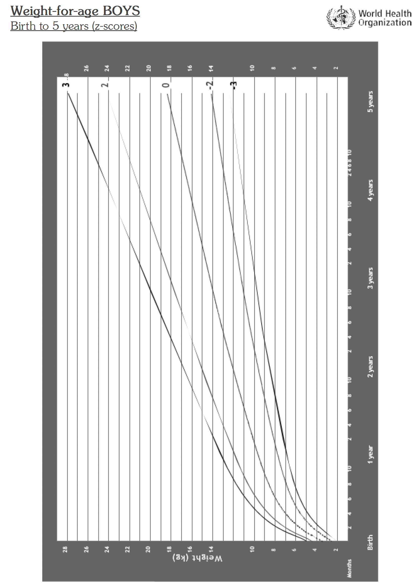
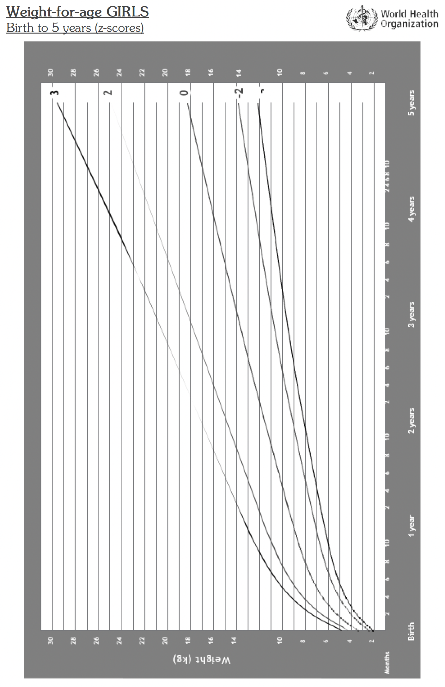
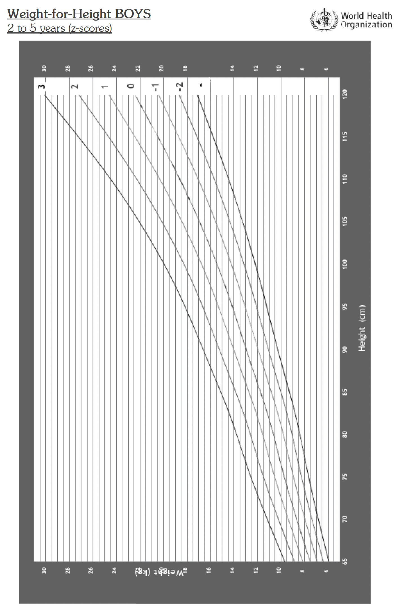
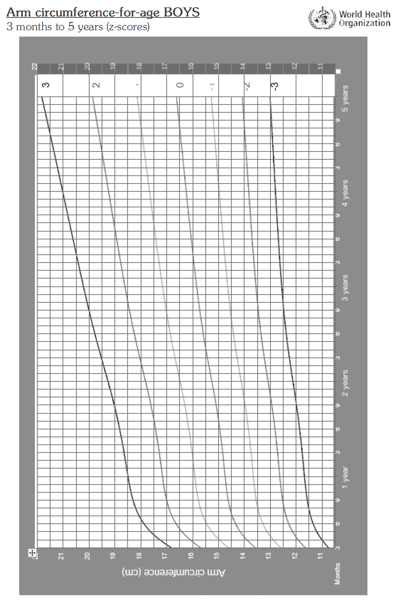
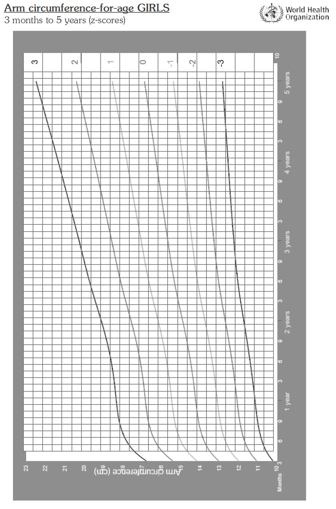

# Chapter 17: Childhood Illness

This chapter presents the management of sick infant and child up to age 5, following the WHO syndromic approach IMNCI.

Additional information about management of childhood illnesses can be found in specific sections:

| Topic | Reference section |
|---|---|
| Care of the newborn | See Chapter 16 |
| Immunisable diseases and other infectious diseases | See Chapter 1: Infections and body system chapters |
| HIV care in children | See Chapter 3: HIV/AIDS |
| Immunisation | See Chapter 18: Immunisation |
| Malnutrition rehabilitation | See Chapter 19: Nutrition |
| Sickle cell disease | See Chapter 11: Blood Disorders |

## IMNCI: Integrated Management of Newborn and Childhood Illnesses

The following guidelines use a syndromic approach to the management of common childhood conditions at primary health care level and should be followed page by page.

The general approach involves 5 main steps:

- Assess the child
- Classify the illness
- Identify and provide the required treatment
- Counsel the mother
- Provide follow-up support

There are 3 sections, based on age:

- Sick newborn, first week of life
- Sick infant, up to 2 months
- Sick child, 2 months to 5 years

<!-- Source: 17-01-newborn-and-young-infant-assessment.md -->

## 17.1 Sick Newborn

### 17.1.1 Newborn Examination / Danger Signs

Use the following procedures to examine all newborn babies after delivery, before discharge or if baby is seen as an outpatient for routine, FOLLOW UP, or sick newborn visit during first week of life.

| Ask if first visit | Look, listen, feel |
|---|---|
| How old is the baby? Where was the baby born?  Who delivered the baby? Check infant record for risk factors  What was birth weight? LBW? Preterm? Twin?  Any problem at birth? Breech? Difficult birth? Was resuscitation done?  **Ask the mother**  - Has the baby had any convulsions? - Does the baby have frequent heavy vomiting? - How is the baby feeding? Any feeding problems? - How many times has baby breastfed in last 24 hours? - Is baby satisfied with feeds? - Have you fed baby any other food or drinks? - Has baby breastfed in previous hour? - How do your breasts feel? - Do you have any other concerns? | Assess breathing (baby must be calm)  - Count breaths (normal: 30–60/min) - Assess for grunting/chest in-drawing - Check SpO₂ if available  Look at the movements: normal and symmetrical?  Look at the presenting part for swelling or bruises  Check abdomen for pallor and distention  Look for malformations  Feel the tone: normal?  Feel for warmth and check temperature  Weigh the baby  Observe a breastfeed: Is the baby able to attach? Suckling effectively? Well-positioned?  Look for ulcers and white patches in the mouth (thrush) |

#### If danger signs present, treat as below

| SIGNS | CLASSIFY | TREAT |
|---|---|---|
| Any of the following:  - Respiratory rate >60 or <30 or grunting or gasping - Severe chest indrawing or cyanosis - Not feeding well - Convulsions - Abdominal overdistension - Heart rate constantly >180 beats per minute - Floppy or stiff body or no spontaneous movements - Temperature >37.5 or <35.5°C after warming - Umbilicus draining pus, redness/swelling extended to skin - Skin pustules >10 or bullae or skin swelling and hardness - Bleeding from stump or cut - Pallor | Possible Serious Illness  See section 2.1.7.1, neonatal sepsis, 2.1.5.1 meningitis, 2.1.8.1 tetanus | Give ampicillin 50 mg/kg IM every 12 hours plus gentamicin 5 mg/kg every 24 hours (4 mg/kg if preterm)  Refer baby to hospital  If referral not possible continue treatment for 7 days  Keep baby warm  Clean infected umbilicus and pustules and apply Gentian Violet  If risk of staphylococcus infection, give cloxacillin 50 mg/kg IV/IM every 6 hours and gentamicin 5–7 mg/kg every 24 hours |

#### If no danger signs present, classify and treat as below

| SIGNS | CLASSIFY | MANAGE BY / ADVISE ON |
|---|---|---|
| Feeding well (suckling effectively >8 times in 24 hours)  Weight >2,500 g or small baby but eating and gaining weight well  No danger signs  No special treatment needs | Well Baby | Continue exclusive breastfeeding on demand  Ensure warmth, cord care, hygiene, other baby care  Routine visit at age 3–7 days  Next immunisation at 6 weeks  When to return if danger signs  Record on home-based record  If first visit (baby not delivered in health facilities) give:  - Vitamin K 1 mg IM - Tetracycline eye ointment |
| Receiving other foods/drinks or given pacifier | Feeding Problem | Stop other food/drinks  Feed more frequently, day and night. Reassure mother she has enough milk |
| Breastfeeding <8 times/24 hours  Not well attached/not suckling well  Thrush | Feeding Problem | Ensure correct positioning/attachment  If thrush: teach how to treat at home; apply gentian violet paint 4 times daily for 7 days with clean hands, use a soft cloth |
| Poor weight gain | Feeding Problem | FOLLOW UP visit in 2 days, re-check weight  If no improvement: Refer for breastfeeding counselling |
| Thrush  Poor weight gain | Feeding Problem | FOLLOW UP visit in 2 days, re-check weight  If no improvement: Refer for breastfeeding counselling |
| Preterm | Small Baby | Provide as close to continuous Kangaroo mother care as possible to prevent hypothermia  Give special support to breastfeed small baby |
| Preterm  Low birth weight (LBW) 1,500–2,500g | Small Baby | Teach mother how to care for a small baby  Teach alternative feeding method (cup feeding) |
| Twin |  | Assess daily (if admitted) or every 2 days (if outpatient) until feeding and growing well  If twins, discharge them only when both are fit to go home |
| Very Low Birth weight <1,500 g  Very preterm (<32 weeks) | Very Small Baby | Refer urgently to hospital for special care  Ensure extra warmth during referral |
| Mother very ill/receiving special treatments  Mother transferred | Mother Unable To Take Care of Baby | Help mother to express breastmilk (to maintain lactation)  Consider other feeding methods until mother can breastfeed  Ensure warmth using other methods  Cord care and hygiene  Monitor daily |

### 17.1.2 Assess for Special Treatment Needs, Local Infection, and Jaundice

| Ask (check records) | Look Listen and feel |
|---|---|
| Has the mother had (within 2 days of delivery) fever >38°C and/or infection treated with antibiotic?  Did the mother have membrane ruptured >18 hours before delivery?  Has the mother tested RPR positive?  Has the mother started TB treatment <2 months ago?  Is the mother HIV positive? is she on ARVs?  Has anything been applied to the umbilicus? | Eyes: Swollen and draining pus?  Umbilicus: Red and draining pus?  Skin: Many or severe pustules? Swelling, hardness or large bullae?  Jaundice: check face if baby <24 hours, check palms and soles if >24 hours  Movements: Less than normal? Limbs moving symmetrically?  Presenting part (head or buttocks): Swelling, bruising?  Any malformation? |

#### Classify and treat as below

| SIGNS | CLASSIFY | MANAGE BY / ADVISE ON |
|---|---|---|
| Baby <1 day old and membrane ruptured >18 hours  Mother with fever and/or on antibiotics | Risk of Bacterial Infection | Give ampicillin 50 mg/kg every 12 hours plus gentamicin 5 mg/kg (4 mg if pre-term) once daily for 5 days  Assess baby daily |
| Mother tested RPR positive | Risk of Congenital Syphilis | Give baby single dose benzathine penicillin 50,000 IU/kg IM  Ensure mother and partner are treated (see section 3.2.7)  FOLLOW UP every 2 weeks |
| Mother started TB treatment <2 months before delivery | Risk of TB | Give baby prophylaxis with isoniazid 5 mg/kg daily for 6 months  Vaccinate with BCG only after treatment completed  Reassure breastfeeding is safe  FOLLOW UP every 2 weeks |
| Mother known HIV positive | Risk of HIV | Give ARV prophylaxis as per national guidelines (see section 3.1.9.3)  Counsel on infant feeding  Special counselling if mother breastfeeding  FOLLOW UP every 2 weeks |
| Eyes swollen, draining pus | Gonococcal Eye Infection / Possible Chlamydia Co-infection (see section 3.2.9.1) | Give ceftriaxone 125 mg IM stat plus azithromycin syrup 20 mg/kg daily for 3 days  Teach mother how to treat eye infection at home: clean eyes with clean wet cloth and apply tetracycline ointment 3 times daily  Assess and treat mother and partner for possible gonorrhoea and chlamydia (section 3.2.1–3.2.2)  FOLLOW UP in 2 days  If no improvement: Refer urgently to hospital |
| Red umbilicus | Local Umbilical Infection | Teach mother how to treat at home: wash crust and pus with boiled cooled water, dry and apply Gentian Violet 0.5% 3 times a day  FOLLOW UP in 2 days  If not improved, reclassify and treat or refer |
| <10 pustules | Local Skin Infection | Teach mother how to treat infection at home: wash crust and pus with boiled cooled water, dry and apply Gentian Violet 0.5% 3 times a day  Reassess after 2 days  If not improved, reclassify and treat or refer |
| Yellow face (<24 hours old) or yellow palms and soles (>24 hours old) | Severe Jaundice | Refer urgently to hospital  Encourage breastfeeding  If breastfeeding problem, give expressed milk by cup |
| Bruises or swelling on buttocks  Swollen bump on one or both sides | Birth Injury | Explain to parents that it does not hurt the baby and it will disappear in 1 or 2 weeks by itself  DO NOT force the leg into a different position  Gently handle the limb that is not moving, do not pull |
| Abnormal position of legs after breech presentation  Asymmetrical movement or arm does not move | Birth Injury | Explain to parents that it does not hurt the baby and it will disappear in 1 or 2 weeks by itself  DO NOT force the leg into a different position  Gently handle the limb that is not moving, do not pull |
| Club foot  Cleft palate or lip  Odd looking unusual appearance  Open tissue on the head/abdomen/back/perineum or genitalia | Malformation | Refer for special evaluation and treatment  Help mother breastfeed or teach mother alternative method if not possible  Cover open tissue with sterile gauze soaked in sterile saline solution before referral |

## 17.2 Sick Young Infant Age up to 2 Months

- Ask the mother what the child’s problems are.
- Check if this is an initial or FOLLOW UP visit for this problem.
- If FOLLOW UP visit: Check up on previous treatments.
- If initial visit: Continue as below.

**Assess, classify and treat for the following:**

- Severe disease and local bacterial infection
- Jaundice
- Diarrhoea and dehydration
- HIV
- Feeding and weight problems
- Any other problem
- Immunization status

**Counsel the mother on**

- Nutrition and breastfeeding of the child
- Her own health needs
- To return for FOLLOW UP as scheduled
- To return immediately at the clinic if the danger signs in the table below appear:

| DANGER SIGN | RETURN |
|---|---|
| Breastfeeding or drinking poorly  Becomes more ill  Develops fever  Fast or difficult breathing  Blood in stool | Immediately |

### 17.2.1 Check for Very Severe Disease and Local Bacterial Infection

| Ask | Look, listen, feel |
|---|---|
| Ask if the infant is having difficulty in feeding?  Has the infant had any convulsions? | Count the number of breaths per minute. **Infant must be calm.**  - Repeat the count if this is >60 breaths per minute  Look for severe chest indrawing and nasal flaring  Look and listen for grunting  Look and feel for a bulging fontanel  Look for pus draining from the ear  Look at the umbilicus. Is it red or draining pus?  Does the redness extend to the skin?  Measure the body temperature or feel for fever or low body temperature  Look for skin pustules, if present, are they many or severe?  See if the young infant is lethargic or unconscious  Observe the young infant’s movements:  - Are they less than normal? - Observe the young infant for any spasms, differentiate from convulsions - Check if young infant has stiff neck or lock jaw - Feel the young infant’s abdomen for rigidity |

#### Classify and treat possible infection as in the table below

| SIGNS | CLASSIFY AS | TREATMENT |
|---|---|---|
| Any of the following:  - Not feeding well - Convulsions - Fast breathing (>60 breaths/min) - Severe chest indrawing or grunting - Fever (>37.5°C or feels hot) - Low body temperature (<35.5°C or feels cold) - Movement when stimulated or no movement at all - Blood in stool | Very Severe Disease | Give 1st dose of IM antibiotics: ampicillin 50 mg/kg plus gentamicin 5 mg/kg if <7 days or 7.5 mg/kg if >7 days.  HC2: give benzylpenicillin 50,000 IU/kg IM single pre-referral.  Treat to prevent low blood sugar: breastfeed or give expressed breast milk or sugar water by cup or NGT.  Advise mother how to keep infant warm on the way to hospital.  Refer URGENTLY to Hospital.  If referral not possible:  - Continue ampicillin twice daily if <7 days, thrice daily if >7 days - Gentamicin once daily for at least 5 days |
| Any of the following:  - Umbilicus red or discharging pus - Skin pustules | Local Bacterial Infection | Give appropriate oral antibiotic: amoxicillin 250 mg DT ½ tab if below 1 month, 4 kg, or ½–1 tab for 1–2 months, 4–6 kg every 12 hours for 5 days.  Teach mother to treat local infection at home.  Gentian Violet paint twice daily for five days.  Advise mother on home care for the young infant.  FOLLOW UP in two days.  If better, praise the mother, advise to complete treatment.  If same or worse, refer to hospital. |
| None of the signs of very severe disease or local bacterial infection | Severe Disease or Local Infection Unlikely | Continue assessment of other problems.  Advise mother to give home care. |

> **Note**
> Body temperatures are based on axillary measurement. Rectal readings are approximately 0.5°C higher.
>
### 17.2.2 Check for Jaundice

| If jaundice present, Ask | Look and feel |
|---|---|
| When did the jaundice appear first? | Look for jaundice (yellow eyes or skin).  Look at the young infant’s palms and soles. Are they yellow? |

#### Classify jaundice as in the following table

| SIGNS | CLASSIFY AS | TREATMENT |
|---|---|---|
| Any jaundice if age less than 24 hours or yellow palms and soles at any age | Severe Jaundice | Treat to prevent low blood sugar (breastfeed or give expressed breast milk or sugar water by cup or NGT).  Refer urgently to hospital.  Advise mother to keep infant warm.  Advise mother to give home care for the young infant.  Advise mother to return immediately if palms and soles appear yellow.  If the young infant is older than 14 days refer to hospital for assessment. |
| Jaundice appearing after 24 hours of age and palms and soles not yellow | Jaundice | FOLLOW UP in one day:  - If palms and soles are yellow, refer to hospital. - If palms and soles are not yellow but jaundice has not decreased, advise FOLLOW UP in one day. - If jaundice is decreasing, reassure mother and FOLLOW UP in two weeks. - If still there in 2 weeks, refer to hospital. |
| No jaundice | No Jaundice | Advise mother to give home care for the young infant.  Continue assessment for other problems. |

### 17.2.3 Check for Diarrhoea/Dehydration

| Ask | If yes, Look and feel |
|---|---|
| If child has diarrhoea.  If yes, ask for how long it has been present. | Infant’s movements:  - Does the infant move on his/her own? - Does the infant move when stimulated but then stops? - Does the infant not move at all? - Is the infant restless and irritable? - Check the eyes. Are they sunken? - Pinch the skin of the abdomen. Does it go back very slowly? (takes >2 seconds) - Slowly? (up to 2 seconds) |

#### Classify and treat the dehydration and diarrhoea as in the table below

| CLINICAL FEATURES | CLASSIFY AS | MANAGEMENT |
|---|---|---|
| **For dehydration (see also section 1.1.3.1)** |  |  |
| Two of these signs:  - Movement only when stimulated or no movement at all - Sunken eyes - Skin pinch goes back very slowly | Severe Dehydration | If infant has no other severe classification:  - Give fluid for severe dehydration (Plan C) OR  If infant also has another severe classification:  - Refer URGENTLY to hospital with mother giving frequent sips of ORS on the way. - Advise the mother to continue breastfeeding. |
| Two of these signs:  - Restless, irritable - Sunken eyes - Skin pinch returns slowly (up to 2 seconds) | Some Dehydration | Give Plan B (Give fluid and breast milk for some dehydration).  Advise mother when to return immediately.  FOLLOW UP in 2 days:  - If better, praise the mother and advise to continue breastfeeding. - If not better, reassess and treat accordingly.  If infant also has another severe classification:  - Refer URGENTLY to hospital with mother giving frequent sips of ORS on the way. - Advise the mother to continue breastfeeding. |
| Not enough signs to classify as some or severe dehydration | No Dehydration | Give fluids to treat diarrhoea at home and continue breastfeeding (Plan A).  Advise mother when to return immediately.  FOLLOW UP in two days:  - If better, praise the mother and advise to continue breastfeeding. - If not better, reassess and treat accordingly. |
| Diarrhoea lasting 14 days or more | Severe Persistent Diarrhoea | Refer to hospital.  Treat dehydration before referral. |

> **Note**
> What is diarrhoea in a young infant?
>
> - A young infant has diarrhoea if the stools have changed from usual pattern and are many and watery, more water than faecal matter.
> - The normally frequent or semi-solid stools of a breastfed baby are not diarrhoea.
>
### 17.2.4 Check for HIV Infection

- - Serological test POSITIVE or NEGATIVE

- What is the young infant’s HIV status?

- - Virological test POSITIVE or NEGATIVE - Serological test POSITIVE or NEGATIVE

If mother is HIV positive (or serological test of the child is positive) and NO positive virological test in child ASK:

- Is the young infant breastfeeding now?

- Was the young infant breastfeeding at the time of test or

before it?

- Is the mother and young infant on PMTCT ARV prophy-

laxis? IF NO test: Mother and young infant status unknown - Perform serological HIV test for the mother (or serological test

**for the child if the mother is not present); if positive, perform virological test for the young infant**

**Classify and treat HIV status (see also section 3.1.4)**

|MANAGEMENT|-Give cotrimoxazole prophylaxis from  age 6 weeks.  -Give HIV care and ART  -Advise the mother on home care  -FOLLOW UP regularly as per national  guidelines|-Give cotrimoxazole prophylaxis from  6 weeks of age  -Start or continue PMTCT ARV  prophylaxis as per national  recommendations  -Do virological test at age 6 weeks or  repeat 6 weeks after the child stops  breastfeeding  -Advise the mother on home care  -FOLLOW UP regularly as per  national guidelines|-Treat, counsel and FOLLOW UP existing  infections|
|---|---|---|---|
|CLASSIFY AS|Confirmed HIV  Infection|HIV Exposed|HIV Infection  Unlikely|
|CLINICAL FEATURES|

- Positive virological  testing in young infant|

- Mother HIV positive  AND negative virological  test in young infant  breastfeeding or if only  stopped less than 6  weeks ago.OR  

- Mother HIV positive**,  young infant not yet  tested OR  

- Positive serological test  in infant|

- Negative HIV test in  mother  

- or young infant|

<!-- Source: 17-02-05-check-for-feeding-problem-or-low-weight-for-age.md -->

## 17.2.5 Check for Feeding Problem or Low Weight-for-Age

### 17.2.5.1 All Young Infants Except HIV-exposed Infants Not Breastfed

| **If an infant has no indications to refer urgently to hospital:** | **Look listen and feel** |
|---|---|
| **Ask**  - Is there any difficulty feeding? - Is the infant breastfed? &nbsp;&nbsp;- If yes, how many times in a 24-hour period? - Does the infant usually receive any other foods or drinks, including water? &nbsp;&nbsp;- If yes, how often? - What do you use to feed the infant? | - Determine weight for age &nbsp;&nbsp;- Weigh the child and use the chart at the end of this chapter to determine if the child is low weight for its age in months - Look for ulcers or white patches in the mouth (thrush) |
| **Assess breastfeeding**  - Has the infant breastfed in the previous hour? &nbsp;&nbsp;- If no, ask the mother to put the infant to the breast. &nbsp;&nbsp;- If yes, ask the mother if she can wait and tell you when the infant is willing to feed again - Observe breastfeeding for 4 minutes: is the infant able to attach properly to the breast? For good attachment, the following should be present: &nbsp;&nbsp;- Chin touching breast &nbsp;&nbsp;- Mouth wide open &nbsp;&nbsp;- Lower lip turned outwards &nbsp;&nbsp;- More areola visible above than below the mouth - Is the infant able to suckle effectively? This means slow, deep sucks with occasional pauses &nbsp;&nbsp;- Clear a blocked nose if it interferes with breastfeeding |  |

#### Classify and treat feeding problems

| **CLINICAL FEATURES** | **CLASSIFY AS** | **MANAGEMENT** |
|---|---|---|
| Any of these signs  Feeding  - Not well attached to breast or - Not sucking effectively or - Less than 8 breastfeeds in 24 hours or - Receives other foods or drinks or - Low weight for age or - Thrush (ulcers or white patches in mouth) | Feeding Problem or Low Weight | - If not well attached or not sucking effectively, teach correct positioning and attachment &nbsp;&nbsp;- If not able to attach well immediately, teach the mother to express breast milk and feed by a cup - If breastfeeding less than 8 times in 24 hours, advise to increase frequency of feeding. Advise the mother to breastfeed as often and as long as the infant wants, day and night - If not breastfeeding at all - Advise the mother how to feed and keep the low weight infant warm at home - If thrush, teach the mother to treat thrush at home (apply gentian violet paint 4 times daily for 7 days with clean hands, use a soft cloth) - Advise mother to give home care for the young infant - FOLLOW UP any feeding problem or thrush in 2 days and reassess. &nbsp;&nbsp;- Continue FOLLOW UP till satisfactory feeding. If losing weight, refer. &nbsp;&nbsp;- If thrush is worse, check that treatment is given correctly. If better, complete 7-day treatment. - FOLLOW UP low weight for age in 14 days: &nbsp;&nbsp;- If no longer low weight for age, praise the mother and encourage to continue. &nbsp;&nbsp;- If still low weight for age but feeding well, praise the mother and FOLLOW UP in 14 days &nbsp;&nbsp;- If low weight for age, still feeding problem or lost weight: refer to hospital |
| Not low weight for age and no other signs of inadequate feeding | No Feeding Problem | - Advise mother on home care for young infant - Praise mother for feeding the infant well |

#### 17.2.5.2 HIV-exposed Non Breastfeeding Infants

| **Ask** | **Look, listen and feel** |
|---|---|
| - What milk are you giving? - How many times during the day and night? - How much is given at each feed? - How are you preparing the milk? - Let mother demonstrate or explain how a feed is prepared, and how it is given to the infant. - Are you giving any breast milk at all? - What foods and fluids in addition to replacement feeds is given? - How is the milk being given? Cup or bottle? - How are you cleaning the feeding utensils? | - Determine weight for age - Look for ulcers or white patches in the mouth (thrush) |

##### Classify and treat feeding problems

| **CLINICAL FEATURES** | **CLASSIFY AS** | **MANAGEMENT** |
|---|---|---|
| - Milk incorrectly or unhygienically prepared or - Giving inappropriate replacement feeds or - Giving insufficient replacement feeds or - An HIV positive mother - Mixing breast and other feeds before 6 months or - Using a feeding bottle or - Low weight for age or - Thrush (ulcers or white patches in mouth) | Feeding Problem or Low Weight | - Counsel about feeding - Explain the guidelines for safe replacement feeding. If identify concerns of mother and family about feeding if mother is using a bottle, teach cup feeding. Advise the mother how to feed and keep infant warm at home - If thrush, teach the mother to treat thrush at home (apply gentian violet paint 4 times daily for 7 days with clean hands, use a soft cloth) - Advise mother to give home care for the young infant - FOLLOW UP any feeding problem or thrush in 2 days &nbsp;&nbsp;- Continue FOLLOW UP till satisfactory feeding. If losing weight, refer &nbsp;&nbsp;- If thrush is worse, check that treatment is given correctly. If better, complete 7-day treatment - FOLLOW UP low weight for age in 14 days &nbsp;&nbsp;- If no longer low weight for age, praise the mother and encourage to continue. &nbsp;&nbsp;- If still low weight for age but feeding well, praise the mother and FOLLOW UP in 14 days &nbsp;&nbsp;- If low weight for age, still feeding problem or lost weight: refer to hospital |
| Not low weight for age and no other signs of inadequate feeding | No Feeding Problem | - Advise mother to give home care for the young infant - Praise the mother for feeding the infant well |

### 17.2.6 Check Young Infant’s Immunization Status

Check immunization card and classify

| **CLINICAL FEATURES** | **CLASSIFY AS** | **MANAGEMENT** |
|---|---|---|
| Immunization not up to date according to national schedule (see chapter 18) | Infant Not Immunized as per Schedule | Give all missed doses on this visit (Include sick infants unless being referred) |
| Immunization up to date as per national schedule | Infant Immunized as Per Schedule | Advise caretaker when to return for the next dose |

### 17.2.7 Assess Other Problems

Assess any other presenting problems (e.g. eye problems, rashes) and manage accordingly.

### 17.2.8 Assess Mother’s Health Needs

- Check for current health problems
- Check nutritional status and anaemia
- Check whether family planning help is required
- Check on tetanus immunization status

### 17.2.9 Summary of IMNCI Medicines Used for Young Infants

| **DRUG** | **DOSE** | **INDICATION** | **LOC** |
|---|---|---|---|
| Ampicillin | 50 mg/kg | Pre referral IM dose in very severe disease | HC3 |
| Gentamicin | Age < 7 days 5 mg/Kg  Age > 7 days 7.5 mg/kg | Pre referral IM dose in very severe disease | HC3 |
| Benzyl penicillin | 50,000 IU/Kg IM | Pre referral IM dose in very severe disease if ampicillin/gentamicin not available | HC2 |
| Amoxicillin 250 mg dispersible tablets (DT) | Birth-<1 month (< 4 kg): ¼ tab every 12 hours for 5 days  1-2 month (4-6 kg): ½ tab every 12 hours for 5 days | In local bacterial infection | HC1 |
| Gentian Violet 0.5% | Apply in the mouth 4 times a day for 7 days | In oral thrush | HC2 |
|  | Apply on skin twice daily for 5 days | Local bacterial infection (skin pustules or umbilical infection) |  |
| Cotrimoxazole Tab 120 mg pediatric tablet | 1 tab once daily | Prophylaxis in HIV infected or HIV exposed children till infection can be excluded | HC2 |

### 17.2.10 Counsel the Mother

#### Teach correct positioning and attachment for breast feeding

- Show mother how to hold the infant:
    - With the infant’s head and body straight
    - Facing her breast with infant’s nose opposite the nipple
    - With infant’s body close to hers
    - Supporting the infant’s whole body, not just the neck and shoulders
- Show her how to help the infant attach, she should:
    - Touch her infant’s lips with her nipple
    - Wait until her infant’s mouth opens wide
    - Move her infant quickly onto her breast aiming the infant’s lower lip well below the nipple
    - Look for signs of good attachment and effective suckling
    - If either is not good, try again

#### Advise mother on home care for the young infant

- Food and fluids: Breastfeed frequently on demand (as often and for as long as the infant wants) day and night, during sickness and health
- Warmth: Ensure the young infant is always warm

## 17.3 SICK CHILD AGE 2 MONTHS TO 5 YEARS

### Assess, classify, and treat

- Ask the mother what the child’s problems are
- Check if this is an initial or FOLLOW UP
    - If FOLLOW UP visit: Check up on previous problems, check that the treatment has been given correctly and assess any new problems
- If initial visit: Continue as below

**In assessing a sick child, assess for the following:**

- General danger signs: URGENT ATTENTION and ACTION REQUIRED.

**Then check for:**

- Cough or difficult breathing
- Diarrhoea and dehydration
- Fever
- Ear problems
- Malnutrition and feeding problems
- Anaemia
- HIV
- Immunization, deworming and vitamin A
- Any other problem

**Then counsel the mother on**

- Extra fluids for any sick child
- Nutrition and breastfeeding of the child
- How to give home treatments
- Her own health needs
- To return for FOLLOW UP as scheduled
- To return immediately if any danger sign appear

| **DANGER SIGN** | **RETURN** |
|---|---|
| Breastfeeding or drinking poorly  Becomes more ill  Develops fever  Fast or difficult breathing  Blood in stool | Immediately |

### 17.3.1 Check for General Danger Signs

| **Ask** | **Look** |
|---|---|
| - Is the child unable to drink or breastfeed - Is the child vomiting everything - Has the child had convulsions | - See if the child lethargic or unconscious - Is the child convulsing now |

#### Classify and treat as below

| **CLINICAL FEATURE** | **CLASSIFY AS** | **MANAGEMENT** |
|---|---|---|
| Any general danger sign | Very Severe Disease | - Give diazepam if convulsing (rectal diazepam 0.5 mg/kg) - Quickly complete the assessment - Give any pre referral treatment immediately - Treat to prevent low blood sugar (breastfeed or give expressed breast milk breastmilk substitute or sugar water by cup or NGT) - Keep the child warm REFER URGENTLY |

### 17.3.2 Check for Cough or Difficult Breathing

| **Ask** | **Look Listen and feel** |
|---|---|
| - If child has cough and/or difficulty in breathing  **If yes, ask**  - For how long child has had this? | **Ensure the child is calm, then**  - Count the number of breaths/minute - Look for chest indrawing - Look/listen for stridor (stridor is an abnormal harsh, high-pitched sound caused by obstructed airflow, usually more audible while inhaling) - Look and listen for wheezing - If pulse oximeter is available, determine oxygen saturation. Refer if < 90%  **If wheezing with either fast breathing or chest indrawing:**  - Give a trial of rapid acting inhaled bronchodilator (with spacer) for up to 3 times 15-20 min apart. Count the breaths and look for chest indrawing again, and then classify  **Fast breathing:**  - Child 2-12 months: 50 breaths per minute - Child 1-5 years: 40 breaths per minute |

#### Classify and treat as below

| **CLINICAL FEATURES** | **CLASSIFY AS** | **MANAGEMENT** |
|---|---|---|
| - Any general danger sign - Or stridor in calm child - SpO2 < 90% | Severe Pneumonia or Very Severe Disease | - Give 1st dose of appropriate antibiotic: ampicillin 50 mg/Kg IM and gentamicin 7.5 mg/Kg IM &nbsp;&nbsp;- Or Benzylpenicillin 50,000 IU/Kg IM if at HC2 &nbsp;&nbsp;- Or Amoxicillin DT 40 mg/kg if parenteral antibiotics not available &nbsp;&nbsp;- Refer URGENTLY to HC4/HOSPITAL  **If referral not possible**  - Continue ampicillin 6 hourly and gentamicin once daily for 5 days &nbsp;&nbsp;- If strong suspicion of meningitis, dose of ampicillin can be increased 4 times |
| - Chest indrawing - Fast breathing &nbsp;&nbsp;- Child 2-12 months: 50 breaths/minute &nbsp;&nbsp;- Children 1-5 years: 40 breaths/minute | Pneumonia | - Give amoxicillin DT 40 mg/kg for 5 days as first line treatment - If wheezing give an inhaled bronchodilator for 5 days (salbutamol inhaler every 3-4 hours as necessary)† - If coughing for more than 14 days or recurrent wheeze, refer for possible TB or asthma assessment - If chest indrawing in HIV exposed/infected child, give first dose of amoxicillin DT 40 mg/kg and refer - Soothe throat/relieve cough with safe remedy - If coughing for more than 14 days or recurrent wheeze refer for possible TB or asthma assessment. - Advise mother when to return immediately (danger signs) - FOLLOW UP in 3 days and reassess &nbsp;&nbsp;- If better (slower breathing, no indrawing, less fever, eating better), praise the mother and advise to complete treatment &nbsp;&nbsp;- If not better or worse, refer urgently to hospital |
| No signs of severe disease or pneumonia | Cough or Cold (No pneumonia)  Most likely viral so no antibiotics needed | - If wheezing give an inhaled bronchodilator (salbutamol inhaler every 3-4 hours as necessary) for 5 days - Soothe throat/relieve cough with safe remedy - If coughing for more than 14 days or recurrent wheezing, refer for possible TB or asthma assessment - Advise mother when to return immediately (danger signs) - If not improving, FOLLOW UP in 5 days |

> **Note**
> Use age-appropriate spacers to administer salbutamol inhaler.
>
>
### 17.3.3 Child Has Diarrhoea

| **Ask** | **Look and feel** |
|---|---|
| - Does the child have diarrhoea? - If yes, for how long child has had this - Using appropriate local terms, ask if there is blood in the stool | Look at the child’s general condition. Is the child:  - Lethargic or unconscious? - Restless and irritable? - Look for sunken eyes - Offer the child fluid. Is the child: &nbsp;&nbsp;- Unable to drink or drinks poorly? &nbsp;&nbsp;- Thirsty, drinks eagerly? - Pinch the skin of the abdomen. Does it go back: &nbsp;&nbsp;- Very slowly? (>2 seconds) &nbsp;&nbsp;- Slowly? |

#### Classify and treat as below

| **CLINICAL FEATURES** | **CLASSIFY AS** | **MANAGEMENT** |
|---|---|---|
| **Any 2 of these signs:**  - Lethargic or unconscious - Sunken eyes - Unable to drink or drinks poorly - Skin pinch returns very slowly (>2 seconds) | Severe Dehydration | - If child has no other severe classification, give dehydration Plan C (see section 1.1.3) - If child also has another severe classification: &nbsp;&nbsp;- Give pre-referral treatment and refer urgently with mother giving frequent sips of ORS on the way &nbsp;&nbsp;- Advise mother to continue breastfeeding - If child is 2 years or older and there is cholera in your area: &nbsp;&nbsp;- Give 1st dose of erythromycin 125 mg (if child < 2 years) or 250 mg (child 2-5 years) every 6 hours for 3 days - Educate mother on hygiene and sanitation |
| **Any 2 of these signs:**  - Restless, irritable - Sunken eyes - Thirsty, drinks eagerly - Skin pinch returns slowly | Some Dehydration | - Give fluid, zinc supplements, and food if possible. See Dehydration Plan B (see section 1.1.3) - If child also has a severe classification: &nbsp;&nbsp;- Refer URGENTLY to hospital with mother &nbsp;&nbsp;- Giving frequent sips of ORS on the way &nbsp;&nbsp;- Advise the mother to continue breastfeeding - Advise mother when to return immediately - FOLLOW UP in 5 days &nbsp;&nbsp;- If better (diarrhoea stopped, less than 3 loose stools per day, praise mother and advise her on feeding) &nbsp;&nbsp;- If not better (> 3 loose stools per day), reassess, treat dehydration and refer - Educate mother on hygiene and sanitation |
| Not enough signs to classify as some or severe dehydration | No Dehydration | - Give fluid, zinc supplements, and food to treat diarrhoea at home (Plan A) (see section 1.1.3) - Advise mother when to return immediately - FOLLOW UP in 5 days &nbsp;&nbsp;- If better (diarrhoea stopped, less than 3 loose stools per day, praise mother and advise her on feeding) &nbsp;&nbsp;- If not better (> 3 loose stools per day), reassess, treat dehydration and refer - Continue with breastfeeding - Educate mother on hygiene and sanitation |
| Blood in stool | Dysentery | - Give ciprofloxacin 15 mg/kg for 3 days for Shigella - FOLLOW UP in 3 days &nbsp;&nbsp;- If better (fewer stools, less blood in stool, less fever, less abdominal pain, better feeding) praise the mother, complete the ciprofloxacin and advise on feeding &nbsp;&nbsp;- If not better, refer |
| Dehydration present | Severe Persistent Diarrhoea | - Give vitamin A - Treat dehydration before referral (unless child has another severe classification) - Refer to hospital |
| **If diarrhoea for 14 days or more:**  No dehydration | Persistent Diarrhoea | - Advise mother on feeding child with PERSISTENT DIARRHOEA - Give vitamin A; multivitamins and minerals (including zinc) for 14 days - FOLLOW UP in five days &nbsp;&nbsp;- If better (diarrhoea stopped, less than 3 loose stools per day, praise mother and advise her on feeding) &nbsp;&nbsp;- If not better (> 3 loose stools per day), reassess, treat dehydration and refer &nbsp;&nbsp;- If symptoms are the same or worse, start treating dehydration if present and refer to hospital |

> **Note**
> - The current recommendation for treatment of diarrhoea is oral rehydration salts (ORS) and zinc salts (Zn sulphate, Zn gluconate or Zn acetate).
> - Give zinc for 10 days: Child < 6 months: 10 mg per day; Child > 6 months: 20 mg per day.
>
>
### 17.3.4 Check for Fever

| **Ask** | **Look and feel** |
|---|---|
| - If the child has fever &nbsp;&nbsp;- By history, feels hot, or temperature 37.5 C (see note 1 in table below) - If yes, ask for how long child has had this &nbsp;&nbsp;- If >7 days, ask if fever has been present every day &nbsp;&nbsp;- Ask if the child has had measles in the last 3 months - DO MALARIA TEST in all fever cases | - Look/feel for stiff neck - Look for runny nose - Look for any bacterial cause of fever: local tenderness, oral sores, refusal to use a limb, hot tender swelling, red tender skin or boils, lower abdominal pain or pain on passing urine in older children - Look for signs of measles: &nbsp;&nbsp;- Generalised rash &nbsp;&nbsp;- Cough, runny nose, or red eyes  **If child has measles now or had measles in last 3 months**  - Look for mouth ulcers: are they deep or extensive? - Look for pus draining from the eyes - Look for clouding of the cornea |

#### Classify and treat as below

| **CLINICAL FEATURES** | **CLASSIFY AS** | **MANAGEMENT** |
|---|---|---|
| - Any general danger sign - Stiff neck | Very Severe Febrile Disease | - Give 1st dose of rectal artesunate (10 mg/kg) or IM/IV artesunate (3 mg/kg if < 20 kg, 2.4 mg/kg if > 20 kg) (see section 2.5.2) - Give 1st dose of appropriate antibiotic for serious bacterial infection: ampicillin 50 mg/Kg IM and gentamicin 7.5 mg/Kg IM or &nbsp;&nbsp;- Benzylpenicillin 50,000 IU/Kg IM if at HC2 - Treat child to prevent low blood sugar (breastfeed or give expressed breast milk or breastmilk substitute or sugar water by cup or NGT) - Give one dose of paracetamol 10 mg/kg for high fever (38.5 C) - Refer urgently |
| Malaria test positive | Malaria | - Give 1st line malaria treatment (oral ACT, see section 2.5.2) - Give one dose of paracetamol 10 mg/kg for high fever (38.5 C) - If a bacterial infection is also identified, give appropriate antibiotic treatment - Advise mother when to return immediately, counsel on use of insecticide treated mosquito nets and educate on environmental sanitation - FOLLOW UP in 3 days if fever persists: &nbsp;&nbsp;- Do a full reassessment and look for other causes of fever &nbsp;&nbsp;- Check that the child has completed the full course of antimalarials (without vomiting any dose) &nbsp;&nbsp;- Do not repeat RDT if it was positive on the initial visit &nbsp;&nbsp;- If no danger sign, no other apparent cause of fever and antimalarial treatment was given correctly, refer for microscopy and/or second line antimalarial - If fever every day for >7 days, refer for assessment |
| Malaria test Negative | Fever  No Malaria | - Give one dose of paracetamol 10 mg/Kg in child with high fever (38.5°C) - If a bacterial infection is identified, give appropriate antibiotic treatment - If no bacterial infection identified, reassure, give paracetamol, advise to come back in 3 days or in case of any problem - Advise mother when to return immediately and counsel on use of insecticide treated mosquito net and educate on environmental sanitation. - FOLLOW UP in 3 days if fever persists - Reassess the child for danger signs and other possible causes of fever &nbsp;&nbsp;- Repeat the malaria test and treat if positive &nbsp;&nbsp;- If no apparent cause of fever, refer &nbsp;&nbsp;- If fever every day for >7 days, refer for assessment |

#### If measles now or in last 3 months, classify as:

| **CLINICAL FEATURES** | **CLASSIFY AS** | **MANAGEMENT** |
|---|---|---|
| - Any general danger sign - Clouding of cornea - Deep or extensive mouth ulcers | Severe Complicated Measles | - Give vitamin A - Give 1st dose of appropriate antibiotic for severe bacterial infection: ampicillin 50 mg/Kg IM and gentamicin 7.5 mg/Kg IM or &nbsp;&nbsp;- Benzylpenicillin 50,000 IU/Kg IM if at HC2 - If clouding of cornea or pus draining from eye: apply tetracycline eye ointment - REFER URGENTLY to hospital |
| - Stridor - Difficulty in breathing - Diarrhoea - Acute malnutrition - Ear problem | Complicated Measles | - Refer to the relevant IMCI sections |
| - Pus draining from eye - Mouth ulcers | Measles + Eye or Mouth Complications | - Give vitamin A - If pus draining from eye: Apply tetracycline eye ointment - If mouth ulcers, apply gentian violet paint - FOLLOW UP in three days &nbsp;&nbsp;- If eyes still discharging pus and treatment has been given correctly, refer. If eyes only red or better, complete treatment &nbsp;&nbsp;- If mouth ulcers/thrush are the same or better, continue treatment. If worse and/or child has problem swallowing, refer |
| Measles now or in the last three months | Measles | - Give Vitamin A (see section 2.3.3) |

> **Note**
> - Body temperatures are based on axillary measurement. Rectal readings are approximately 0.5 C higher.
> - For doses of Vitamin A, Gentian violet and Tetracycline ointment see section 17.3.10.2.
>
>
### 17.3.5 Check for Ear Problem

| **Ask** | **Look and feel** |
|---|---|
| - Does the child have an ear problem? - If yes, - Does the child have ear pain? - Is there discharge: - If yes, ask for how long | - Look for pus draining from the ear - Feel for tender swelling behind the ear |

#### Classify and treat as below

| **CLINICAL FEATURES** | **CLASSIFY AS** | **MANAGEMENT** |
|---|---|---|
| Tender swelling behind the ear | Mastoiditis | - Give 1st dose of appropriate antibiotic ampicillin 50 mg/Kg IM and gentamicin 7.5 mg/Kg IM or &nbsp;&nbsp;- Benzylpenicillin 50,000 IU/Kg IM &nbsp;&nbsp;- Amoxicillin DT 40 mg/kg if parenteral not available - Give 1st dose of paracetamol 10 mg/kg for pain - REFER URGENTLY |
| - Ear pain - Pus seen draining | Acute Ear Infection | - Give amoxicillin DT 40 mg/kg every 12 hours for 5 days - Give paracetamol 10 mg/kg for pain - Dry ear by wicking |

### 17.3.6 Check for Malnutrition and Feeding Problems

| **Ask** | **Look and feel** |
|---|---|
| - If child ≤ 6 months, ask if the child has breastfeeding problem (how many times a day, etc) - If child > 6 months, ask if child is able to finish his portions (appetite) - Ask about usual feeding habits - Which foods are available at home - What does the child eat - How many times a day - Does the child receive his/her own serving | - Look for signs of acute malnutrition like: &nbsp;&nbsp;- Oedema on both feet &nbsp;&nbsp;- Determine weight for height/length (WFH/L) using WHO growth charts standards (see end of this chapter) &nbsp;&nbsp;- As an alternative, determine weight for age (WFA) using WHO growth chart standard &nbsp;&nbsp;- Measure MUAC (Mid Upper Arm Circumference) in children ≥ 6 months using MUAC tape  **If WFH/L is less than -3 z-scores or MUAC < 115 mm, then**  - Check for any medical complication present &nbsp;&nbsp;- Any general danger sign &nbsp;&nbsp;- Any severe classification &nbsp;&nbsp;- Pneumonia or chest indrawing  **If no medical complication presents,**  - Child ≥ 6 months: assess child appetite &nbsp;&nbsp;- Offer RUTF (Ready to Use Therapeutic Food) and assess if child able to finish the portion or not - Child ≤ 6 months: assess breastfeeding |

#### Classify and treat as directed below

| **CLINICAL FEATURES** | **CLASSIFY AS** | **MANAGEMENT** |
|---|---|---|
| - Oedema of both feet OR - WFH/L less than -3 z-scores  or  - MUAC less than 115 mm or - Visible severe wasting  **AND**  - Any one of the following: &nbsp;&nbsp;- Medical complication present  **OR**  &nbsp;&nbsp;- Not able to finish RUTF  **OR**  &nbsp;&nbsp;- Breastfeeding problem | Complicated Severe Acute Malnutrition | - Give first dose appropriate antibiotic (ampicillin 50 mg/Kg IM and gentamicin 7.5 mg/Kg IM or &nbsp;&nbsp;- Benzylpenicillin 50,000 IU/Kg IM - Treat the child to prevent low blood sugar (breastfeed or give expressed breast milk or sugar water by cup or NGT) - Keep the child warm - Refer URGENTLY to hospital |
| - WFH/L less than -3 z-scores OR - MUAC less than 115 mm - Or very low weight for age  **AND**  - Able to finish RUTF | Uncomplicated Severe Acute Malnutrition (SAM)  See section 19.2.2.2 for more details | - Give oral antibiotics amoxicillin DT for 5 days (40 mg/kg twice a day) - Give ready-to-use therapeutic food (RUTF) for a child aged 6 months or more - Counsel the mother on how to feed the child - Assess for possible TB infection - Advise mother when to return immediately - FOLLOW UP in 7 days &nbsp;&nbsp;- Reassess child and feeding. If no new problem, review again in 7 days. |
| - WFH/L between -3 and -2 z-scores  **OR**  - MUAC 115 up to 125 mm  or  - Low weight for age | Moderate Acute Malnutrition (MAM)  See section 19.2.2.1 for more details | - FOLLOW UP in 14 days &nbsp;&nbsp;- Reassess and reclassify and continue feeding. Keep checking every 14 days - Assess the child’s feeding and counsel the mother on the feeding recommendations - If feeding problem, counsel and FOLLOW UP in 7 days - Assess for possible TB infection. - Advise mother when to return immediately - FOLLOW UP in 30 days &nbsp;&nbsp;- Reassess and reclassify &nbsp;&nbsp;- If better, praise the mother and counsel on nutrition. &nbsp;&nbsp;- If still moderate malnutrition, counsel and FOLLOW UP in one month &nbsp;&nbsp;- If worse, losing weight, feeding problem: refer |
| - WFH/L > -2 z-scores or more  **OR**  - MUAC 125 mm or more | No Acute Malnutrition | - If child is < 2 years old, assess the child’s feeding and counsel the mother on feeding according to the feeding recommendations - If feeding problem, FOLLOW UP in 7 days &nbsp;&nbsp;- Reassess and counsel - If you advise the mother to make significant changes in feeding, ask her to bring the child back again after 30 days to measure the weight |

> **Note**
> - WFH/L is Weight-for-Height or Weight-for-Length determined by using the WHO growth standards charts.
> - MUAC is Mid-Upper Arm Circumference measured using MUAC tape in all children ≥ 6 months.
> - RUTF is Ready-to-Use Therapeutic Food for conducting the appetite test and feeding children with severe acute malnutrition. For doses and more information see chapter 19.
> - RUTF already contains all the necessary vitamins and minerals (folic acid, iron etc) so there is no need of additional supplements.
>
>
### 17.3.7 Check for Anaemia

| **Ask** | **Look** |
|---|---|
| - In appropriate local language, ask if presence of sickle cell anaemia in the family | - Look for palmar pallor. Is it - Severe palmar pallor? - Some palmar pallor? |

#### Classify and treat as below

| **CLINICAL FEATURES** | **CLASSIFY AS** | **MANAGEMENT** |
|---|---|---|
| Severe palmar pallor | Severe Anaemia | - Refer URGENTLY to hospital |
| Some palmar pallor | Anaemia | - Give ferrous sulphate ½ tab/day if 1-5 years, 1 ml of syrup/day if 2-12 months &nbsp;&nbsp;- If child has severe acute malnutrition and is receiving RUTF, DO NOT give iron because there is already adequate amount of iron in RUTF - Give folic acid 2.5 mg/daily in child with sickle cell anaemia - Give mebendazole if child is 1 year or older and has not had a dose in the previous 6 months - Advise mother when to return immediately - FOLLOW UP in 14 days: &nbsp;&nbsp;- Review and give iron tablets every two weeks &nbsp;&nbsp;- If child still has palmar pallor after two months, refer &nbsp;&nbsp;- If better, continue iron treatment for three months after Hb has normalized |
| No palmar pallor | No Anaemia | - If child is less than two years old, assess the child’s feeding and counsel the mother according to the feeding recommendations - If feeding problem, FOLLOW UP in five days |

#### Check for HIV Infection

**Ask**

- Is the child already enrolled in HIV care?

**If not, ask**

- Has the mother or child had an HIV test?

| **If yes: decide HIV status** | **If no, then test** |
|---|---|
| - Mother: POSITIVE or NEGATIVE - Child: &nbsp;&nbsp;- Virological test POSITIVE or NEGATIVE &nbsp;&nbsp;- Serological test POSITIVE or NEGATIVE | - Mother and child status unknown: TEST mother. - Mother HIV positive and child status unknown: TEST child &nbsp;&nbsp;- If below 18 months: do virological testing &nbsp;&nbsp;- If above 18 months, do serological testing |

**If mother is HIV positive and child is negative or unknown, ASK:**

- Was the child breastfeeding at the time or 6 weeks before the test?
- Is the child breastfeeding now?
- If breastfeeding ASK: Is the mother and child on ARV prophylaxis?

> **Note**
> For HIV testing algorithm and result interpretation in children, see section 3.1.2.
>
| **FEATURES** | **CLASSIFY AS** | **MANAGEMENT** |
|---|---|---|
| Positive virological test in child  **OR**  Positive serological test in a child 18 months or older | Confirmed HIV Infection  (see section 3.1.3) | - Initiate ART treatment and HIV care - Give cotrimoxazole prophylaxis - Assess the child’s feeding and provide appropriate counselling to the mother. - Advise the mother on home care - Assess or refer for TB assessment and Isoniazid (INH) preventive therapy (see section 5.2.9.3) - FOLLOW UP regularly as per national guidelines |
| Mother HIV-positive AND negative virological test in a breastfeeding child  or only stopped less than 6 weeks ago  **OR**  Mother HIV-positive, child not yet tested  **OR**  Positive serological test in a child less than 18 months | HIV Exposed  (see section 3.1.4) | - Give cotrimoxazole prophylaxis till infection can be excluded by HIV testing after cessation of breastfeeding for at least 6 weeks - Start or continue ARV prophylaxis as recommended - Do virological test to confirm HIV status: if negative, repeat 6 weeks after cessation of breastfeeding - Assess the child’s feeding and provide appropriate counselling to the mother - Advise the mother on home care - FOLLOW UP regularly as per national guidelines |
| Negative HIV test in mother or child | HIV Infection Unlikely | - Treat, counsel and FOLLOW UP on existing infections |

### 17.3.8 Check Immunization, Vitamin A, Deworming

Check immunization card and classify

| **CLINICAL FEATURES** | **CLASSIFY AS** | **MANAGEMENT** |
|---|---|---|
| Immunization not up to date according to national schedule (see chapter 18) | Child Not Immunized as Per Schedule | - Give all missed doses on this visit - Include sick child unless being referred - Give vitamin A if not given in the last 6 months - Give mebendazole or albendazole (if age >1 year) if not given in the last 6 months |
| Immunization up to date as per national schedule | Child Immunized as Per Schedule | - Praise the mother - Advise the caretaker when to return for the next dose |

### 17.3.9 Assess Other Problems

Assess any other presenting problems (e.g. eye problems, rashes) and manage accordingly.

### 17.3.10 Summary of Medicines Used

For each medicine:

- Explain to the mother why the medicine is needed
- Calculate the correct dose for the child’s weight or age
- Use a sterile needle and syringe for injections
- Accurately measure and administer the dose
- If referral is not possible, follow the instructions given

#### 17.3.10.1 Medicines Used Only in Health Centers

| **DRUG** | **DOSE** | **INDICATION** | **LOC** |
|---|---|---|---|
| Ampicillin | 50 mg/kg | Pre referral IM dose in very severe disease or severe pneumonia | HC3 |
| Gentamicin | 7.5 mg/kg | Pre referral IM dose in very severe disease or severe pneumonia | HC3 |
| Diazepam rectal (suppository or diluted IV ampoule) | 0.5 mg/kg | Pre referral treatment of convulsions | HC2 |
| Benzyl penicillin | 50,000 IU/kg | Pre referral IM dose in very severe disease or severe pneumonia | HC2 |
| Rectal artesunate | 10 mg/kg (see section 2.5.2.2) | Pre referral dose for very severe febrile disease | HC1 |
| Artesunate parenteral | 3 mg/kg if < 20 kg,  2.4 mg/kg if > 20 kg | Pre referral IM dose for very severe febrile disease | HC3 |
| Salbutamol inhaler | 2 puff | For acute wheezing | HC3 |

#### 17.3.10.2 Medicines for Home Use

**Teach mother/caretaker how to give oral medicines at home**

- Determine the correct medicine and dose for the child’s weight or age

**For each medicine**

- Explain the reason for giving the medicine
- Show how to measure a dose
- Watch the mother practice this
    - Ask the mother to give the first dose to her child
    - Explain carefully how to give the medicine
- Include dose, frequency, and duration

> **Note**
> Stress the need to complete the full course of treatment even if the child gets better.
>
> If child vomits the medicine within one hour from taking it, REPEAT the dose.
>
- Collect, measure/count, pack, and label it separately
- Check the mother’s understanding before she leaves

| **DRUG** | **DOSE** | **INDICATION** | **LOC** |
|---|---|---|---|
| Amoxicillin DT 250 mg | Every 12 hours for 5 days  2-12 months: 250 mg  1-3 years: 500 mg  3-5 years: 750 mg | Pneumonia Acute ear infection | HC1 |
| Artemether/lumefantrine 20/120 mg | Every 12 hours for 3 days  2-12 months: 1 tab  1-3 years: 1 tab  3-5 years: 2 tab | Un-complicated malaria | HC1 |
| Erythromycin | Every 6 hours for 3 days  Child < 2 years: 125 mg  2-5 years: 250 mg | Cholera | HC3 |
| Ciprofloxacin | 15 mg/kg every 12 hours for 3 days  If tab 500 mg: Child < 6 months: ¼ tab Child 6 months-5 years: ½ tab | Dysentery | HC2 |
| Folic acid | 2.5 mg/daily | Anaemia in child with sickle cell anaemia | HC2 |
| Iron ferrous sulphate (with or without folic acid) | Once daily for 14 days, tab 200 mg  1-5 years: ½ tablet Syrup 25 mg/ml  Child < 1 year: 1 ml | Anaemia in non sicklers | HC2 |
| Cotrimoxazole 120 mg paediatric tablet | < 6 months: 1 tablet  6 months-5 years: 2 tab/day (or half adult tablet) Once a day | Prophylaxis in HIV positive and HIV exposed | HC2 |
| Mebendazole | Child 1-2 years: 250 mg single dose  Child > 2 years: 500 mg single dose | Routine deworming every six months | HC2 |
| Albendazole | Child 1-2 years: 200 mg single dose  Child > 2 years: 400 mg single dose | Routine deworming every six months | HC1 |
| Paracetamol | Every 6 hours (4 doses/24 hours)  2-12 months: 125 mg  3-5 years: 250 mg | Fever > 38.5 °C or (ear) pain | HC1 |
| Vitamin A | Up to 6 months: 50,000 IU  6-12 months: 100,000 IU  12 months–5 years: 200,000 IU | Routine every 6 months from age six months, three doses for persistent diarrhoea, measles at day 0, 1 and four weeks | HC2 |
| ORS | As per plan A, B, C  See section 1.1.3 | Rehydration | HC1 |
| Zinc | Daily for 10 days  Child 2-6 months: 10 mg (½ tablet)  Child > 6 months: 20 mg (1 tablet) | Treatment of diarrhoea | HC1 |
| Nystatin syrup | 1 ml 4 times daily for 7 days | Oral thrush | HC2 |
| Tetracycline eye ointment | 5 mm of ointment inside lower lid, 4 times daily till pus discharge resolves | Eye infection | HC2 |
| Ciprofloxacin ear drops | 1-2 drops three times daily | Chronic otitis |  |
| Ready To Use Therapeutic Food RUTF | See chapter 19 | Severe malnutrition | HC1 |
| ARVs | See section 3.1.3 | HIV prophylaxis and treatment | HC3 |

#### 17.3.10.3 Treatment of Local Infections at Home

**Teach mother/caretaker how to treat local infections**

- Explain what the treatment is and why it is needed
- Describe the treatment steps as detailed below
- Watch the mother do the first treatment in the clinic (except cough/sore throat remedy)
- Explain how often to do the treatment and for how long
- Provide the required medication for home treatment
- Check that she understands completely before leaving the clinic

| **INFECTION** | **TREATMENT** |
|---|---|
| Eye infection | - Clean both eyes 4 times daily: &nbsp;&nbsp;- Wash hands &nbsp;&nbsp;- Ask child to close eyes &nbsp;&nbsp;- Use clean cloth with clean water to gently remove pus &nbsp;&nbsp;- Use a different part of the cloth for each eye &nbsp;&nbsp;- Clean each eye from nose-side to ear-side to avoid passing the infection from one eye to the other - Apply tetracycline eye ointment 1% to each eye 4 times daily after cleaning the eyes &nbsp;&nbsp;- Ask the child to look up &nbsp;&nbsp;- Squirt a small amount (5 mm length) on the inside of the lower eyelid &nbsp;&nbsp;- Wash hands again - Continue application until the redness has disappeared - Do not put anything else into the eye |
| Ear infection | - Dry the ear at least 3 times daily &nbsp;&nbsp;- Roll clean absorbent cloth or soft gauze into a wick &nbsp;&nbsp;- Place this in the ear and remove when wet &nbsp;&nbsp;- Replace wick with a clean one &nbsp;&nbsp;- Repeat this process until the ear is dry  **In chronic ear infection:**  &nbsp;&nbsp;- Instill ciprofloxacin ear drops 3 times daily for 3 weeks &nbsp;&nbsp;- Do not put anything else into the ear |
| Mouth ulcers | - Treat these twice daily - Wash hands - Wash child’s mouth with clean soft cloth moistened with salt water and wrapped around the finger - Paint the mouth with gentian violet aqueous paint 0.5% (if necessary, dilute 1% with an equal volume of water and provide this for the mother to use at home) - Wash hands again - Continue giving gentian violet for 48 hours after ulcers are cured - Give paracetamol for pain relief |
| Oral thrush | - Treat for thrush four times daily for seven days - Wash hands - Wash a clean soft cloth with water and use to wash the child’s mouth - Instill nystatin 1 ml every six hours - Avoid feeding for 20 minutes after medication - If breastfed, check mother’s breasts for thrush and if present treat with nystatin - Advise mother to wash breast after feeds - If baby unable to breastfeed advise mother to feed baby with a cup and spoon. - Give paracetamol if needed for pain |
| Sore throat or cough | - Use a safe remedy to soothe the throat and relieve cough: &nbsp;&nbsp;- Breastmilk (for exclusively breastfed infant) &nbsp;&nbsp;- Warm (lemon) tea with honey &nbsp;&nbsp;- Do not use remedies containing codeine or antihistamines (e.g. chlorphenamine, promethazine) |

### 17.3.11 Counsel the Mother

#### 17.3.12.1 Feeding Recommendation during Illness

**For any sick child**

- Breastfeed more often and for longer at each feed

**If not exclusively breastfed**

- Increase fluid intake, e.g. give soup, rice water, yoghurt drinks or clean water

**For a child with diarrhoea**

- Giving extra fluid can be lifesaving
- Give fluid according to Plan A or B, depending on the state of dehydration of the child

#### 17.3.12.2 Assessing Appetite and Feeding

- Ask about the child’s usual feeding habits during the current illness
- Compare the answers given with the feeding recommendations for the child’s age

| **SITUATION** | **QUESTIONS** |
|---|---|
| **Breastfeeding** | - Do you breastfeed the child? - How many times during the day? - How many times at night? - Do you give the child any other food or fluids? |
| **Other food or fluids** | - What food or fluids? - How many times daily? - What do you use to feed the child? - What foods are available in the home? |
| **If severe or moderate malnutrition or any special concern about growth (e.g. HIV)** | - What foods are available at home? - What foods does the child eat? - How large are the servings? - Does the child receive his/her own serving? - Who feeds the child and how? |
| **During this illness** | - Has the child’s feeding changed? - If yes, how? |
| **If HIV exposed child** | - If mother and child on ARVs and child breastfeeding, check on adherence - If child not breastfeeding, check type, quantity and preparation of substitute milk, including cleaning of utensils |

#### 17.3.12.3 Feeding Recommendations

These recommendations are for both sick and healthy children.

| **AGE OF CHILD** | **FEEDING RECOMMENDATIONS** |
|---|---|
| **Birth up to 6 months** | - Breastfeed as often as your child wants - Look for signs of hunger, such as beginning to fuss, sucking fingers, or moving lips - Breastfeed day and night whenever your baby wants, at least 8 times in 24 hours - Frequent feeding produces more milk - Do not give other foods or fluids - Breast milk is all your baby needs |
| **6-9 months** | - Breastfeed as often as your child wants  Also give thick porridge made with maize, cassava, millet, soya flour, or any mix of these. Add sugar and oil, and mix with milk or pounded groundnuts or mixtures of well mashed foods, e.g.  matooke, potatoes, cassava, posho (maize or millet), rice. Mix these with fish, beans, or pounded groundnuts. Add green vegetables  - Give a nutritious snack, e.g. egg, banana, bread: 3 times/day if breastfed or 5 times/day if not - Including animal source foods and vitamin A-rich fruits and vegetables - Start by giving 2 to 3 tablespoons of food. Gradually increase to ½ cups (1 cup = 250 ml) - Give 2 to 3 meals each day - Offer 1 or 2 snacks each day between meals when the child seems hungry |
| **9 to 12 months** | - Breastfeed as often as your child wants - Also give a variety of mashed or finely chopped family food, including animal source foods and vitamin A-rich fruits and vegetables - Give ½ cup at each meal (1 cup = 250 ml) - Give 3 to 4 meals each day - Offer 1 or 2 snacks between meals. The child will eat if hungry - For snacks, give small chewable items that the child can hold. Let your child try to eat the snack, but provide help if needed |
| **12-24 months** | - Breastfeed as often as your child wants - Also give a variety of mashed or finely chopped family food, including animal source foods and vitamin A-rich fruits and vegetables - Give ¾ cup at each meal (1 cup = 250 ml) - Give 3 to 4 meals each day - Offer 1 to 2 snacks between meals - Continue to feed your child slowly, patiently. Encourage but do not force your child to eat - Breastfeed on demand, day and night - Give adequate servings of complementary foods as above except that you may also add meat to mashed foods |
| **Age 2 years and over** | - Give a variety of family foods to your child, including animal source foods and vitamin A-rich fruits and vegetables - Give at least 1 full cup (250 ml) at each meal - Give 3 to 4 meals each day - Offer 1 or 2 snacks between meals - If your child refuses a new food, offer “tastes” several times. Show that you like the food - Be patient. Talk with your child during a meal, and keep eye contact  **Note:**  - A good daily diet should be adequate in quantity and include an energy-rich food (for example, thick cereal with added oil); meat, fish, eggs, or pulses; and fruits and vegetables |
| **Stopping breast feeding** | **STOPPING BREASTFEEDING means**  changing from all breast milk to no breast milk. This should happen gradually over one month. Plan in advance for a safe transition.  **Help Mother Prepare:**  - Mother should discuss and plan in advance with her family, if possible - Express milk and give by cup - Find a regular supply of formula or milk e.g full cream cow’s milk - Learn how to prepare and store milk safely at home  **Help Mother Make Transition:**  - Teach mother to cup feed (See Counsel the mother in next section) - Clean all utensils with soap and water - Start giving only formula or cow’s milk once baby feeds by cup  **Stop Breastfeeding Completely:**  - Express and discard enough breast milk to keep comfortable until lactation stops |
| **Child with persistent diarrhoea** | **If still breastfeeding**  - Give more frequent and longer feeds day and night  **If taking other milk, replace**  - With increased breastfeeding - With fermented milk products, e.g. yoghurt  **OR**  - Half the milk with nutritious mashed foods  **If taking other foods**  - Follow feeding recommendations above for child’s age |

#### 17.3.12.4 Counselling for Feeding Problems

**If the child is not being fed as above**

- Counsel the mother accordingly
- FOLLOW UP in 5-7 days

| **PROBLEM** | **COUNSELLING AND FOLLOW UP** |
|---|---|
| **Breastfeeding problems** | - Assess breastfeeding - As required, show mother correct positioning and attachment |
| **If child <6 months old and taking other milk or foods** | - Build the mother’s confidence that she can provide all the breast milk needed - Suggest giving more frequent, longer feeds day and night, and gradually reduce other milk or foods |
| **If mother is away from the child due to work, etc.** | - Suggest she expresses breast milk to leave for the baby |
| **If other milk needs to be continued** | - Breastfeed as much as possible, including at night - Make sure that any other milk used is an appropriate breastmilk substitute, - e.g. cow’s milk - Correctly and hygienically prepared given in adequate amounts - Finish any prepared milk within 1 hour |
| **If the child is being given diluted milk or thin porridge** | - Remind mother that thick foods rich in energy and nutrients are needed by infants and young children - Advise her not to dilute the milk - Advise her to make thicker porridge |
| **If the mother is using a bottle to feed the child** | - Recommend using a cup instead of a bottle - Show the mother how to feed the child with a cup: press cup on infant’s lower lip and allow him to take the milk himself, do not pour the milk into infant’s mouth |
| **If the child is not being fed actively** | - Counsel the mother to: &nbsp;&nbsp;- Sit with the child and encourage eating &nbsp;&nbsp;- Give the child an adequate serving in a separate bowl |
| **If the mother is not giving foods rich in vitamin A** | - Encourage her to provide these regularly, e.g. eggs, green leafy vegetables, carrots, liver, mangoes, yellow sweet potatoes, and other dark orange fruit |
| **If the child is 6 months and appropriate complementary foods have not been introduced** | - Gradually introduce thick porridge mixed with available protein (e.g. milk); add sugar and fat - Gradually introduce mashed foods mixed with relish - Add green leafy vegetables and fat to this - Give nutritious snacks 3-5 times daily as in feeding recommendations above |
| **If child eats solid food with insufficient nutrient density or variety** | - Give a variety of mashed food mixtures made with local staples and mixed with animal or plant protein relish - Add green leafy vegetables and fat to this - Give nutritious snacks 3-5 times daily as in feeding recommendations above |

#### 17.3.12.5 Mother’s Health

- Counsel mother about her own health
- If she is sick, provide care for her or refer for further management
- If she has a breast problem (e.g. engorgement, sore nipples, infection), provide care for her or refer for further help
- Advise her to eat well to keep up her own strength and health
- Check immunization status and give Tetanus Toxoid (TT) if needed
- Make sure each mother has access to:
    - Family planning services
    - Counselling on prevention of STIs, HIV/AIDS
    - Antenatal care (if pregnant)
- Give additional counselling if the mother is HIV-positive
- Reassure her that with regular FOLLOW UP much can be done to prevent serious illness, and maintain her and the child’s health
- Emphasize good hygiene, and early treatment of illnesses

## 17.4 INTEGRATED COMMUNITY CASE MANAGEMENT

Integrated Community Case Management (iCCM) of malaria, pneumonia and diarrhoea is a recently adopted strategy for the treatment of common childhood illness at community level by trained Community Health Workers since 2010. It addresses a gap in delivery of curative services to children below 5 years allowing:

- Prompt and accessible treatment of uncomplicated malaria, pneumonia and diarrhoea
- Identification of danger signs (convulsions, chest indrawing, unable to feed, vomiting everything, lethargy/unconsciousness) and pre-referral treatment
- Monitoring of newborns during the first week of life
- Counselling and referral if any problem identified

Community health workers work in close collaboration with the health unit, to which they report and refer cases and from which they receive supplies and supervision.

### Supplies provided to trained community health workers

#### ICCM commodities

- Respiratory timers and Amoxicillin dispersible tablets for diagnosis and treatment of pneumonia
- ORS sachets and Zinc tablets for treatment of diarrhoea
- RDTs and ACTs for diagnosis and treatment of uncomplicated malaria
- Rectal artesunate for pre referral treatment of complicated malaria.
- Examination gloves
- Dispensing envelopes
- Registers, referral notes and sick job aids

#### Other commodities for community health workers

- Other preventive treatments: used in prevention and treatment of common conditions and neglected topical diseases like albendazole, azithromycin syrup and tablets, ivermectin, tetracycline eye ointment, praziquantel, COC.

### Treatments prescribed by VHTs

| **TREATMENT** | **INDICATION** | **DOSES** |
|---|---|---|
| Amoxicillin DT 250 mg | Pneumonia (cough < 21 days + increased respiratory rate) | 2-11 months: 1 tab every 12 hours for 5 days RED PACK  1-5 years: 2 tab every 12 hours for 5 days GREEN PACK |
| Zinc Tablets and ORS | Diarrhoea < 14 days without blood | **Zinc**  2-6 months: ½ tab once a day for 10 days  6 months to 5 years: 1 tab once a day for 10 days  **ORS**  As much as the child wants but at least ½ cup after each loose stool |
| ACT | Fever <7 days  RDT positive | 4 months-2 years: 1 tab every 12 hours for 3 days (YELLOW PACK)  2-5 years: 2 tab every 12 hours for 3 days (BLUE PACK) |
| Rectal Artesunate | Fever and danger signs, prereferral | 4-11 months: 1 capsule  1-3 years: 2 capsules  3-5 years: 3 capsules |

## 17.5 CHILD GROWTH WEIGHT STANDARDS CHARTS

The WHO Child Growth Standards charts are used to identify normal growth for children under 5 years, as well as growth problems or trends that suggest that a child is at risk of a problem.

### Weight-for-Age

- Used to show if a child is normal weight or underweight for their age. It should not be used to assess obesity and overweight.

**Disadvantages**

- If a child’s age is unknown, it is of limited use.
- It cannot distinguish between chronic malnutrition (stunting) and acute malnutrition.
- Also, if a child has oedema of both feet, fluid retention increases the child’s weight, masking what may actually be very low weight.

### Weight-for-Height/Length

- Used to diagnose acute malnutrition.
- The cut-off for severe acute malnutrition is -3 z-scores and below. These children are at a high risk of mortality, but respond quickly and safely to re-feeding using therapeutic foods following recommended guidelines.
- The cut-off for moderate acute malnutrition is -2 to -3 z-scores below.

### Mean Upper Arm Circumference (MUAC)

- Used to diagnose acute malnutrition.
- The cut-off for severe acute malnutrition is 115 mm (11.5 cm) and below.

### Weight-for-Age BOYS

**Birth to 5 years (z-scores)**

### Weight-for-Age GIRLS

**Birth to 5 years (z-scores)**

### Weight-for-Height BOYS

**2 to 5 years (z-scores)**

### Weight-for-Height GIRLS

**2 to 5 years (z-scores)**

### Arm Circumference-for-Age BOYS

**3 months to 5 years (z-scores)**

### Arm Circumference-for-Age GIRLS

**3 months to 5 years (z-scores)**

