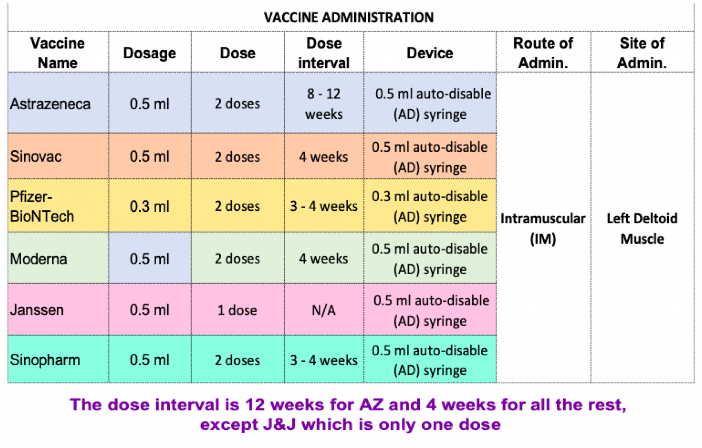

# Chapter 18: Immunization

## 18.1 ROUTINE CHILDHOOD VACCINATION

### 18.1.1 National Immunization Schedule

Adapted from the UNEPI/MOH Immunization Schedule, 2022

| **Vaccine or Antigen** | **Age** | **Dose & Mode of Administration** | **Mode of Administration** | **Site of Administration** |
|---|---|---|---|---|
| BCG | At birth (or first contact) | 0-11 months: 0.05 mL  Above 11 months: 0.1 mL | Intradermally | Right Upper Arm |
| Hepatitis B | At birth (first contact within the first 7 days of life) | 0.5 mL IM | Intramuscular | Outer aspect of left thigh |
| Oral Polio | 4 doses: at birth, 6, 10, and 14 weeks | 2 drops | Orally | Mouth |
| Inactivated Polio Vaccine (IPV) | 2 doses: at 6 and 14 weeks of age | 0.5 mL | Intramuscular | Outer aspect of right thigh; 2.5 cm away from PCV site |
| DPT-HepB + Hib 1 | 3 doses: at 6, 10 and 14 weeks | 0.5 mL | Intramuscular | Outer aspect of left thigh |
| PCV | 3 doses: at 6, 10 and 14 weeks | 0.5 mL | Intramuscular | Outer aspect of right thigh |
| Rota | 2 doses: at 6 and 10 weeks | 2 drops | Orally | Slow administration on inner aspect of cheek |
| Measles Rubella | 2 doses: At 9 and 18 months | 0.5 mL | Subcutaneous | Left Upper Arm |
| Yellow fever | At 9 months | 0.5 mL | Subcutaneous | Right Upper Arm |
| HPV | All girls in primary 4 or 10 year old girls outside school | Give 2 doses IM 6 months apart | Intramuscular | Left Upper Arm |

#### General principles of routine childhood immunization

- The aim is to ensure that all target age groups complete their immunization schedule as above.
- Age for vaccinations: Give each vaccine at the recommended age or if this is not possible, at any first contact with the child after this age.
- BCG vaccination:
    - Give this as early as possible in life, preferably at birth.
    - Do NOT give BCG vaccine to any child with clinical signs and symptoms of immunosuppression, e.g. AIDS.
- Use each vaccine with its corresponding pre-cooled diluent from the same manufacturer.
- Polio vaccination (= ‘birth dose’): This is a primer dose of oral polio vaccine (OPV), which should be given ideally at birth but otherwise in the first 2 weeks of life.
- DPT-HepB-Hib vaccine:
    - Is a combination of DPT vaccine + hepatitis B vaccine (HepB) + haemophilus influenzae type b (Hib) vaccine.
    - Minimum interval between each of the doses is 4 weeks.
- Measles rubella vaccination:
    - Given at 9 and 18 months of age or first contact after this age.
    - Can also be given to any unimmunised child of 6-9 months old who has been exposed to measles patients. Children vaccinated in this way must have the vaccination repeated at 9 months of age.

#### Vaccination of sick children

- Admit and treat any child who is severely ill, and vaccinate at the time of discharge.
- Minor illness is not a contraindication to vaccination.
- Screen clients at points of care and administer the due vaccines.
- Screen clients for vaccine preventable diseases for investigation and notification.

#### Administration and storage of vaccines

##### Storage and transport

- At health units, vaccines should be stored between +2°C to +8°C.
- At the district and central vaccine stores (static units) where freezers exist, polio and measles rubella vaccines may be stored for prolonged periods at -20°C.
- Do not freeze DPT-HepB-Hib, PCV, IPV, HPV, hepatitis B, yellow fever and TT vaccines.
- Never freeze the diluents for BCG, yellow fever and measles vaccines.
- Use conditioned ice packs and sponge method for transport.

Carefully follow recommended procedures to maintain the cold chain for all vaccines, e.g.:

- Ensure continuous supply of power/gas.
- Record fridge temperature twice daily (morning and evening, including weekends/public holidays).
- Use sponge method during each immunization session.

##### Reconstitution and administration

- Never use the diluents provided for vaccines to mix other injectable medicines.
- Never use water for injection as a diluent for vaccine reconstitution.

**Do not vaccinate in direct sunlight (always carry out immunization in a building or under a shade).**

- Record every vaccination in the child register and on a tally sheet until child has completed all the antigens.
- Use the child register and child health card for tracking drop outs.
- A child who received any immunization dose during national immunization campaigns should still get the routine vaccination doses.
- Never use any vaccine:
    - After its expiry date.
    - When the vaccine vial monitor (VVM) has changed to discard point (stage 3 and 4).
    - If there has been contamination, or contamination is suspected in open vials.
    - If the vial labels are lost.
    - DPT-HepB-Hib, HepB, PCV, rotavirus vaccine, IPV, HPV, TT/Td that have been frozen.

#### Multi-Dose Vial Policy

Adhere to the WHO recommended Multi-Dose Vial Policy (MDVP) as below:

| **TYPE OF VACCINE** | **MDVP GUIDELINE** |
|---|---|
| OPV and IPV | Do not use vaccine if:  - Contaminated or has no label. - The VVM at or beyond discard point (stage 3 & 4). - Vials have been opened for 4 weeks. - Vials opened during outreach. - Vaccines have not been stored under cold chain conditions. |
| DPT-HepB-Hib, Hep B, TT, PCV | Do not use vaccine if:  - Contaminated or has no label. - The VVM is at or beyond discard point. - Frozen. - Vials have been opened for 4 weeks or more. - Vials opened during outreach. - Vaccines have not been stored under cold chain conditions. |
| BCG, yellow fever and Measles Rubella | - Discard remaining doses in the opened vials of these vaccines after 6 hours of reconstitution or at the end of the immunization session, whichever comes first. |

#### Common non-serious side effects of vaccines and patient advice

| **VACCINE AND SIDE EFFECTS** | **PATIENT ADVICE** |
|---|---|
| **BCG**  - Pain at injection site | - The ulcer that forms at the injection site is a normal and expected reaction that heals by itself and leaves a permanent scar. It should not be covered with anything. |
| **DPT-HepB-Hib, PCV**  - Mild reactions at injection site: swelling, pain, redness. - Fever within 24 hours of the injection. - Anaphylactic reactions. - Seizures. | - Do not apply anything to the injection site. - Take paracetamol if necessary. &nbsp;&nbsp;- If fever continues after 2 doses of paracetamol, report to health facility. - Wiping the child with a cool sponge or cloth (with water at room temperature) is also good for reducing fever. - If seizures or severe rash/difficulty in breathing occurs, return to health facility immediately. |
| **Oral Polio and Rotavirus**  - Short-lived gastrointestinal symptoms (pain, diarrhoea, irritation). | - Dispose of the child’s faeces properly as the virus spreads through the oral-faecal route. - Wash hands thoroughly after changing the baby’s nappies. |
| **Inactivated/Injectable Polio**  - Pain, redness and swelling at injection site. - Fever, headache, drowsiness. - Irritability in infants. - Diarrhoea, nausea, vomiting. | - Side effects usually mild and should not cause worry. - Take paracetamol if necessary. - If fever continues after 2 doses of paracetamol, report to health facility. - Report any severe reaction to health worker immediately. |
| **Measles rubella**  - Pain, swelling, redness at injection site. - Fever and skin rash 5-12 days after the vaccine. | - Child may get a mild skin rash and fever after few days; do not worry. - Do not apply anything to the injection site. |
| **Yellow fever**  - Pain, swelling, redness at injection site. - Fever and skin rash 5-12 days after the vaccine. | - Side effects may occur within 1-2 days of immunization; they are usually mild and should not cause worry. - Report to health worker immediately any severe reaction. |
| **HPV**  - Injection site reactions: pain, redness, itching, bruising or swelling. - Headaches. - General body aches, nausea. | - Side effects usually mild and should not cause worry. - Report to health worker immediately any severe reaction. |
| **Tetanus Toxoid (TT)**  - Irritation at injection site. - Fever, malaise. | - Side effects may occur within 1-2 days of immunization; they are usually mild and should not cause worry. - Report to health worker immediately any severe reaction. |
| **Hep B Vaccine**  - Pain, redness and swelling at injection site. - Fatigue. - Fever. | - If fever develops, give a single dose of paracetamol. |

#### OTHER VACCINATIONS
### 18.1.2 Hepatitis B Vaccination

- Since 2005, children are immunised against Hepatitis B in the routine childhood immunization using the DPT-HepB-Hib vaccine at 6, 10, and 14 weeks of age.
- For adolescents and adults, it is recommended that the hepatitis B vaccination is given preferably after testing for hepatitis B infection (HBsAg and Anti-HBs). Patients with HIV and pregnant women should be handled on a case-by-case basis.
- Vaccination is recommended for high-risk groups, e.g.:
    - Health workers in clinical settings and training
    - Intravenous drug users
    - Persons who frequently receive blood transfusions
    - Recipients of solid organ transplantation
    - High-risk sexual behaviour
    - Partners and household contacts of HBsAg-positive patients
    - Support staff in health facilities
- The schedule has three doses: at 0, 1 month after 1st dose, and 6 months after first dose (0, 1, 6 months).
- The storage temperature for the vaccine is 2°C to 8°C.
- Dose: 0.5 mL given intramuscularly on the deltoid muscle (upper arm).
- Do NOT give vaccine on the buttocks because of low immune response (decreased protective antibody response) and risks of injury to the sciatic nerve.

### 18.1.3 Yellow Fever Vaccination

The yellow fever vaccine is live attenuated, and it is reconstituted before use. Ideally, it should be used within 6 hours after reconstitution.

- Dose: 0.5 mL given intramuscularly on the upper arm as a single dose.
- The storage temperature for the vaccine is 2°C to 8°C.
- Immunity is life-long and international travel certificate is issued once and valid for life.

### 18.1.4 Tetanus Prevention

- All children should be vaccinated against tetanus during routine childhood immunization using the DPT-HepB-Hib vaccine at 6, 10, and 14 weeks of age (see above).
- Neonatal tetanus is prevented by routinely immunising all pregnant women/women of child-bearing age (15–45 years) against tetanus with Tetanus Toxoid vaccine (see below).

#### 18.2.3.1 Prophylaxis Against Neonatal Tetanus

- Ensure hygienic deliveries, including proper cutting and care of umbilical cords through the use of skilled birth attendants.
- Immunise all pregnant women/women of child-bearing age (15–45 years) against tetanus with Tetanus Toxoid with diphtheria vaccine (Td).
- Give TT vaccine 0.5 mL IM into the upper arm as per the recommended schedule below:

##### Routine TT Vaccine Schedule and the Period of Protection

| **TT DOSE** | **WHEN GIVEN** | **DURATION AND LEVELS OF PROTECTION** |
|---|---|---|
| Td1 | At first contact with woman of childbearing age or as early as possible during pregnancy | None |
| Td2 | At least 4 weeks after Td1 | 3 years; 80% protection |
| Td3 | At least 6 months after Td2 | 5 years; 95% protection |
| Td4 | At least 1 year after Td3 | 10 years; 99% protection |
| Td5 | At least 1 year after Td4 | 30 years; 99% protection |

##### Vaccination Against Adult Tetanus

- High-risk groups such as farm workers, military personnel, miners, safe male circumcision clients, should be vaccinated as in the table above (if not fully immunized) and given regular boosters every 10 years.
- Patients at risk of tetanus as a result of contaminated wounds, bites, burns, and victims of road traffic accidents should be given Antitetanus Immunoglobulin (TIG) and then be vaccinated as indicated in the table below.

| **TREATMENT** | **LOC** |
|---|---|
| **General measures**  - Ensure adequate surgical toilet and proper care of wounds | HC3 |
| **Passive immunization: give to any patient at risk, except if fully immunized and having had a booster within the last 10 years**  - Give IM tetanus immunoglobulin human (TIG): &nbsp;&nbsp;- Child <5 years: 75 IU &nbsp;&nbsp;- Child 5–10 years: 125 IU &nbsp;&nbsp;- Child >10 years/adult: 250 IU - Double the dose if heavy contamination suspected or if >24 hours since injury was sustained  **Alternative - only if TIG not available:**  - Antitetanus serum (tetanus antitoxin) 1,500 IU deep SC or IM | HC4 |
| **Active immunization**  **Unimmunised or partially immunised patients:**  - Give a full course of vaccination for those who are not immunized at all (3 doses 0.5 mL IM at intervals of 4 weeks)  **Fully immunized patients with a booster >10 years before:**  - Give one booster dose of TT 0.5 mL intramuscularly  **Fully immunised patients who have had a booster dose within the last 10 years:**  - A booster is NOT necessary | HC3 |

> **Note**
> Giving TIG or TT to a fully immunised person may cause an unpleasant reaction, e.g. redness, itching, swelling, and fever, but with a severe injury this is justified.
>
#### 18.2.4 Vaccination Against COVID-19

**Who should be vaccinated?**

- 12 years and above

- A booster dose that can be administered at least 6 months after completion of the primary series is recommended for all those aged 50 years and above, health workers, teachers both in pre-primary, primary, secondary, and tertiary institutions, religious leaders, cultural leaders, security personnel, media personnel, drivers and conductors of public transport vehicles, boda boda riders, bar and night club workers, market workers and vendors.

##### COVID Vaccine Matching and Mixing (Heterologous Primary Schedules)/Booster Dosing

| **First Dose** | **Second Dose OR Booster** |
|---|---|
| AstraZeneca | Pfizer or Moderna |
| Pfizer | AstraZeneca |
| Moderna | AstraZeneca |
| Sinopharm | AstraZeneca or Pfizer or Moderna |
| Sinovac | AstraZeneca or Pfizer or Moderna |
| Johnson & Johnson | Pfizer or Moderna |
