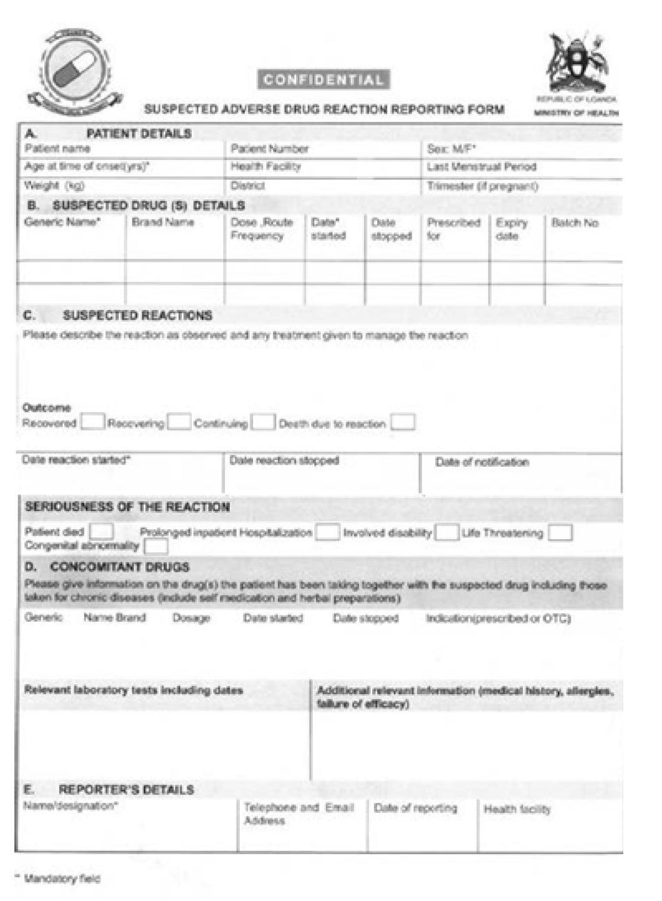

# Chapter 24: Surgery, Radiology and Anaesthesia

## 24.1 SURGERY

### 24.1.1 Intestinal Obstruction

**ICD10 CODE: K56**

Interruption of the normal flow of intestinal content, due to mechanical obstruction at small or large bowel level, or due to functional paralysis.

**Causes**

- Small bowel mechanical obstruction: tumours, adhesions from previous surgeries or infections
- Large bowel obstructions: tumours, volvulus, adhesions, inflammatory strictures, e.g., diverticulosis

**Clinical features**

- **Small bowel obstruction:** Cramping abdominal pain, nausea, vomiting and abdominal distention. Due to the accumulation of fluids into the dilated intestinal loops, there is usually a varying degree of dehydration.
- **Large bowel obstruction:** Bloating, abdominal pain, constipation, vomiting and nausea less frequent and mainly in proximal colon obstruction; signs of dehydration and shock come later.

**Investigations**

- Abdominal X-ray, erect or left lateral decubitus, to assess for air-fluid levels. See section 24.2.1 for details.

**Differential diagnosis**

- Paralytic ileus, which is diffuse functional paralysis of the small and large bowel due to medicines, biochemical abnormalities, or abdominal infections

**Management**

| **TREATMENT** | **LOC** |
|---|---|
| **Pre-operative management**  - Give IV fluids, such as normal saline or Ringer’s lactate &nbsp;&nbsp;- Correct fluid deficit and replace ongoing losses, in addition to maintenance fluids &nbsp;&nbsp;- Monitor haemodynamic status, including pulse, blood pressure, skin turgor, level of consciousness, hydration of mucosa, and urine output of at least 0.5–1.0 mL/kg/hour &nbsp;&nbsp;- Rehydration may take up to 6 hours &nbsp;&nbsp;- If the patient does not respond to IV fluids, suspect septic shock &nbsp;&nbsp;- Insert a urinary catheter to monitor urinary output  - Perform nasogastric tube decompression &nbsp;&nbsp;- Pass an NGT and connect it to a drainage bag to empty the stomach in small bowel obstruction, or when clinically indicated &nbsp;&nbsp;- Maintain nil by mouth  - Give appropriate antibiotics &nbsp;&nbsp;- Ceftriaxone 2 g IV once daily &nbsp;&nbsp;- Plus metronidazole 500 mg IV every 8 hours  - If the patient is in severe colicky pain, administer pethidine 50–100 mg IV or IM  - If surgery is indicated and the patient’s parameters are near normal after resuscitation, take the patient to the operating theatre for appropriate surgical relief of the obstruction  **Intra-operative fluid therapy** - Replace blood loss, fluid aspirated from the gut, and other fluid losses - Give maintenance fluid at 5 mL/kg/hour | H |
| **Post-operative fluid therapy** - Replace all fluid losses - Give maintenance fluid - Use normal saline or Ringer’s lactate with 5% dextrose in a ratio of 1:2 for the first 24–48 hours post-operatively - Monitor for adequate rehydration  **Post-operative antibiotics and analgesics** - Continue analgesics in the postoperative period. Tramadol, pethidine, diclofenac, paracetamol, or morphine may be used - Continue antibiotic treatment where clinically indicated, such as metronidazole plus ceftriaxone, with or without gentamicin |  |
| **In selected cases, non-operative treatment of intestinal obstruction, particularly small bowel obstruction, may be tried**  - May be indicated in appendicular mass, acute pyosalpingitis or PID, some patients with adhesions, pseudo-obstruction, plastic peritonitis of TB, or acute pancreatitis - Involves NGT decompression, intravenous fluid therapy, and antibiotic therapy if indicated - Monitor clinical progression of obstruction using abdominal pain, abdominal girth, amount and colour of NG aspirate, temperature, and pulse - If there is no improvement after 72 hours, or the NG content becomes faeculent, operate on the patient | RR |

### 24.1.2 Internal Haemorrhage

Internal bleeding, also called internal haemorrhage, is a loss of blood that occurs from the vascular system into a body cavity or space. It is a serious medical emergency, and the extent of severity depends on:

- Bleeding rate, including hypovolaemic shock
- Location of the bleeding, including damage to organs even with relatively limited amounts. See specific chapters.

Severe bleeding in a body cavity or space is an emergency condition with unstable vital signs, for example, ruptured spleen or ruptured tubal pregnancy.

**Management**

| **TREATMENT** | **LOC** |
|---|---|
| **Invasive surgical intervention to control bleeding is life-saving**  - Do not delay operation in an attempt to stabilise the patient, as this may not be achieved - Perform prompt resuscitation - Establish an IV line and give fluids rapidly - Draw blood for grouping and cross-matching for volume replacement after surgical haemostasis - Undertake surgical intervention &nbsp;&nbsp;- Use rapid sequence induction of general anaesthesia &nbsp;&nbsp;- Use medicines with minimal or no cardiac depression &nbsp;&nbsp;- Perform laparotomy to achieve surgical haemostasis | RR |

### 24.1.3 Management of Medical Conditions in Surgical Patients

**Principle**

The medical condition must be stabilised as much as possible before surgery.

**Pre-operative management**

- Establish whether the condition is stable or unstable
- If unstable, control or correct the condition

**Operative and post-operative management**

- Select the anaesthesia technique based on the condition and nature of surgery
- Maintain the stable condition

| **TREATMENT** | **LOC** |
|---|---|
| **Hypertension**  - Diastolic pressure of 90 mmHg and systolic pressure of 140 mmHg are acceptable - If hypertension is not adequately controlled, there is risk of vasoconstriction, hypovolaemia, exaggerated vasoactive response to stress leading to hypo- or hypertension, and hypertensive complications during anaesthesia - Control hypertension pre-operatively - The patient should take antihypertensive medicines on schedule, even on the day of operation - General anaesthesia technique is preferred - Ensure adequate depth of anaesthesia and analgesia | HC4 |
| **Anaemia**  Condition of reduced oxygen-carrying capacity; patient is prone to hypoxia.  - Heart failure may occur - Hypotension or hypoxia can cause cardiac arrest - Correct anaemia to an acceptable level depending on urgency of surgery. See section on anaemia 11.2.2 - Regional anaesthesia is the preferred method - If general anaesthesia is used, avoid myocardial depressants, e.g., thiopental - Use small doses of anaesthetics - Use a high oxygen concentration - Intubate and ventilate, except for very short procedures - Replace blood very carefully - Extubate the patient when fully awake - Give oxygen in the post-operative period  For sickle-cell anaemia, the above also applies, in addition to avoiding use of a tourniquet | HC4 |
| **Asthma**  - Avoid medicines and other factors likely to trigger bronchospasm, e.g., thiopental - Regional anaesthesia is the preferred method | HC4 |
| **Diabetes**  - Achieve blood glucose control using standard treatment pre-operatively - If diabetic ketoacidosis is present: &nbsp;&nbsp;- Delay surgery, even in an emergency, for 8–12 hours &nbsp;&nbsp;- Correct and control all associated disturbances - Hyperglycaemia under general anaesthesia is safer than hypoglycaemia - The patient should be operated on early in the morning and must be first on the theatre list - Regional anaesthesia is the method of choice where applicable  **Minor surgery** - Stop the usual antidiabetic dose on the morning of surgery - Start infusion of 5% glucose at 2 mL/minute in theatre - Monitor blood sugar - Resume usual medication as soon as the patient is able to take it orally | HC4 |

| **TREATMENT** | **LOC** |
|---|---|
| **Major surgery**  - Control on sliding scale of insulin - Start infusion of 5% glucose on the morning of surgery, or use a glucose-insulin-potassium infusion - Monitor blood sugar at 200 mg/dL | HC4 |

### 24.1.4 Newborn with Surgical Emergencies

Babies may be born at lower health facilities with congenital defects that require emergency surgical intervention at tertiary level.

- Common surgical emergencies in neonates include gastroschisis, which is a defect of the abdominal wall with intestine protruding outside the body, tracheoesophageal fistula, imperforate anus, and spina bifida.
- If diagnosed in lower-level health facilities, including HCII, HCIII, HCIV, and District Hospital, apply general principles of supportive management of the newborn.
- The aim should be to avoid hypothermia, minimise the risk of infection, ensure adequate hydration, and minimise the risk of aspiration and hypoglycaemia.

**Management**

| **TREATMENT** | **LOC** |
|---|---|
| - Use sterile or clean gauze, if available, to properly cover externally visible defects - For gastroschisis, moisten the gauze using warm saline and use it to properly wrap the exposed intestines - Properly cover the newborn using clean thick linen to avoid hypothermia - Insert an IV cannula, gauge 24, and administer prophylactic antibiotics, preferably IV antibiotics such as ampicillin plus gentamicin | HC2 |
| - Keep the baby well hydrated. See IV fluids in neonates, section 11.1.4 | HC3 |
| - If there is vomiting or signs of intestinal obstruction, pass a neonatal feeding tube, Fr. 6 or Fr. 8 if available, and aspirate all stomach contents - If tracheoesophageal fistula is suspected, insert the tube as above and ensure that the baby is kept in a propped-up position - Urgently refer the neonate to the nearest regional or national referral hospital for further advanced treatment and care | RR |

### 24.1.5 Surgical Antibiotic Prophylaxis

This is the pre-operative administration of antibiotics to reduce the risk of surgical-site infection.

**General principles**

- The need for prophylaxis depends on the nature of the expected wound:
  - Wounds expected to be clean, with no inflammation and where the respiratory, genital, urinary, and alimentary tracts are not entered, generally do not require prophylaxis, except where the consequences of surgical-site infection could be severe, such as joint replacements.
  - Prophylaxis is indicated in clean-contaminated wounds, where the respiratory, genital, urinary, or alimentary tracts are entered but there is no unusual contamination.
  - Treatment with a course of antibiotics is indicated in procedures involving contaminated wounds, such as fresh open accidental wounds, operations with major breaks in sterile technique, dirty or infected wounds, old traumatic wounds with retained necrotic tissue, clinical infection, or perforated viscera.
- Prophylaxis is given less than 60 minutes before the first incision.
- Refer to institution-specific protocols for details.

> Prophylaxis is not recommended for most uncomplicated clean procedures.
>
> One single dose before the procedure is usually sufficient.
>
> Routine post-operative antimicrobial administration is not recommended for most surgeries because it wastes limited resources, causes unnecessary adverse effects to the patient, and may contribute to antimicrobial resistance.

## 24.2 DIAGNOSTIC IMAGING

### 24.2.1 Diagnostic Imaging: A Clinical Perspective

Medical imaging is an essential part of the diagnosis of many diseases.

A diagnostic imaging procedure is indicated when management of the patient depends on the findings of the procedure. Before any diagnostic imaging procedure is requested, the question of how the results will influence patient management and care should always be asked.

- Before requesting a procedure, determine whether the required information is already available from recent procedures and whether relevant clinical, laboratory, diagnostic-imaging, and treatment information has been provided.
- Where indicated and available, alternative diagnostic-imaging procedures that do not use ionising radiation, such as ultrasound, should be chosen first, particularly in children.

**Questions to be answered to prevent unnecessary use of procedures and radiation**

- Has this procedure been done already?
- Does the patient need it?
- Does the patient need it now?
- Is this the best procedure?
- Are all the investigations being requested necessary?
- Have appropriate clinical information and the questions that the procedure should answer been provided?

> No procedure should ever be requested in place of a thorough clinical assessment or as a means of satisfying a difficult patient.

**Basic diagnostic imaging modalities**

- Plain radiography, available at hospital level
- Ultrasound scan, available at HC4 and hospital level
  - Ultrasound is non-invasive and does not use ionising radiation. Therefore, when indicated, it is the most appropriate imaging modality for children and pregnant women.

**Other imaging modalities available at RR and NR**

- Computed tomography
- Fluoroscopy
- Magnetic resonance imaging
- Nuclear medicine
- Mammography

The following table summarises clinical indications, the suggested investigation modality, and the possible findings. It is intended as a guide for requesting the correct investigation based on the clinical suspicion.

**Note**

CT scan is the investigation of choice for intracranial pathological processes such as severe head trauma and stroke, but it is only available at referral facilities.

| **SYSTEM/BODY AREA** | **INDICATIONS** | **MODALITY** | **INFORMATION PROVIDED** |
|---|---|---|---|
| Musculoskeletal | - Suspected skull, spine, and extremity fractures - Monitoring progress of pathological conditions, such as osteomyelitis | Plain X-rays  Two views taken at right angles, including the joint above and below in case of a fracture | - Fractures - Dislocations - Foreign bodies, including metallic objects - Bone lesions or destruction - Osteomyelitis |
| Chest/pulmonary | - Cough for more than 2 weeks not responding to treatment - Haemoptysis - Blunt chest trauma - Acute respiratory insufficiency or problems, including asthma - Foreign bodies, metallic objects, or coins | Chest X-ray | - Chest infections, e.g., bronchopneumonia, lobar pneumonia, interstitial pneumonia - Pleurisy or pleural effusion - Tuberculosis, including lung infiltrates especially in the upper lobe, pleural effusion, cavities, and mediastinal or hilar lymph nodes - Trauma complications, including pneumothorax, fractured ribs, lung contusion, and haemothorax - Lung masses - Other lung or bronchial disorders, including COPD |
| Cardiovascular | - Palpitations - Exertional dyspnoea - Difficulty in breathing - Peripheral oedema | Chest X-ray | - Heart enlargement or cardiomegaly - Pericardial effusion - Poorly defined cardiac borders - Pulmonary oedema or Kerley B lines - Pleural effusion |
| Paranasal sinuses | - Acute uncomplicated sinusitis - Chronic headache - Nasal congestion - Nasal discharge | X-rays of the paranasal sinuses | - Air-fluid levels - Opacification - Polyps - Mucosal thickening indicating sinusitis |
| Postnasal space | - Snoring and difficulty in breathing in small children | X-ray of the postnasal space | - Hypertrophied adenoids - Compromised airways |

| **SYSTEM/BODY AREA** | **INDICATIONS** | **MODALITY** | **INFORMATION PROVIDED** |
|---|---|---|---|
| Obstetric, first trimester | - First-trimester per-vaginal bleeding - Lower abdominal pain - Not sure of date - Embryo viability - Suspected ectopic pregnancy | Obstetric ultrasound scan | - Intrauterine or extrauterine pregnancy - Ectopic pregnancy - Cardiac activity - Number of embryos or foetuses - Gestational age |
| Obstetric, second and third trimesters | - Second and third trimester - Fundal height greater or less than weeks of amenorrhoea - Per-vaginal bleeding - Loss of foetal movements - Foetal anomalies | Obstetric ultrasound scan | - Foetal presentation - Amniotic fluid volume - Cardiac activity - Placental position - Foetal biometry and foetal number - Anatomical survey - Umbilical cord around the neck |
| Gynaecology | - Lower abdominal pain - Abnormal per-vaginal bleeding or discharge - Amenorrhoea and irregular periods - Pelvic mass or masses - Infertility | - Pelvic ultrasound - Transvaginal ultrasound | - Uterine masses, including fibroids and polyps - Ovarian masses or cysts - Pelvic inflammatory disease, including fluid in the pouch of Douglas - Polycystic ovaries |
| Abdomen | Suspected small bowel obstruction | - Plain abdominal X-ray, supine and non-dependent, either upright or left lateral decubitus - Ultrasound and X-ray | - Dilated small bowel - Presence of more than two air-fluid levels - Air-fluid levels wider than 2.5 cm - Air-fluid levels differing by more than 2 cm in height within the same small bowel loop - Lumen of fluid-filled small bowel loops dilated to more than 3 cm - Length of the segment more than 10 cm - Persistalsis of the dilated segment is increased, as shown by the to-and-fro or whirling motion of bowel contents |
| Abdomen | Suspected perforation | Abdominal X-ray, erect or left lateral decubitus | - Gut perforation - Free air below the hemidiaphragm on the chest X-ray indicates pneumoperitoneum |
| Abdomen | Liver or gall bladder disease | Ultrasound | - Gallstones - Cholecystitis - Hepatomegaly or cirrhosis of the liver |
| Abdomen | Intra-abdominal bleeding | Ultrasound | - Liver masses or tumours - Fluids or blood in the peritoneum - Liver or spleen rupture or haematoma - Aortic aneurysm - Renal trauma or haematoma |
| Abdomen | Urological diseases | Ultrasound | - Kidney stones - Kidney diseases, including cancer, chronic pyelonephritis, and hydronephrosis - Prostate enlargement |

## 24.3 ANAESTHESIA

The main objectives of anaesthesia during surgery are to:

- Relieve pain
- Support physiological functions
- Provide favourable conditions for the operation

### 24.3.1 General Considerations

| **BODY PART AFFECTED** | **FEATURES** |
|---|---|
| Equipment | - Available and in a state of readiness at all times - Appropriate in quality and quantity - Compatible with safety |
| Staff | - Qualified anaesthesia provider - An assistant for the anaesthesia provider - Adequate assistance in positioning the patient - Adequate technical assistance to ensure proper functioning and servicing of all equipment |
| Before anaesthesia | - Read the patient’s notes and medical records - Assess the patient very carefully - Know the drugs, equipment, instruments, and materials to be used - Properly prepare the workplace and the patient - Anaesthesia is administered, including induction and maintenance - The patient must be monitored meticulously to: &nbsp;&nbsp;- Ensure his or her well-being &nbsp;&nbsp;- Detect dangerous signs as soon as they arise and treat them appropriately &nbsp;&nbsp;- Ensure expertise in resuscitation is available; ask for help when in doubt &nbsp;&nbsp;- Keep an accurate and legible record of the anaesthetic and all measured vital signs on the anaesthetic chart or form |
| After anaesthesia | The patient: - Recovers from the effects of anaesthesia - Has stable vital signs - Is returned to the ward in a fully conscious state - Is followed up for the next 24 hours |

**Types of anaesthesia**

Anaesthesia may be produced in a number of ways.

**General anaesthesia**

- Basic elements include loss of consciousness, analgesia, prevention of undesirable reflexes, and muscle relaxation.

**Regional or local anaesthesia**

- Sensation of pain is blocked without loss of consciousness. The conduction of stimuli from a painful site to the brain can be interrupted at one of several points.

- Surface anaesthesia
- Infiltration anaesthesia
- Intravenous regional anaesthesia
- Nerve block/plexus block
- Epidural anaesthesia
- Spinal anaesthesia

### 24.3.1.1 General Anaesthesia

**Preparation in the operating theatre**

**Should be in a constant state of preparedness for anaesthesia**

The following should be available, checked, and ready:

- Oxygen source
- Operating table that is adjustable and with its accessories
- Anaesthesia machine with accessories
- Self-inflating bag for inflating the lungs with oxygen
- Appropriate range of face masks
- Suction machine with range of suction catheters
- Appropriate range of oropharyngeal airways, endotracheal tubes, and other airways, e.g., laryngeal mask airway
- Laryngoscope with suitable range of blades
- Magill’s forceps
- Intravenous infusion equipment, appropriate range of cannulae and fluids (solutions)
- Equipment for regional anaesthesia
- Adequate lighting
- Safe disposal of items contaminated with body fluids, sharps, and waste glass
- Refrigeration for storage of fluids, drugs, and blood
- Anaesthetic drugs: general and local anaesthetic agents
- Muscle relaxants
- Appropriate range of sizes of syringes
- Monitors: stethoscope, sphygmomanometer, pulse oximeter
- Appropriate protection of staff against biological contaminants. This includes caps, gowns, gloves, masks, footwear, and eye shields as personal protective equipment
- Drugs necessary for management of conditions that may complicate or coexist with anaesthesia

**Pre-operative management**

The aim is to make the patient as fit as possible before surgical operation.

**Assessment of the patient**

- Identify the patient and establish rapport
- Obtain a standard history and conduct an examination
- Emphasise the cardiorespiratory systems
- Interpret investigations appropriately, e.g., haemoglobin
- Assess the patient’s health status or condition
- Classify the patient’s physical status according to the American Society of Anesthesiologists physical status classification, ASA 1–5, with or without emergency status
- Make an anaesthesia plan based on the information obtained

**Preparation of the patient**

- Explain the procedure to the patient and ensure that he or she has understood
- Ensure the informed-consent form is signed
- Record the patient’s weight
- Check the site and side of the operation
- Check the fasting period
- Remove ornaments, prostheses, dentures, and make-up that may injure the patient or interfere with monitoring
- Undertake any other necessary preparation based on the patient’s condition and the nature of the operation. Correct deficits or imbalances and control chronic conditions
- Consider the patient’s ability to withstand the stresses and adverse effects of anaesthesia and the surgical procedure according to how well prepared he or she is

### 24.3.1.2 General Anaesthetic Agents

**Intravenous agents**

Most anaesthetic agents are included in the specialist essential medicines list, meaning their use is restricted to specialised health workers.

| **MEDICINE** | **CHARACTERISTICS AND USE** |
|---|---|
| **Ketamine**  Solution: 50 mg/mL, 10 mg/mL  Route: IV or IM  Dose: - IV: 1–2 mg/kg - IM: 5–7 mg/kg | - **Indication:** Induction of anaesthesia, maintenance of anaesthesia by infusion, and analgesia - **Contraindications:** Hypertension, epilepsy, raised intracranial pressure, e.g., head injury - **Side effects:** Emergence delirium, hallucinations, increased salivation, and increased muscle tone - Prevent salivation with atropine premedication and treat emergence delirium by giving diazepam |
| **Propofol**  Solution/emulsion: 1% or 10 mg/mL  Route: IV  Dose: 1–2.5 mg/kg titrated at a rate of 4 mL per second | - **Indications:** Induction and maintenance of anaesthesia - **Contraindications:** Hypersensitivity and hypotension - **Side effects:** Pain at the site of injection |

**Inhalational anaesthetic agents**

Halothane is included in the general essential medicines list but should only be used by health workers confident in the use of this anaesthetic.

| **MEDICINE** | **CHARACTERISTICS AND USE** |
|---|---|
| **Halothane** | - A volatile liquid at room temperature - **Indications:** &nbsp;&nbsp;- Induction of anaesthesia in children and patients with airway obstruction &nbsp;&nbsp;- Maintenance of anaesthesia - **Precaution:** Always use at least 30% oxygen with halothane - It is safe to avoid the use of adrenaline to prevent a high incidence of arrhythmias - Adverse effects may include: &nbsp;&nbsp;- Atony of the gravid uterus &nbsp;&nbsp;- Post-operative shivering &nbsp;&nbsp;- Severe cardiopulmonary depression |

### 24.3.1.3 Muscle Relaxants

Muscle relaxants are used to provide muscle relaxation to facilitate a procedure. They are used in a patient who is unconscious, such as under general anaesthesia, or sedated.

- Before using a muscle relaxant, always have a means of supporting the airway and respiration.

### 24.3.3 Selection of Type of Anaesthesia for the Patient

Consider the following factors:

- **Patient factors:** Medical state, time of last meal, mental state, and the patient’s wishes, where applicable
- **Surgical factors:** Nature of surgery, site of operation, estimated duration of surgery, and the position in which the surgery is to be performed
- **Anaesthetic factors:** Availability of drugs and the experience and competence of the anaesthetic provider

### 24.3.3.1 Techniques of General Anaesthesia

**Requirements for all**

- Take and record baseline vital signs
- Establish an intravenous line and commence infusion

**Rapid sequence induction of general anaesthesia**

**Induce anaesthesia by:**

- Intravenous route in adults; or
- Inhalation route in children or patients with a difficult airway

**Maintenance**

- Secure a clear airway using an oropharyngeal airway
- Place the mask on the face
- Titrate the concentration of the inhalational agent against the patient’s response
- Monitor and record at least every five minutes:
  - Blood pressure
  - Pulse
  - Respiration
  - Colour
  - Oxygen saturation

**Indications**

- This technique may be used for operations on the limbs, perineum, superficial chest wall, and abdomen
- Suitable for operations lasting less than 30 minutes

**Induce anaesthesia**

- Use intravenous or inhalational induction as described above
- Perform tracheal intubation:
  - When the child is breathing spontaneously and a difficult airway is anticipated; or
  - Under relaxation with suxamethonium and laryngoscopy
- Confirm correct tube placement by the presence of breath sounds on both sides of the chest
- Connect the breathing or delivery system to the endotracheal tube

**Maintenance**

- Titrate the concentration of the inhalational agent against the patient’s response
- Give a selected long-acting muscle relaxant
- Provide intermittent positive-pressure ventilation
- Monitor vital signs as described above
- At the end of the operation, when the patient shows signs of respiratory effort, give intravenous neostigmine 0.03–0.07 mg/kg to reverse the effects of the long-acting muscle relaxant

**Indication**

- All operations that require a protected airway and controlled ventilation, e.g., intra-abdominal, intrathoracic, and intracranial operations

**Rapid sequence or crash induction**

This is used for patients with a “full stomach” and those at risk of regurgitation, e.g., emergency surgery or a distended abdomen.

**Crash-induction steps**

- Establish an intravenous line and commence infusions
- Give preoxygenation for more than 3 minutes
- Induce with the selected intravenous anaesthetic agent
- The assistant applies cricoid pressure
- Give intravenous suxamethonium
- Perform laryngoscopy
- Intubate the trachea and confirm correct tube placement
- Inflate the cuff of the endotracheal tube, then release cricoid pressure
- Fix the position of the tube by strapping and insert an airway
- Connect the tube to the breathing circuit or system to maintain anaesthesia

### 24.1.1.1 Techniques for Regional Anaesthesia

- Detailed knowledge of anatomy, technique, and possible complications is important for correct injection placement
- Conduct pre-operative assessment and preparation of the patient
- Patient refusal and local sepsis are the only absolute contraindications
- Select the appropriate technique for the operation

**Procedure**

- Discuss the procedure with the patient
- Identify the injection site using appropriate landmarks
- Observe aseptic conditions
- Use a small-bore needle, which causes less pain during injection
- Select the concentration and volume of the drug according to the technique
- Aspirate before injection to avoid accidental intravascular injection
- Inject slowly and allow 5–10 minutes for the onset of drug action
- Confirm the desired block effect before surgery commences
- Monitor the patient throughout the procedure

> **Note**
>
> Supplemental agents should be available for analgesia or anaesthesia if the technique is inadequate.
>
> Resuscitative equipment, drugs, and oxygen must be available before administration of any anaesthetic.

